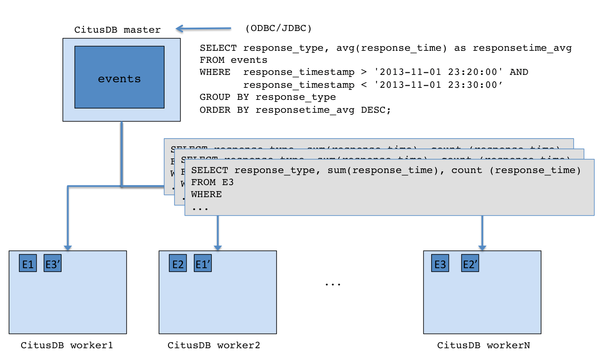

.. _introduction_to_citus:

Architecture
############

At a high level, Citus distributes the data across a cluster of commodity servers.
Incoming SQL queries are then parallel processed across these servers.

In the sections below, we briefly explain the concepts relating to Citus’s architecture.

Master / Worker Nodes
$$$$$$$$$$$$$$$$$$$$$$$$$

You first choose one of the PostgreSQL instances in the cluster as the Citus master. You
then add the DNS names of worker PostgreSQL instances (Citus workers) to a membership file on
the master. From that point on, you interact with the master through standard PostgreSQL
interfaces for data loading and querying. All the data is distributed across the workers.
The master only stores metadata about the shards.

Logical Sharding
$$$$$$$$$$$$$$$$$$$$$$$

Citus utilizes a modular block architecture which is similar to Hadoop Distributed File System blocks but uses PostgreSQL tables on the workers instead of files. Each of these tables is a horizontal partition or a logical “shard”. The Citus master then maintains metadata tables which track all the workers and the locations of the shards on the workers.

Each shard is replicated on at least two of the workers (Users can configure this to a higher value). As a result, the loss of a single machine does not impact data availability. The Citus logical sharding architecture also allows new workers to be added at any time to increase the capacity and processing power of the cluster.

Metadata Tables
$$$$$$$$$$$$$$$$$

The Citus master maintains metadata tables to track all the workers and the locations of the database shards on them. These tables also maintain statistics like size and min/max values about the shards which help Citus’s distributed query planner to optimize the incoming queries. The metadata tables are small (typically a few MBs in size) and can be replicated and quickly restored if the master ever experiences a failure.

To learn more about the metadata tables and their schema, please visit the :ref:`metadata_tables` section of our documentation.

Query Processing
$$$$$$$$$$$$$$$$

When the user issues a query, the Citus master partitions it into smaller query fragments where each query fragment can be run independently on a worker shard. This allows Citus to distribute each query across the cluster, utilizing the processing power of all of the involved nodes and also of individual cores on each node. The master then assigns the query fragments to workers, oversees their execution, merges their results, and returns the final result to the user. To ensure that all queries are executed in a scalable manner, the master also applies optimizations that minimize the amount of data transferred across the network.

Failure Handling
$$$$$$$$$$$$$$$$$$$$$$$$$$$$$$$$$

Citus can easily tolerate worker failures because of its logical sharding-based architecture. If a worker fails mid-query, Citus completes the query by re-routing the failed portions of the query to other workers which have a copy of the shard. If a worker is permanently down, users can easily rebalance the shards onto other workers to maintain the same level of availability.
