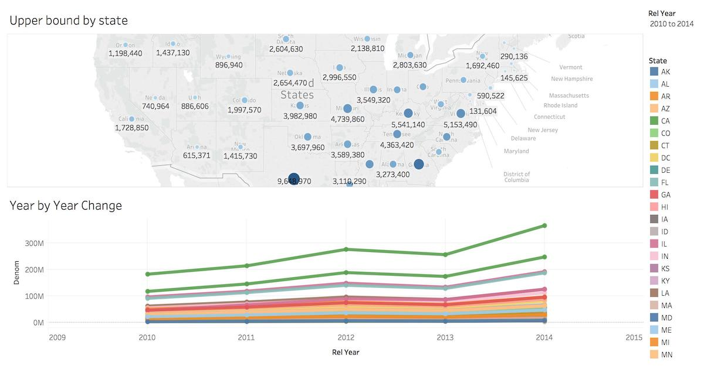

External Integrations
#####################

Ingesting Data from Apache Kafka
================================

Citus can leverage existing Postgres data ingestion tools. For instance, we can use a tool called `kafka-sink-pg-json <https://github.com/justonedb/kafka-sink-pg-json>`_ to copy JSON messages from a Kafka topic into a database table. As a demonstration, we'll create a ``kafka_test`` table and ingest data from the ``test`` topic with a custom mapping of JSON keys to table columns.

The easiest way to experiment with Kafka is using the Confluent platform, which includes Kafka, Zookeeper, and associated tools whose versions are verified to work together.

.. code-block:: bash

  # we're using Confluent 2.0 for kafka-sink-pg-json support
  curl -L http://packages.confluent.io/archive/2.0/confluent-2.0.0-2.11.7.tar.gz \
    | tar zx

  # Now get the jar and conf files for kafka-sink-pg-json
  mkdir sink
  curl -L https://github.com/justonedb/kafka-sink-pg-json/releases/download/v1.0.2/justone-jafka-sink-pg-json-1.0.zip \
    | tar zx -C sink

The download of kafka-sink-pg-json contains some configuration files. We want to connect to the coordinator Citus node, so we must edit the configuration file ``sink/justone-kafka-sink-pg-json-connector.properties``:

.. code-block:: ini

  # add to sink/justone-kafka-sink-pg-json-connector.properties

  # the kafka topic we will use
  topics=test

  # db connection info
  # use your own settings here
  db.host=localhost:5432
  db.database=postgres
  db.username=postgres
  db.password=bar

  # the schema and table we will use
  db.schema=public
  db.table=kafka_test

  # the JSON keys, and columns to store them
  db.json.parse=/@a,/@b
  db.columns=a,b

Notice ``db.columns`` and ``db.json.parse``. The elements of these lists match up, with the items in ``db.json.parse`` specifying where to find values inside incoming JSON objects.

.. note::

  The paths in ``db.json.parse`` are written in a language that allows some flexibility in getting values out of JSON. Given the following JSON,

  .. code-block:: json

    {
      "identity":71293145,
      "location": {
        "latitude":51.5009449,
        "longitude":-2.4773414
      },
      "acceleration":[0.01,0.0,0.0]
    }

  here are some example paths and what they match:

  * ``/@identity`` - the path to element 71293145.
  * ``/@location/@longitude`` - the path to element -2.4773414.
  * ``/@acceleration/#0`` - the path to element 0.01
  * ``/@location`` - the path to element ``{"latitude":51.5009449, "longitude":-2.4773414}``

Our own scenario is simple. Our events will be objects like ``{"a":1, "b":2}``. The parser will pull those values into eponymous columns.

Now that the configuration file is set up, it's time to prepare the database. In psql run:

.. code-block:: psql

  -- create metadata tables for kafka-sink-pg-json
  \i sink/install-justone-kafka-sink-pg-1.0.sql

  -- create and distribute target ingestion table
  create table kafka_test ( a int, b int );
  select create_distributed_table('kafka_test', 'a');

Start the Kafka machinery:

.. code-block:: bash

  # save some typing
  export C=confluent-2.0.0

  # start zookeeper
  $C/bin/zookeeper-server-start \
    $C/etc/kafka/zookeeper.properties

  # start kafka server
  $C/bin/kafka-server-start \
    $C/etc/kafka/server.properties

  # create the topic we'll be reading/writing
  $C/bin/kafka-topics --create --zookeeper localhost:2181   \
                      --replication-factor 1 --partitions 1 \
                      --topic test

Run the ingestion program:

.. code-block:: bash

  # the jar files for this are in "sink"
  export CLASSPATH=$PWD/sink/*

  # Watch for new events in topic and insert them
  $C/bin/connect-standalone \
    sink/justone-kafka-sink-pg-json-standalone.properties \
    sink/justone-kafka-sink-pg-json-connector.properties

At this point Kafka-Connect is watching the ``test`` topic, and will parse events there and insert them into ``kafka_test``. Let's send an event from the command line.

.. code-block:: bash

  echo '{"a":42,"b":12}' | \
    $C/bin/kafka-console-producer --broker-list localhost:9092 --topic test

After a small delay the new row will show up in the database.

::

  select * from kafka_test;

  ┌────┬────┐
  │ a  │ b  │
  ├────┼────┤
  │ 42 │ 12 │
  └────┴────┘

Caveats
-------

* At the time of this writing, kafka-sink-pg-json requires Kafka version 0.9 or earlier.
* The kafka-sink-pg-json connector config file does not provide a way to connect with SSL support, so this tool will not work with Citus Cloud which requires secure connections.
* A malformed JSON string in the Kafka topic will cause the tool to become stuck. Manual intervention in the topic is required to process more events.

Business Intelligence with Tableau
==================================

`Tableau <https://www.tableau.com/>`_ is a popular business intelligence and analytics tool for databases. Citus and Tableau provide a seamless experience for performing ad-hoc reporting or analysis.

You can now interact with Tableau using the following steps.

* Choose PostgreSQL from the "Add a Connection" menu.

  .. image:: ../images/tableau-add-connection.png
* Enter the connection details for the coordinator node of your Citus cluster. (Note if you're connecting to Citus Cloud you must select "Require SSL.")

  .. image:: ../images/tableau-connection-details.png
* Once you connect to Tableau, you will see the tables in your database. You can define your data source by dragging and dropping tables from the “Table” pane. Or, you can run a custom query through “New Custom SQL”.
* You can create your own sheets by dragging and dropping dimensions, measures, and filters. You can also create an interactive user interface with Tableau. To do this, Tableau automatically chooses a date range over the data. Citus can compute aggregations over this range in human real-time.

