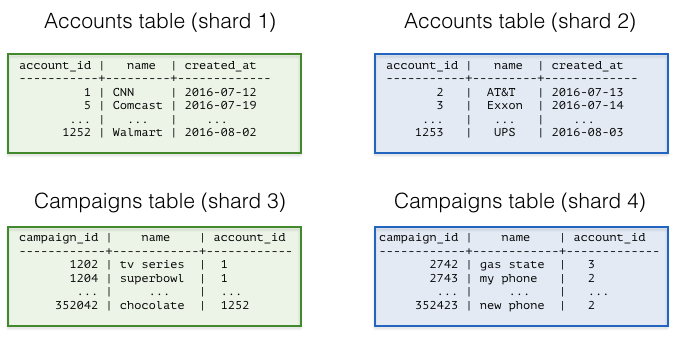
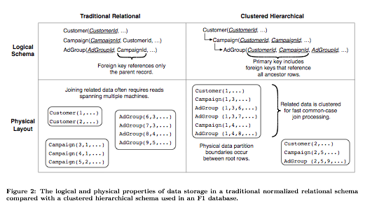
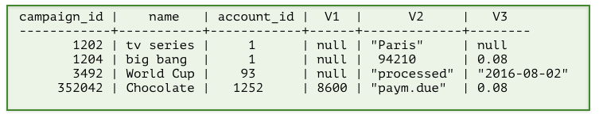

Designing your SaaS Database for Scale with Postgres
####################################################

If you’re building a SaaS application, you probably already have the
notion of tenancy built in your data model. Typically, most information
relates to tenants / customers / accounts and your database tables
capture this natural relation.

With smaller amounts of data (10s of GB), it’s easy to throw more
hardware at the problem and scale up your database. As these tables grow
however, you need to think about ways to scale your multi-tenant
database across dozens or hundreds of machines.

After our blog post on `sharding a multi-tenant app with
Postgres <https://citusdata.com/blog/2016/08/10/sharding-for-a-multi-tenant-app-with-postgres/>`__,
we received a number of questions on architectural patterns for
multi-tenant databases and when to use which. At a high level,
developers have three options:

1. Create one database per tenant
2. Create one schema per tenant
3. Have all tenants share the same table(s)

The option you pick has implications on scalability, how you handle data
that varies across tenants, isolation, and ease-of-maintenance. And
these implications have been discussed in detail across many
`StackOverflow
questions <http://stackoverflow.com/search?tab=votes&q=multi-tenant%20database>`__
and `database
articles <https://msdn.microsoft.com/en-us/library/aa479086.aspx>`__.
So, what is the best solution?

In practice, each of the three design options -with enough effort- can
address questions around scale, data that varies across tenants, and
isolation. The decision depends on the *primary* dimension you’re
building/optimizing for. The tldr:

-  If you’re building for scale: Have all tenants share the same
   table(s)
-  If you’re building for isolation: Create one database per tenant

In this article, we’ll focus on the scaling dimension, as we found
that more users who talked to us had questions in that area. (We also
intend to describe considerations around isolation in a follow-up blog
post.)

To expand on this further, if you’re planning to have 5 or 50 tenants in
your B2B application, and your database is running into scalability
issues, then you can create and maintain a separate database for each
tenant. If however you plan to have thousands of tenants, then sharding
your tables on a tenant\_id/account\_id column will help you scale in a
much better way.

   Sharding tables for multi-tenant applications

Common benefits of having all tenants share the same database are:

Resource pooling (reduced cost): If you create a separate database for
each tenant, then you need to allocate resources to that database.
Further, databases usually make assumptions about resources available to
them–for example, PostgreSQL has shared\_buffers, makes good use of the
operating system cache, comes with connection count settings, runs
processes in the background, and writes logs and data to disk. If you’re
running 50 of these databases on a few physical machines, then resource
pooling becomes tricky even with today’s virtualization tech.

If you have a distributed database that manages all tenants, then you’re
using your database for what it’s designed to do. You could shard your
tables on tenant\_id and easily support 1000s or tens of thousands of
tenants.

`Google’s F1
paper <http://static.googleusercontent.com/media/research.google.com/en//pubs/archive/41344.pdf>`__
is a good example that demonstrates a multi-tenant database that scales
this way. The paper talks about technical challenges associated with
scaling out the Google AdWords platform; and at its core describes a
multi-tenant database. The F1 paper also highlights how best to model
data to support many tenants/customers in a distributed database.

   Google F1 diagram on relational and hierarchical database models

The data model on the left-hand side follows the relational database
model and uses foreign key constraints to ensure data integrity in the
database. This strict relational model introduces certain drawbacks in a
distributed environment however.

In particular, most transactions and joins you perform on your database,
and constraints you’d like to enforce across your tables, have a
customer/tenant dimension to them. If you shard your tables on their
primary key column (in the relational model), then most distributed
transactions, joins, and constraints become expensive. Network and
machine failures further add to this cost.

The diagram on the right-hand side proposes the hierarchical database
model. This model is the one used by F1 and resolves the previously
mentioned issues. In its simplest form, you add a
customer\_id/tenant\_id column to your tables and shard them on
customer\_id. This ensures that data from the same customer gets
`colocated
together <https://citusdata.com/blog/2016/08/10/sharding-for-a-multi-tenant-app-with-postgres/>`__
-- co-location dramatically reduces the cost associated with distributed
transactions, joins, and `foreign key
constraints <https://github.com/citusdata/citus/issues/698>`__.

Ease of maintenance: Another challenge associated with supporting
100-100K tenants is schema changes (Alter Table) and index creations
(Create Index). As your application grows, you will iterate on your
database model and make improvements.

If you’re following an architecture where each tenant lives in a
separate database, then you need to implement an infrastructure that
ensures that each schema change either succeeds across all tenants or
gets eventually rolled back. For example, what happens when you changed
the schema for 5,000 of 10K tenants and observed a failure? How do you
handle that?

When you shard your tables for multi-tenancy, then you’re having your
database do the work for you. The database will either ensure that an
Alter Table goes through across all shards, or it will roll it back.

What about data that varies across tenants? Another challenge with
scaling to thousands of tenants relates to handling data that varies
across tenants. Your multi-tenant application will naturally include a
standard database setup with default tables, fields, queries, and
relationships that are appropriate to your solution. But different
tenants/organizations may have their own unique needs that a rigid,
inextensible default data model won’t be able to address. For example,
one organization may need to track their stores in the US through their
zip codes. Another customer in Europe might not care about US zip codes,
but may be interested to keep tax ratios for each store.

This used to be an area where having a tenant per database offered the
most flexibility, at the cost of extra maintenance work from the
developer(s). You could create separate tables or columns per tenant in
each database, and manage those differences across time.

If then you wanted to scale your infrastructure to thousands of tenants,
you’d create a huge table with many string columns (Value0, Value1, …
Value500). Probably, the best known example of this model is
`Salesforce’s multi-tenant
architecture <http://www.developerforce.com/media/ForcedotcomBookLibrary/Force.com_Multitenancy_WP_101508.pdf>`__.

   Representing data that varies across tenants, traditional method

In this database model, your tables have a preset collection of custom
columns, labeled in this image as V1, V2, and V3. Dates and Numbers are
stored as strings in a format such that they can be converted to their
native types. When you’re storing data associated with a particular
tenant, you can then use these custom columns and tailor them to each
tenant’s special needs.

Fortunately, designing your database to account for "flexible" columns
became significantly easier with the introduction of semi-structured
data types. PostgreSQL has a rich set of semi-structured data types that
include `hstore, json, and
jsonb <https://citusdata.com/blog/2016/07/14/choosing-nosql-hstore-json-jsonb/>`__. You can
now represent the previous database schema by simply declaring a jsonb
column and scale to thousands of tenants.

.. figure:: ../images/articles-saas-fig-4.png
   :alt: Representing data that varies across tenants, modern method

   Representing data that varies across tenants, modern method

Of course, these aren’t the only design criteria and questions to be
aware of. If you shard your database tables, how do you handle isolation
or integrate with ORM libraries? What happens if you have a table that
you can’t easily add a tenant\_id column? In this article, we focused
on building multi-tenant databases with scaling as the primary
consideration in mind; and skipped over certain points. If you’re
looking to learn more about designing multi-tenant databases, please
sign up for our `upcoming webinar on the
topic! <https://attendee.gotowebinar.com/register/46885752336450820>`__

The good news is, databases have advanced quite a bit in the past ten
years in accommodating SaaS applications at scale. What was once only
available to the likes of Google and Salesforce with significant
engineering effort, is now becoming accessible to everyone with
open-source technologies such as PostgreSQL and Citus.
