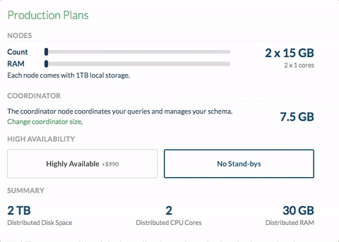
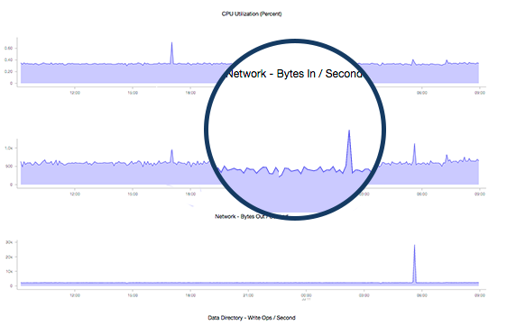

Introducing Citus Add-on for Heroku: Scale out your Postgres
############################################################

(Copy of `original publication <https://www.citusdata.com/blog/2017/07/13/citus-addon-for-heroku/>`__)

Just as Heroku has made it simple for you to deploy applications, at
`Citus Data <https://www.citusdata.com/>`__ we aim to make it simple for
you to scale out your Postgres database.

Once upon a time at Heroku, it all started with
``git push heroku master``. Later, the team at `Heroku made it
easy <https://blog.heroku.com/add_ons_launch>`__ to add any service you
could want within your app via ``heroku addons:create foo``. The
simplicity of dragging a slider to scale up your dynos is the type of
awesome customer experience we strive to create at Citus. With Citus
Cloud (our fully-managed `database as a
service <https://www.citusdata.com/product/cloud>`__), you can simply
drag and save—then voila, you've scaled the resources to your database.

Today we are excited to announce our `Citus add-on for
Heroku <https://elements.heroku.com/addons/citus>`__. Now with
``heroku addons:create citus`` you can get a database that scales out
just as easily as your app does.

   Citus console provisioning slider

When running Postgres on a single node, the need to scale out can occur
anywhere from 100 GB of data up to 1 TB. If you’re running Postgres
already, then Citus is a natural fit. With Citus you’ll get much of the
experience you expect on Heroku, coupled with the ability to keep
scaling out your database. Let’s take a deeper look at a few of the
features available for the Citus add-on.

Continuous protection and monitoring with Citus Cloud
-----------------------------------------------------

Citus leverages the same underlying tools as Heroku Postgres for
continuous protection. In fact, the team that runs Citus Cloud is the
founding engineering team from Heroku Postgres.

With continuous protection, Citus takes incremental backups of your
database every minute. From there our `control
plane <https://www.citusdata.com/blog/2016/08/12/state-machines-to-run-databases/>`__
then monitors your database every 30 seconds to make sure your database
is healthy and active. If anything goes wrong, our `Citus state
machine <https://www.citusdata.com/blog/2016/08/12/state-machines-to-run-databases/>`__
begins a series of automated processes to restore availability. If our
systems determine it's needed, we may perform an `HA failover or
disaster
recovery <https://www.citusdata.com/blog/2017/03/23/a-look-into-disaster-recovery-and-high-availability-and-how-they-work-with-postgres-on-citus-cloud/>`__,
leveraging the continuous protection and frequent incremental backups to
ensure your data is still safe.

I like to say that we wear the pager for you, to keep you up and
running. So you can focus on your app, not your database.

The insights you need
---------------------

When managing an app, there can be a lot to juggle: there are endless
options for metrics and what to pay attention to. Many of the standard
best practices for Postgres performance apply—most importantly, I always
recommend you pay attention to your `cache hit
rate <http://www.craigkerstiens.com/2012/10/01/understanding-postgres-performance/>`__
and index hit rate, both of which we make available for you in the Citus
Cloud dashboard.

We also make it easy for you to centralize your logs into any one of the
`Heroku add-on providers <https://elements.heroku.com>`__ of your
choosing. To do this you can create a new secure TLS drain which will
send the logs from all Citus database nodes to your logging system.

Finally, with Citus, you get insights into system level metrics such as
disk i/o, network i/o, and perhaps most key, the CPU load:

Granular access control in Citus Cloud
--------------------------------------

We know that Heroku makes it easy to add new collaborators to your app.
And when it comes to your database you may want to grant access to users
that are a bit less familiar with a CLI—or perhaps you don't want some
of your users to have full access to your Heroku app. With Citus Cloud,
you can add new users and restrict their permissions however you see
fit. Want to allow inserts but not deletes? Done. Want them to only have
read-only permissions? Done. You have the ultimately flexibility to
control roles how you see fit.

Scale out Postgres on Heroku today
----------------------------------

At Citus we get that flexibility matters. So we're making it simple for
you by allowing custom Citus add-on plans to be created. If you don't
see the Heroku add-on plan that makes sense for you, just let us or let
the Heroku team know and we'll make sure to get it created and available
for you.

We want scaling your Postgres database on Heroku to be as easy as
scaling your Heroku app. Which is why we're excited to roll out the
Citus add-on to help you grow. If you’re using Heroku Postgres and are
looking for scale, `give the Citus add-on for
Heroku <https://elements.heroku.com/addons/citus>`__ a try today.
