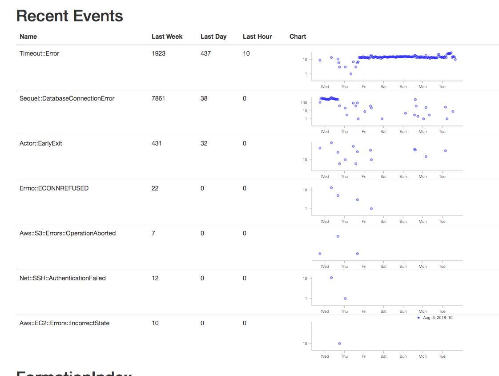

Building a Scalable Postgres Metrics Backend using the Citus Extension
######################################################################

From nearly the beginning of the `Citus
Cloud <https://www.citusdata.com/product/cloud/>`__ service, we've had
an internal formation provisioned and managed by the service itself.
`Dogfooding <http://blog.launchdarkly.com/tag/dogfooding/>`__ in this
manner brings all the usual benefits such as gaining operational
knowledge, customer empathy, and etc.

However, more interesting than yet another blog post going over the
importance of dogfooding is the two different ways we're using our Citus
formation. Setting up a distributed table requires a bit more
forethought than a normal Postgres table, because the choice of shard
column has a big impact on the types of queries and joins you can do
with the data.

We're going to look at two cases here: a time-series metrics table and
an events table.

Time-Series Metrics
~~~~~~~~~~~~~~~~~~~

The first is a metrics table that we fill with data from AWS Cloud Watch
for all servers and volumes that we manage. We then show graphs of this
both for internal and customer-facing dashboards. The table has the
following structure and is sharded on ``server_id``. The primary key is
several columns wide to both serve as a unique constraint preventing
duplicate data points and as an index over all the columns we query on.

.. code:: sql

                      Table "public.cw_metrics"
        Column    |           Type           |     Modifiers
    --------------+--------------------------+--------------------
     server_id    | uuid                     | not null
     aws_id       | text                     | collate C not null
     name         | text                     | collate C not null
     timestamp    | timestamp with time zone | not null
     sample_count | bigint                   | not null
     average      | double precision         | not null
     sum          | double precision         | not null
     minimum      | double precision         | not null
     maximum      | double precision         | not null
     unit         | text                     | collate C not null
    Indexes:
        "cw_metrics_pkey" PRIMARY KEY, btree (server_id, "timestamp", aws_id, name)

Some sample rows:

.. code:: sql

    citus=> select * from cw_metrics order by timestamp desc limit 2;
    -[ RECORD 1 ]+-------------------------------------
    server_id    | f2239a4b-7297-4b66-b9e3-851291760b70
    aws_id       | i-723a927805464ac8b
    name         | NetworkOut
    timestamp    | 2016-07-28 14:13:00-07
    sample_count | 5
    average      | 127505
    sum          | 637525
    minimum      | 111888
    maximum      | 144385
    unit         | Bytes
    -[ RECORD 2 ]+-------------------------------------
    server_id    | f2239a4b-7297-4b66-b9e3-851291760b70
    aws_id       | i-723a927805464ac8b
    name         | NetworkIn
    timestamp    | 2016-07-28 14:13:00-07
    sample_count | 5
    average      | 32930.8
    sum          | 164654
    minimum      | 18771
    maximum      | 46584
    unit         | Bytes

There are currently only two queries on this table. The first is simply
inserting data after periodically fetching data from AWS CloudWatch.

The other gets the data for the graphs that are shown both on the
internal admin site and on the customer-facing console and looks like
``select … where server_id in (?,) and name in (?,) and timestamp > now()-'? hours'::interval``.
Because Citus shards are just normal postgres tables, this query is
parallelized by going to only the shards necessary for the ``server_id``
list. Once on each shard, finding the data is very fast because the
other two where conditions are covered by the primary key.

The main downside to sharding on ``server_id`` is expiring old data is a
little cumbersome. We have to go to each shard and run a
``delete … where timestamp > '?'``. This can take a while depending on
how big a window we're pruning, and it leaves a bloated table that
requires vacuuming. A nice alternative is to use standard time-based
table partitioning for each of the shards, and then simply drop the old
time tables. We haven't done this yet because expiry hasn't been a
problem so far, but it's nice the option is there.

Events
~~~~~~

The other table is a general event table. We are using a hosted
exception tracker to discover problems in production. However we were
also sending that service unexceptional exceptions. That is, these were
expected errors, such as the failure to ssh into a server that was still
booting. Sometimes an increased rate of exceptions in a particular
category can indicate a problem even though a normal baseline rate is
okay.

However the exception tracker was not the right place for this. It made
it harder than necessary to spot real errors, so we moved these events
to a distributed Citus table which looks like this:

.. code:: sql

                   Table "public.events"
       Column   |           Type           | Modifiers
    ------------+--------------------------+-----------
     id         | uuid                     | not null
     name       | text                     | not null
     created_at | timestamp with time zone | not null
     data       | jsonb                    |
    Indexes:
        "events_pkey" PRIMARY KEY, btree (id)
        "events_created_at_idx" brin (created_at)
        "events_data_idx" gin (data jsonb_path_ops)
        "events_name_idx" btree (name)

The ``id`` column is a randomly generated uuid and the shard key, which
gives a roughly equal distribution amongst the shards as events come in.
Also because Citus is just an extension on top of Postgres, we're able
to take advantage of the powerful ``jsonb`` data type with the
corresponding gin index which gives us very fast lookups on arbitrary
keys, and the new brin index type.

Here are some example rows from the events table:

.. code:: sql

    citus=> select * from events order by created_at desc limit 2;
    -[ RECORD 1 ]-
    id         | 9a3dfdbd-c395-40bb-8d25-45ee7c913662
    name       | Timeout::Error
    created_at | 2016-07-28 13:18:47.289917-07
    data       | {"id": "5747a999-9768-429c-b13c-c7c0947dd950", "class": "Server", "message": "execution expired"}
    -[ RECORD 2 ]-
    id         | ba9d6a13-0832-47fb-a849-02f1362c9019
    name       | Sequel::DatabaseConnectionError
    created_at | 2016-07-28 12:58:40.506267-07
    data       | {"id": "232835ec-31a1-44d0-ae5b-edafb2cf6978", "class": "Timeline", "message": "PG::ConnectionBad: could not connect to server: Connection refused\n\tIs the server running on host \"ec2-52-207-18-20.compute-1.amazonaws.com\" (52.207.18.20) and accepting\n\tTCP/IP connections on port 5432?\n"}

This data is currently mostly used to show graphs on the admin dashboard
to spot outliers. The query to gather data is for the graphs is

.. code:: sql

    SELECT count(*), name, date_trunc('hour', created_at) as hour
    FROM events
    WHERE created_at > now()-'1 week'::interval
    GROUP BY name, hour;

And the graphs look like

This clearly shows a time period of something not quite right. Sometimes
we've gone into psql to look at the
`jsonb <https://www.citusdata.com/blog/2016/07/14/choosing-nosql-hstore-json-jsonb/>`__
to get details if there is a high rate of some particular error to
figure out which server is causing it. That is currently a manual
process, and perhaps sample json bodies could be put into the UI, but
doing the work for that hasn't been worth it yet.

A more exciting project would be to use some machine learning on past
time periods to automatically detect outliers. If we ever do that, I'll
be sure to put a writeup on the experience on this blog.
