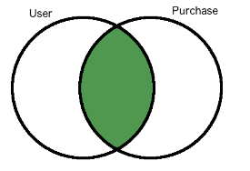
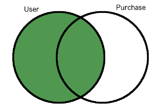
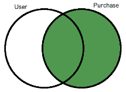
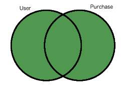
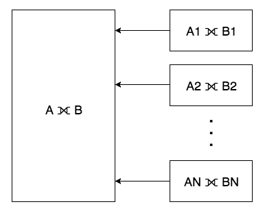

How Distributed Outer Joins on PostgreSQL with Citus Work
#########################################################

(Copy of `original publication <https://www.citusdata.com/blog/2016/10/10/outer-joins-in-citus/>`__)

SQL is a very powerful language for analyzing and reporting against
data. At the core of SQL is the idea of joins and how you combine
various tables together. One such type of join: outer joins are useful
when we need to retain rows, even if it has no match on the other side.

And while the most common type of join, inner join, against tables A and
B would bring only the tuples that have a match for both A and B, outer
joins give us the ability to bring together from say all of table A even
if they don’t have a corresponding match in table B. For example, let's
say you keep customers in one table and purchases in another table. When
you want to see all purchases of customers, you may want to see all
customers in the result even if they did not do any purchases yet. Then,
you need an outer join. Within this post we’ll analyze a bit on what
outer joins are, and then how we support them in a distributed fashion
on Citus.

Let’s say we have two tables, customer and purchase:

.. code:: sql

    customer table:
     customer_id |      name
    -------------+-----------------
               1 | Corra Ignacio
               3 | Warren Brooklyn
               2 | Jalda Francis

    purchase table:
     purchase_id | customer_id | category |           comment
    -------------+-------------+----------+------------------------------
            1000 |           1 | books    | Nice to Have!
            1001 |           1 | chairs   | Comfortable
            1002 |           2 | books    | Good Read, cheap price
            1003 |          -1 | hardware | Not very cheap
            1004 |          -1 | laptops  | Good laptop but expensive...

The following queries and results help clarifying the inner and outer
join behaviors:

.. code:: sql

     SELECT customer.name, purchase.comment
     FROM customer JOIN purchase ON customer.customer_id = purchase.customer_id
     ORDER BY purchase.comment;

          name      |        comment
     ---------------+------------------------
      Corra Ignacio | Comfortable
      Jalda Francis | Good Read, cheap price
      Corra Ignacio | Nice to Have!

.. code:: sql

     SELECT customer.name, purchase.comment
     FROM customer INNER JOIN purchase ON customer.customer_id = purchase.customer_id
     ORDER BY purchase.comment;

          name      |        comment
     ---------------+------------------------
      Corra Ignacio | Comfortable
      Jalda Francis | Good Read, cheap price
      Corra Ignacio | Nice to Have!

.. code:: sql

     SELECT customer.name, purchase.comment
     FROM customer LEFT JOIN purchase ON customer.customer_id = purchase.customer_id
     ORDER BY purchase.comment;

           name       |        comment
     -----------------+------------------------
      Corra Ignacio   | Comfortable
      Jalda Francis   | Good Read, cheap price
      Corra Ignacio   | Nice to Have!
      Warren Brooklyn |

.. code:: sql

     SELECT customer.name, purchase.comment
     FROM customer RIGHT JOIN purchase ON customer.customer_id = purchase.customer_id
     ORDER BY purchase.comment;

          name      |           comment
     ---------------+------------------------------
      Corra Ignacio | Comfortable
      Jalda Francis | Good Read, cheap price
                    | Good laptop but expensive...
      Corra Ignacio | Nice to Have!
                    | Not very cheap

.. code:: sql

     SELECT customer.name, purchase.comment
     FROM customer FULL JOIN purchase ON customer.customer_id = purchase.customer_id
     ORDER BY purchase.comment;

           name       |           comment
     -----------------+------------------------------
      Corra Ignacio   | Comfortable
      Jalda Francis   | Good Read, cheap price
                      | Good laptop but expensive...
      Corra Ignacio   | Nice to Have!
                      | Not very cheap
      Warren Brooklyn |

Distributed Outer Joins with Citus
~~~~~~~~~~~~~~~~~~~~~~~~~~~~~~~~~~

The Citus extension allows PostgreSQL to distribute big tables
into smaller fragments called "shards" and performing outer joins
on these distributed tables becomes a bit more challenging,
since the union of outer joins between individual shards does
not always give the correct result. Currently, Citus support
distributed outer joins under some criteria:

- Outer joins should be between distributed(sharded) tables only,
i.e. it is not possible to outer join a sharded table with a regular
PostgreSQL table.
- Join criteria should be on `partition columns
<https://docs.citusdata.com/en/v5.2/dist_tables/concepts.html>`__ of the
distributed tables.
- The query should join the distributed tables on the equality of
partition columns (table1.a = table2.a)
- Shards of the distributed table should match one to one, i.e. each
shard of table A should overlap with one and only one shard from table
B.

For example lets assume we 3 hash distributed tables X, Y and Z and let
X and Y have 4 shards while Z has 8 shards.

.. code:: sql

    CREATE TABLE user (user_id int, name text);
    SELECT create_distributed_table('user', 'user_id');

    CREATE TABLE purchase (user_id int, amount int);
    SELECT create_distributed_table('purchase', 'user_id');

    CREATE TABLE comment (user_id int, comment text, rating int);
    SELECT create_distributed_table('comment', 'user_id');

The following query would work since distributed tables user and
purchase have the same number of shards and the join criteria is
equality of partition columns:

.. code:: sql

    SELECT * FROM user OUTER JOIN purchase ON user.user_id = purchase.user_id;

The following queries are not supported out of the box:

.. code:: sql

    -- user and comment tables doesn’t have the same number of shards:
    SELECT * FROM user OUTER JOIN comment ON user.user_id = comment.user_id;

    -- join condition is not on the partition columns:
    SELECT * FROM user OUTER JOIN purchase ON user.user_id = purchase.amount;

    -- join condition is not equality:
    SELECT * FROM user OUTER JOIN purchase ON user.user_id < purchase.user_id;

How Citus Processes OUTER JOINs When one-to-one matching between shards
exists, then performing an outer join on large tables is equivalent to
combining outer join results of corresponding shards.

Let’s look at how Citus handles an outer join query:

.. code:: sql

    SELECT table1.a, table1.b AS b1, table2.b AS b2, table3.b AS b3, table4.b AS b4
    FROM table1
    FULL JOIN table2 ON table1.a = table2.a
    FULL JOIN table3 ON table1.a = table3.a
    FULL JOIN table4 ON table1.a = table4.a;

First, the query goes through the standard PostgreSQL planner and Citus
uses this plan to generate a distributed plan where various checks about
Citus’ support of the query are performed. Then individual queries that
will go to workers for distributed table fragments are generated.

.. code:: sql

    SELECT table1.a, table1.b AS b1, table2.b AS b2, table3.b AS b3, table4.b AS b4
    FROM (((table1_102359 table1
    FULL JOIN table2_102363 table2 ON ((table1.a = table2.a)))
    FULL JOIN table3_102367 table3 ON ((table1.a = table3.a)))
    FULL JOIN table4_102371 table4 ON ((table1.a = table4.a))) WHERE true

.. code:: sql

    SELECT table1.a, table1.b AS b1, table2.b AS b2, table3.b AS b3, table4.b AS b4
    FROM (((table1_102360 table1
    FULL JOIN table2_102364 table2 ON ((table1.a = table2.a)))
    FULL JOIN table3_102368 table3 ON ((table1.a = table3.a)))
    FULL JOIN table4_102372 table4 ON ((table1.a = table4.a))) WHERE true

.. code:: sql

    SELECT table1.a, table1.b AS b1, table2.b AS b2, table3.b AS b3, table4.b AS b4
    FROM (((table1_102361 table1
    FULL JOIN table2_102365 table2 ON ((table1.a = table2.a)))
    FULL JOIN table3_102369 table3 ON ((table1.a = table3.a)))
    FULL JOIN table4_102373 table4 ON ((table1.a = table4.a))) WHERE true

.. code:: sql

    SELECT table1.a, table1.b AS b1, table2.b AS b2, table3.b AS b3, table4.b AS b4
    FROM (((table1_102362 table1
    FULL JOIN table2_102366 table2 ON ((table1.a = table2.a)))
    FULL JOIN table3_102370 table3 ON ((table1.a = table3.a)))
    FULL JOIN table4_102374 table4 ON ((table1.a = table4.a))) WHERE true

The resulting queries may seem complex at first but you can see that
they are actually the same with the original query with just the table
names are a bit different. This is because Citus stores the data in
standard postgres tables called shards with the name as \_. With 1-1
matching of shards, the distributed outer join is equivalent to the
union of all outer joins of individual matching shards. In many cases
you don’t even have to think about this as Citus simply takes care of
you. If you’re sharding on some shared id, as is common in certain `use
cases <https://www.citusdata.com/blog/2016/08/10/sharding-for-a-multi-tenant-app-with-postgres/>`__,
then Citus will do the join on the appropriate node without any
inter-worker communication.

We hope you found the insight into how we perform distributed outer
joins valuable. If you’re curious about trying Citus or learning how
more works we encourage you to join the conversation with us on Slack.
