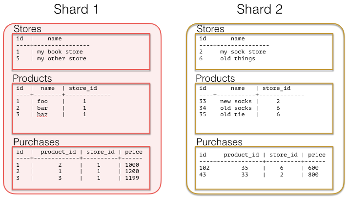

Sharding a Multi-Tenant App with Postgres
=========================================

(Copy of `original publication <https://www.citusdata.com/blog/2016/08/10/sharding-for-a-multi-tenant-app-with-postgres/>`__)

Whether you’re building marketing analytics, a portal for e-commerce
sites, or an application to cater to schools, if you’re building an
application and your customer is another business then a multi-tenant
approach is the norm. The same code runs for all customers, but each
customer sees their own private data set, *except in some cases of
holistic internal reporting*.

Early in your application’s life customer data has a simple structure
which evolves organically. Typically all information relates to a
central customer/user/tenant table. With a smaller amount of data (10’s
of GB) it’s easy to scale the application by throwing more hardware
at it, but what happens when you’ve had enough success and data that
you have no longer fits in memory on a single box, or you need more
concurrency? You scale out, often painfully.

This scale out model has worked well for the likes of
`Google <http://research.google.com/pubs/pub41344.html>`__ and
`Instagram <http://instagram-engineering.tumblr.com/post/10853187575/sharding-ids-at-instagram>`__,
but also doesn't have to be as complicated as you might think. If
you're able to model your multi-tenant data in the right way sharding
can become much simpler and still give you the power you need from a
database including joins, indexing, and more. While Citus lets you
scale out your processing power and memory, how you model your data may
determine the ease and flexibility you get from the system. If you're
building a multi-tenant SaaS application hopefully the following example
highlights how you can plan early for scaling without having to contort
too much of your application.

Tenancy
~~~~~~~

At the core of most non-consumer focused applications tenancy is already
built in, whether you realize it or not. As we mentioned above you may
have a users table. Let's look at a very basic SaaS schema that
highlights this:

.. code:: sql

    CREATE TABLE stores (
      id UUID,
      owner_email VARCHAR(255),
      owner_password VARCHAR(255),
      name VARCHAR(255),
      url VARCHAR(255),
      last_login_at TIMESTAMPTZ,
      created_at TIMESTAMPTZ
    )

    CREATE TABLE products (
      id UUID,
      name VARCHAR(255),
      description TEXT,
      price INTEGER,
      quantity INTEGER,
      store_id UUID,
      created_at TIMESTAMPTZ,
      updated_at TIMESTAMPTZ
    )

    CREATE TABLE purchases (
      id UUID,
      product_id UUID,
      customer_id UUID,
      store_id UUID,
      price INTEGER,
      purchased_at TIMESTAMPTZ,
    )

The above schema highlights an *overly simplified* multi-tenant
e-commerce site. Say for example someone like an Etsy. And of course
there are a number of queries you would run against this:

List the products for a particular store:

.. code:: sql

    SELECT id, 
           name,
           price
    FROM products
    WHERE store_id = 'foo';

Or let’s say you want to compute how many purchases exist weekly for a
given store:

.. code:: sql

    SELECT date_trunc('week', purchased_at),
           sum(price * quantity)
    FROM purchases,
         stores
    WHERE stores.id = products.stores_id
      AND store_id = 'foo'

From here you could envision how to give each store its own presence and
analytics. Now if we fast-forward a bit and start to look at scaling
this out then we have a choice to make on how we'll shard the data. The
easiest level to do this at is the tenant level or in this case on store
id. With the above data model the largest tables over time are likely to
be products and purchases, we could shard on both of these. Though if we
choose products or purchases the difficulty lies in the fact that we may
want to do queries that focus on some high level item such as store. If
we choose store id then all data for a particular store would exist on
the same node, this would allow you push down all computations directly
to the a single node.

Multi-tenancy and co-location, a perfect pair
~~~~~~~~~~~~~~~~~~~~~~~~~~~~~~~~~~~~~~~~~~~~~

Co-locating data within the same physical instance avoids sending data
over the network during joins. This can result in much faster
operations. With Citus there are a number of ways to move your data
around so you can join and query it in a flexible manner, but for this
class of multi-tenant SaaS apps it’s simple if you can ensure data ends
up on the shard. To do this though we need to push down our store id to
all of our tables.

The key that makes this all possible is including your ``store_id`` on
all tables. By doing this you can easily shard out all your data so it’s
located on the same shard. In the above data model we coincidentally had
``store_id`` on all of our tables, but if it weren’t there you could add
it. This would put you in a good position to distribute all your data so
it’s stored on the same nodes. So now lets try sharding our tenants, in
this case stores:

.. code:: sql

    SELECT create_distributed_table('stores', 'id');
    SELECT create_distributed_table('products', 'store_id');
    SELECT create_distributed_table('purchases', 'store_id');

Now you’re all set. *Again, you’ll notice that we shard everything by
store\_id–this allows all queries to be routed to a single Postgres
instance.* The same queries as before should work just fine for you as
long as you have store\_id on your query. An example layout of your data
now may look something like:

The alternative to colocation is to choose some lower level shard key
such as orders or products. This has a trade-off of making joins and
querying more difficult because you have to send more data over the
network and make sure things work in a distributed way. This lower level
key can be useful for consumer focused datasets, if your analytics are
always against the entire data set as is often the case in
metrics-focused use cases.

In conclusion
~~~~~~~~~~~~~

It’s important to note that different distribution models can
have different benefits and trade-offs. In some cases modeling on
a lower level entity id such as products or purchases can be the
right choice. You gain more parallelism for analytics and trade
off simplicity in querying a single store.  Either choice of
picking a multi-tenant data model or adopt a more :ref:`distributed
document model <semi_structured_sharding>` can be made to scale,
but each comes with its own trade-offs.
