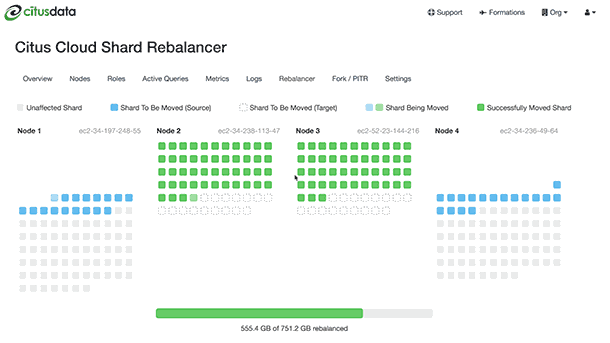

Manage
######

.. _cloud_scaling:

Scaling
=======

Citus Cloud provides self-service scaling to deal with increased load. The web interface makes it easy to either add new worker nodes or increase existing nodes' memory and CPU capacity.

For most cases either approach to scaling is fine and will improve performance. However there are times you may want to choose one over the other. If the cluster is reaching its disk limit then adding more nodes is the best choice. Alternately, if there is still a lot of headroom on disk but performance is suffering, then scaling node RAM and processing power is the way to go.

Both adjustments are available in the formation configuration panel of the settings tab:

.. image:: ../images/cloud-nodes-slider.png

The slider, **Total Nodes**, scales out the cluster by adding new nodes. The **RAM** buttons scale it up by changing the instance size (RAM and CPU cores) of existing nodes.

For example, just drag the slider for node count:

.. image:: ../images/cloud-nodes-slider-2.png

After you adjust the slider and/or buttons and accept the changes, Citus Cloud begins applying the changes. Increasing the number of nodes will begin immediately, whereas increasing node instance size will wait for a time in the user-specified maintenance window.

.. image:: ../images/cloud-maintenance-window.png

Citus Cloud will display a popup message in the console while scaling actions have begun or are scheduled. The message will disappear when the action completes.

For instance, when adding nodes:

.. image:: ../images/cloud-scaling-out.png

Or when waiting for node resize to begin in the maintenance window:

.. image:: ../images/cloud-scaling-up.png

Scaling Up (increasing node size)
---------------------------------

Resizing node size works by creating a PostgreSQL follower for each node, where the followers are provisioned with the desired amount of RAM and CPU cores. It takes an average of forty minutes per hundred gigabytes of data for the primary nodes' data to be fully synchronized on the followers. After the synchronization is complete, Citus Cloud does a quick switchover from the existing primary nodes to their followers which takes about two minutes. The creation and switchover process uses the same well-tested replication mechanism that powers Cloud's :ref:`ha` feature. During the switchover period clients may experience errors and have to retry queries, especially cross-tenant queries hitting multiple nodes.

.. _scaling_out:

Scaling Out (adding new nodes)
------------------------------

Node addition completes in five to ten minutes, which is faster than node resizing because the new nodes are created without data. To take advantage of the new nodes you still must adjust manually rebalance the shards, meaning move some shards from existing nodes to the new ones.

You can go to the "Rebalancer" tab in the Cloud console to see the shard balance across nodes. Ordinarily this page will show, "No rebalance required."

.. image:: ../images/cloud-rebalance-unnecessary.png

However if the shards could be placed more evenly, such as after a new node has been added to the cluster, the page will show a "Rebalance recommended."

.. image:: ../images/cloud-rebalance-recommended.png

For maximum control, the choice of when to run the shard rebalancer is left to the database administrator. Citus does not automatically rebalance on node creation. To start the shard rebalancer, connect to the cluster coordinator node with psql and run:

.. code-block:: postgres

  SELECT rebalance_table_shards('distributed_table_name');

.. note::

  The :code:`rebalance_table_shards` function rebalances all tables in the :ref:`colocation group <colocation_groups>` of the table named in its argument. Thus you do not have to call it for every single table, just call it on a representative table from each colocation group.

  Learn more about this function in :ref:`shard_rebalancing`.

Citus will output progress in both psql (saying which shards are moving) and graphically in the Cloud console:

.. _cloud_pgbouncer:

Scaling Connections (pgBouncer)
-------------------------------

Each client connection to PostgreSQL consumes a noticeable amount of resources. To protect resource usage Citus Cloud enforces a hard limit of 300 concurrent connections to the coordinator node.

For further scaling we provide PgBouncer out of the box on Cloud. If your application requires more than 300 connections, change the port in the Cloud connection URL from 5432 to 6432. This will connect to PgBouncer rather than directly to the coordinator, allowing up to roughly two thousand simultaneous connections. The coordinator can still only process three hundred at a time, but more can connect and PgBouncer will queue them.

When connecting to PgBouncer you have:

- 1800 idle connections available
- 300 active connections to Citus available

To measure the number of active connections at a given time, run:

.. code-block:: postgresql

  SELECT COUNT(*)
    FROM pg_stat_activity
   WHERE state <> 'idle';

Monitoring
==========

Resources Usage
===============

Citus Cloud metrics enable you to get information about your cluster's health and performance. The "Metrics" tab of the Cloud Console provides graphs for a number of measurements, all viewable per node.

Amazon EBS Volume Metrics
-------------------------

* Read IOPS. The average number of read operations per second.
   .. image:: ../images/metric-iops-read.png
* Write IOPS. The average number of write operations per second.
   .. image:: ../images/metric-iops-write.png
* Average Queue Length (Count). The number of read and write operation requests waiting to be completed.
   .. image:: ../images/metric-queue.png
* Average Read Latency (Seconds)
   .. image:: ../images/metric-latency-read.png
* Average Write Latency (Seconds)
   .. image:: ../images/metric-latency-write.png
* Bytes Read / Second
   .. image:: ../images/metric-bytes-read.png
* Bytes Written / Second
   .. image:: ../images/metric-bytes-write.png

CPU and Network
---------------

* CPU Utilization (Percent)
   .. image:: ../images/metric-cpu.png
* Network - Bytes In / Second
   .. image:: ../images/metric-network-in.png
* Network - Bytes Out / Second
   .. image:: ../images/metric-network-out.png

PostgreSQL Write-Ahead Log
--------------------------

* WAL Bytes Written / Second
   .. image:: ../images/metric-wal.png

Formation Events Feed
---------------------

To monitor events in the life of a formation with outside tools via a standard format, we offer RSS feeds per organization. You can use a feed reader or RSS Slack integration (e.g. on an :code:`#ops` channel) to keep up to date.

On the upper right of the "Formations" list in the Cloud console, follow the "Formation Events" link to the RSS feed.

.. image:: ../images/cloud-formation-events.png

The feed includes entries for three types of events, each with the following details:

**Server Unavailable**

This is a notification of connectivity problems such as hardware failure.

*  Formation name
*  Formation url
*  Server

**Failover Scheduled**

For planned upgrades, or when operating a formation without high availability that experiences a failure, this event will appear to indicate a future planned failover event.

*  Formation name
*  Formation url
*  Leader
*  Failover at

For planned failovers, "failover at" will usually match your maintenance window. Note that the failover might happen at this point or shortly thereafter, once a follower is available and has caught up to the primary database.

**Failover**

Failovers happen to address hardware failure, as mentioned, and also for other reasons such as performing system software upgrades, or transferring data to a server with better hardware.

*  Formation name
*  Formation url
*  Leader
*  Situation
*  Follower

Security
========

Connecting with SSL
-------------------

For security Citus Cloud accepts only SSL connections, which is why the URL contains the :code:`?sslmode=require` parameter. To avoid a man-in-the-middle attack, you can also verify that the server certificate is correct. Download the official `Citus Cloud certificate <https://console.citusdata.com/citus.crt>`_ and refer to it in connection string parameters:

::

  ?sslrootcert=/location/to/citus.crt&sslmode=verify-full

The string may need to be quoted in your shell to preserve the ampersand.

.. note::

  Database clients must support SSL to connect to Citus Cloud. In particular :code:`psql` needs to be compiled :code:`--with-openssl` if building PostgreSQL from source.

Two-Factor Authentication
~~~~~~~~~~~~~~~~~~~~~~~~~

We support two factor authentication for all Citus accounts. You can enable it from within your Citus Cloud account. We support Google Authenticator and Authy as two primary apps for setting up your two factor authentication.

Users and Permissions
---------------------

As we saw above, every new Citus Cloud formation includes a user account called :code:`citus`. This account is great for creating tables and other DDL, but it has too much power for certain applications.

We'll want to create new roles for specialized purposes. For instance, a user with read-only access is perfect for a web/reporting tool. The Cloud console allows us to create a new user, and will set up a new password automatically. Go to the "Roles" tab and click "Create New Role."

.. image:: ../images/cloud-roles-tab.png

It pops up a dialog where we will fill in the role name, which we can call :code:`reports`.

.. image:: ../images/cloud-role-dialog.png

After creating the role on a fresh formation, there will be three roles:

.. code-block:: text

  ┌─[ RECORD 1 ]────────────────────────────────────────────────────────────┐
  │ Role name  │ citus                                                      │
  │ Attributes │                                                            │
  │ Member of  │ {reports}                                                  │
  ├─[ RECORD 2 ]────────────────────────────────────────────────────────────┤
  │ Role name  │ postgres                                                   │
  │ Attributes │ Superuser, Create role, Create DB, Replication, Bypass RLS │
  │ Member of  │ {}                                                         │
  ├─[ RECORD 3 ]────────────────────────────────────────────────────────────┤
  │ Role name  │ reports                                                    │
  │ Attributes │                                                            │
  │ Member of  │ {}                                                         │
  └────────────┴────────────────────────────────────────────────────────────┘

The new :code:`reports` role starts with no privileges, except "usage" on the public schema, meaning the ability to get a list of the tables etc inside. We have to specifically grant the role extra permissions to database objects. For instance, to allow read-only access to :code:`mytable`, connect to Citus as the :code:`citus` user with the connection string provided in the Cloud console and issue this command:

.. code-block:: postgresql

  -- run as the citus user

  GRANT SELECT ON mytable TO reports;

You can confirm the privileges by consulting the information schema:

.. code-block:: postgresql

  SELECT grantee, privilege_type
    FROM information_schema.role_table_grants
   WHERE table_name = 'mytable';

::

  ┌─────────┬────────────────┐
  │ grantee │ privilege_type │
  ├─────────┼────────────────┤
  │ citus   │ INSERT         │
  │ citus   │ SELECT         │
  │ citus   │ UPDATE         │
  │ citus   │ DELETE         │
  │ citus   │ TRUNCATE       │
  │ citus   │ REFERENCES     │
  │ citus   │ TRIGGER        │
  │ reports │ SELECT         │
  └─────────┴────────────────┘

The PostgreSQL documentation has more detailed information about types of privileges you can `GRANT on database objects <https://www.postgresql.org/docs/current/static/sql-grant.html#SQL-GRANT-DESCRIPTION-OBJECTS>`_.

Granting Privileges in Bulk
~~~~~~~~~~~~~~~~~~~~~~~~~~~

Citus propagates single-table GRANT statements through the entire cluster, making them apply on all worker nodes. However GRANTs that are system-wide (e.g. for all tables in a schema) need to be applied individually to every data node using a Citus helper function.

.. code-block:: postgresql

  -- applies to the coordinator node
  GRANT SELECT ON ALL TABLES IN SCHEMA public TO reports;

  -- make it apply to workers as well
  SELECT run_command_on_workers(
    'GRANT SELECT ON ALL TABLES IN SCHEMA public TO reports;'
  );

Systemic Cloud Status
=====================

Any events affecting the Citus Cloud platform as a whole are recorded on `status.citusdata.com <https://status.citusdata.com/>`_.

.. raw:: html

  

Encryption at Rest
------------------

All data within Citus Cloud is encrypted at rest, including data on the instance as well as all backups for disaster recovery. As mentioned in the connection section, we also require that you connect to your database with TLS.

Network Perimeter Controls
--------------------------

All Citus Cloud clusters run in their own isolated Amazon Virtual Private Cloud (VPC). In addition to the options discussed earlier, Citus Cloud provides the ability to further secure your cluster by limiting network access in two ways:

VPC Peering
  VPC peering forms a network connection between two VPCs which routes traffic securely between them using private IPv4 addresses or IPv6 addresses. Instances in either VPC can communicate with each other as if they are within the same network. To set up a VPC peering connecting between an existing Citus Cloud formation and an Amazon VPC, open a support ticket and we will initiate the peering request.

IP Whitelisting
  IP whitelisting restricts access to servers within a Citus Cloud cluster so that only designated IP addresses are able to connect to them. IP whitelisting is available for a single IP or a set of IP ranges. To enable IP whitelisting on your Citus Cloud formation, open a support ticket with the desired IP ranges and we'll set it up for you.

.. _ha:

Availability and Recovery
=========================

In the real world, insurance is used to manage risk when a natural
disaster such as a hurricane or flood strikes. In the database world,
there are two critical methods of insurance. High Availability (HA)
replicates the latest database version virtually instantly. Disaster
Recovery (DR) offers continuous protection by saving every database
change, allowing database restoration to any point in time.

High availability and disaster recovery are both forms of data backups
that are mutually exclusive and inter-related. The difference between
them is that HA has a secondary reader database replica (often referred
to as stand-by or follower) ready to take over at any moment, but DR
just writes to cold storage (in the case of Amazon that’s S3) and has
latency in the time for the main database to recover data.

Citus Cloud continuously protects the cluster data against hardware
failure. To do this we perform backups every twenty-four hours, then
stream the write-ahead log (WAL) from PostgreSQL to S3 every 16 MB or 60
seconds, whichever is less. Even without high availability enabled you
won't lose any data. In the event of a complete infrastructure failure
we'll restore your back-up and replay the WAL to the exact moment before
your system crashed.

High-Availability (HA)
----------------------

In addition to continuous protection which is explained above, high
availability is available if your application requires less exposure
to downtime. We provision stand-bys if you select high availability
at provisioning time. This can be for your primary node, or for your
distributed nodes.

.. image:: ../images/ha-availability.gif
   :align: right

For HA, any data that is written to a primary database called the Writer
is instantly replicated onto a secondary database called the Reader in
real-time, through a stream called a
`WAL <https://www.postgresql.org/docs/9.4/static/wal-intro.html>`__ or
Write-Ahead-Log.

To ensure HA is functioning properly, Citus Cloud runs health checks
every 30 seconds. If the primary fails and data can’t be accessed after
six consecutive attempts, a failover is initiated. This means the
primary node will be replaced by the standby node and a new standby will
be created.

Disaster Recovery (DR)
----------------------

.. image:: ../images/ha-disaster.gif
   :align: right

For DR, read-only data is replayed from colder storage. On AWS this is
from S3, and for Postgres this is downloaded in 16 MB pieces. On Citus
Cloud this happens via WAL-E, using precisely the same procedure as
creating a new standby for HA.
`WAL-E <https://github.com/wal-e/wal-e>`__ is an open source tool
initially developed by our team, for archiving PostgreSQL WAL (Write
Ahead Log) files quickly, continuously and with a low operational
burden.

This means we can restore your database by fetching the base backup and
replaying all of the WAL files on a fresh install in the event of
hardware failure, data corruption or other failure modes

On Citus Cloud prior to kicking off the DR recovery process, the AWS EC2
instance is automatically restarted. This process usually takes 7±2
minutes. If it restarts without any issues, the setup remains the same.
If the EC2 instance fails to restart, a new instance is created. This
happens at a rate of at least 30MB/second, so 512GB of data would take
around 5 hours.

Comparison of HA and DR
-----------------------

While some may be familiar many are not acutely aware of the
relationship between HA and DR.

Although it’s technically possible to have one without the other, they
are unified in that the HA streaming replication and DR archiving
transmit the same bytes.

For HA the primary “writer” database replicates data through streaming
replication to the secondary “reader” database. For DR, the same data is
read from S3. In both cases, the “reader” database downloads the WAL and
applies it incrementally.

Since DR and HA gets regularly used for upgrades and side-grades, the DR
system is maintained with care. We ourselves rely on it for releasing
new production features.

Disaster Recovery takes a little extra work but gives greater reliability
~~~~~~~~~~~~~~~~~~~~~~~~~~~~~~~~~~~~~~~~~~~~~~~~~~~~~~~~~~~~~~~~~~~~~~~~~

You might think that if HA provides virtually instant backup
reliability, so ‘Why bother with DR?’ There are some compelling reasons
to use DR in conjunction with HA including cost, reliability and
control.

From a cost efficiency perspective, since HA based on EBS and EC2 is a
mirrored database, you have to pay for every layer of redundancy added.
However, DR archives in S3 are often 10-30% of the monthly cost of a
database instance. And with Citus Cloud the S3 cost is already covered
for you in the standard price of your cluster.

From reliability perspective, S3 has proven to be up to a thousand times
more reliable than EBS and EC2, though a more reasonable range is ten to
a hundred times. S3 archives also have the advantage of immediate
restoration, even while teams try to figure out what’s going on.
Conversely, sometimes EBS volume availability can be down for hours with
uncertainty it will completely restore.

From a control perspective, using DR means a standby database can be
created while reducing the impact on the primary database. It also has
the capability of being able to recover a database from a previous
version.

Trade-offs between latency and reliability
~~~~~~~~~~~~~~~~~~~~~~~~~~~~~~~~~~~~~~~~~~

There is a long history of trade-offs between latency and reliability,
dating back to when the gold standard for backups were on spools of
tape.

Writing data to and then reading data from S3 offers latencies that are
100 to 1,000 times longer than streaming bytes between two computers as
seen in streaming replication. However, S3's availability and durability
are both in excess of ten times better than an EBS volume.

On the other hand, the throughput of S3 is excellent: with parallelism,
and without downstream bottlenecks, one can achieve multi-gigabit
throughput in backup and WAL reading and writing.

How High Availability and Disaster Recovery is used for crash recovery
~~~~~~~~~~~~~~~~~~~~~~~~~~~~~~~~~~~~~~~~~~~~~~~~~~~~~~~~~~~~~~~~~~~~~~

When many customers entrust your company with their data, it is your
duty to keep it safe under all circumstances. So when the most severe
database crashes strike, you need to be ready to recover.

Our team is battle-hardened from years of experience as the original
Heroku Postgres team, managing over 1.5 million databases. Running at
that scale with constant risks of failure, meant that it was important
to automate recovery processes.

Such crashes are a nightmare. But crash recovery is a way to make sure
you sleep well at night by making sure none of your or your customers
data is lost and your downtime is minimal.

.. _cloud_pitr:

Point-in-Time Recovery
----------------------

While :ref:`cloud_forking` means making a copy of the database at the current moment, point-in-time recovery (PITR) means making a copy from a specific moment in the past. PITR acts as a time machine, allowing simple restoration from even the most severe data loss.

Suppose a customer deletes a record stored in your Citus cluster and you want to recover it, or an engineer drops a table by accident. Just navigate to the "Fork / PITR" tab in the Citus Cloud console and select the "Recover to a point in time" option:

.. image:: ../images/cloud-pitr.png

Similar to forking, PITR creates a copy of your formation and leaves the original unaffected. It uses the same operations internally as forking does: base backups and WAL shipping. This means that performing PITR causes no extra load on the original database.

Citus Cloud stores base backups and WAL records for up to ten days, which limits the recovery period to that amount of time. The user interface will prevent you from going back further, and will show the earliest possible recovery time.

Note that Citus worker nodes have different base backup timings and sizes, so it can happen that one node restores faster than another. In general the recovery process begins with restoring base backups at roughly 30MB/second. When that is complete the Cloud Console will provide a progress meter as it replays transactions from the WAL. The length of time for this stage varies by the number of transactions that must be replayed.

Logging
=======

What Is Logged
--------------

By default, Citus Cloud logs all errors and other useful information that happen on any of the Citus instances and makes it available to you.

The logs will contain the following messages:

* Citus and PostgreSQL errors
* Slow queries that take longer than 30 seconds
* `Checkpoint <https://www.postgresql.org/docs/current/static/wal-configuration.html>`_ statistics
* Temporary files that are written and bigger than 64 MB
* `Autovacuum <https://www.postgresql.org/docs/current/static/routine-vacuuming.html#AUTOVACUUM>`_ that takes more than 30 seconds

Recent Logs
-----------

The Citus Cloud dashboard automatically shows you the most recent 100 log lines from each of your servers. You don't need to configure anything to access this information.

.. image:: ../images/citus_logs_dashboard.png

External Log Destinations
-------------------------

For anything more than a quick look at your logs, we recommend setting up an external provider. Through this method the logs will transmit to a dedicated logging service and you can analyze and retain them according to your own preferences. To use an external provider, create a new logging destination in the Citus Cloud console. For instance, here is the new destination dialog filled in with Papertrail settings:

.. image:: ../images/citus_logs_add_log_form.png

Note that after creation, it might take up to five minutes for logging preferences to be applied. You'll then see logs show up in your chosen provider's dashboard.

The settings to use differ per provider. In the following tables we list settings verified to work for a number of popular providers.

Verified Provider Settings
~~~~~~~~~~~~~~~~~~~~~~~~~~

Replace :code:`<token>` with the custom token listed in the provider's web site. This token tells them the logs are yours.

**Papertrail**

+------------------+-------------------------+
| Hostname         | logs4.papertrailapp.com |
+------------------+-------------------------+
| Port             | 19493                   |
+------------------+-------------------------+
| TLS              | Yes                     |
+------------------+-------------------------+
| Protocol         | IETF Syslog             |
+------------------+-------------------------+
| Message Template |                         |
+------------------+-------------------------+

**Loggly**

+------------------+------------------------------------------------------------------------------------------------------+
| Hostname         | logs-01.loggly.com                                                                                   |
+------------------+------------------------------------------------------------------------------------------------------+
| Port             | 514                                                                                                  |
+------------------+------------------------------------------------------------------------------------------------------+
| TLS              | No                                                                                                   |
+------------------+------------------------------------------------------------------------------------------------------+
| Protocol         | BSD Syslog over TCP                                                                                  |
+------------------+------------------------------------------------------------------------------------------------------+
| Message Template | ``<${PRI}>1 ${ISODATE} ${HOST} ${PROGRAM} ${PID} ${MSGID} [<token>@41058 tag=\\"CITUS\\" ] $MSG\\n`` |
+------------------+------------------------------------------------------------------------------------------------------+

**Sumologic**

+------------------+-------------------------------------------------------------------------------------+
| Hostname         | syslog.collection.us2.sumologic.com                                                 |
+------------------+-------------------------------------------------------------------------------------+
| Port             | 6514                                                                                |
+------------------+-------------------------------------------------------------------------------------+
| TLS              | Yes                                                                                 |
+------------------+-------------------------------------------------------------------------------------+
| Protocol         | IETF Syslog                                                                         |
+------------------+-------------------------------------------------------------------------------------+
| Message Template | ``<${PRI}>1 ${ISODATE} ${HOST} ${PROGRAM} ${PID} ${MSGID} [<token>@41123] $MSG\\n`` |
+------------------+-------------------------------------------------------------------------------------+

**Logentries**

+------------------+------------------------------------+
| Hostname         | data.logentries.com                |
+------------------+------------------------------------+
| Port             | 80                                 |
+------------------+------------------------------------+
| TLS              | No                                 |
+------------------+------------------------------------+
| Protocol         | IETF Syslog                        |
+------------------+------------------------------------+
| Message Template | ``<token> $ISODATE $HOST $MSG\\n`` |
+------------------+------------------------------------+

**LogDNA**

+------------------+------------------------------------------------------------------------------------------------------+
| Hostname         | syslog-a.logdna.com                                                                                  |
+------------------+------------------------------------------------------------------------------------------------------+
| Port             | 514                                                                                                  |
+------------------+------------------------------------------------------------------------------------------------------+
| TLS              | No                                                                                                   |
+------------------+------------------------------------------------------------------------------------------------------+
| Protocol         | BSD Syslog over TCP                                                                                  |
+------------------+------------------------------------------------------------------------------------------------------+
| Message Template | ``<${PRI}>1 ${ISODATE} ${HOST} ${PROGRAM} ${PID} ${MSGID} [logdna@48950 key=\\"<token>\\"] $MSG\\n`` |
+------------------+------------------------------------------------------------------------------------------------------+

**Other**

We support other providers that can receive syslog via the BSD or IETF protocols. Internally Citus Cloud uses syslog-ng, so check your providers configuration documentation for syslog-ng settings.

Please reach out if you encounter any issues.
