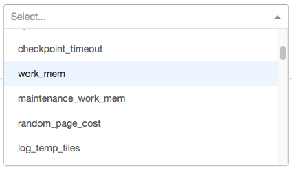

.. include:: deprecated.rst

Custom PostgreSQL Configuration
===============================

Citus Cloud supports changing of a number of PostgreSQL and Citus database server configuration parameters. Adjusting the parameters can help tune the server for particular workloads.

Within the configuration tab you can see any configuration parameters that have been customized as well as add new ones. Any configurations that require a database failover or restart must be configured by the Citus Cloud team -- in order to customize one of those configurations please open a support ticket. Parameters that do not require a server restart are available directly in the customize tab. These settings will be immediately propagated to your cluster when set.

To access these settings, go to the Configuration tab in your Cloud formation and click "Change a Parameter." It will present a dropdown list of config parameters:

The options are grouped by which server and system they control:

* Coordinator PostgreSQL
* Coordinator Inbound PgBouncer
* Worker PostgreSQL

Selecting an option opens an input box that accepts the appropriate values, whether numerical, textual, or a pre-set list. The selected option also shows a link to learn more about the configuration parameter.

Numerical parameters do not yet allow specifying units in this interface, and are interpreted as their default unit. The default unit appears in the description under the selected parameter. For instance in the picture above it says, "in kilobytes." In this example one could specify a ``work_mem`` of ``1GB`` using the value 1048576 (= 1024*1024).
