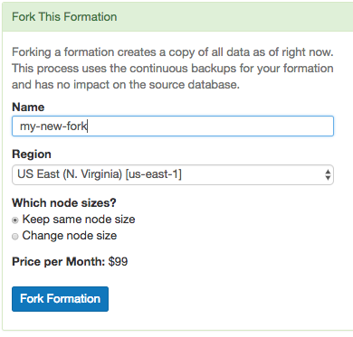
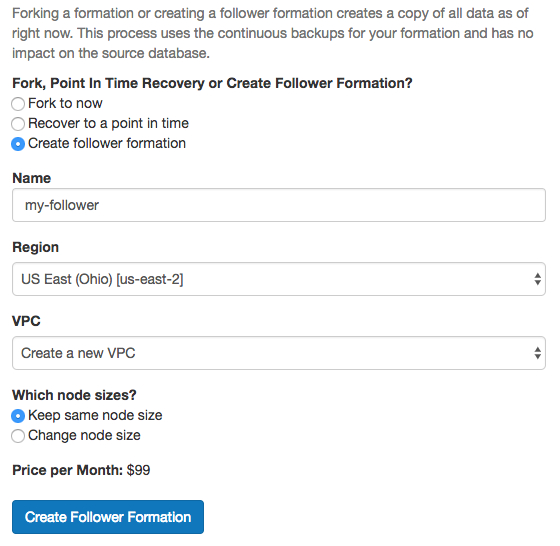

.. include:: deprecated.rst

.. _cloud_forking:

Forking
=======

Forking a Citus Cloud formation makes a copy of the cluster's data at the current point in time and produces a new formation in precisely that state. It allows you to change, query, or generally experiment with production data in a separate protected environment. Fork creation runs quickly, and you can do it as often as you want without causing any extra load on the original cluster. This is because forking doesn't query the cluster, rather it taps into the write-ahead logs for each database in the formation.

How to Fork a Formation
-----------------------

Citus Cloud makes forking easy. The control panel for each formation has a "Fork" tab. Go there and enter the name, region, and node sizing information for the destination cluster.

Shortly after you click "Fork Formation," the new formation will appear in the Cloud console. It runs on separate hardware and your database can connect to it in the :ref:`usual way <connection>`.

When is it Useful
-----------------

A fork is a great place to do experiments. Do you think that denormalizing a table might speed things up? What about creating a roll-up table for a dashboard? How can you persuade your colleagues that you need more RAM in the coordinator node rather than in the workers? You could prove yourself if only you could try your idea on the production data.

In such cases, what you need is a temporary copy of the production database. But it would take forever to copy, say, 500GB of data to a new formation. Not to mention that making the copy would slow down the production database. Copying the database in the old fashioned way is not a good idea.

However, a Citus fork is different. Forking fetches write-ahead log data from S3 and has zero effect on the production load. You can apply your experiments to the fork and destroy it when you're done.

Another use of forking is to enable complex analytical queries. Sometimes data analysts want to have access to live production data for complex queries that would take hours. What's more, they sometimes want to bend the data: denormalize tables, create aggregations, create an extra index or even pull all the data onto one machine.

Obviously, it is not a good idea to let anyone play with a production database. You can instead create a fork and give it to whomever wants to play with real data. You can re-create a fork every month to update your analytics results.

How it Works Internally
-----------------------

Citus is an extension of PostgreSQL and can thus leverage all the features of the underlying database. Forking is actually a special form of point-in-time recovery (PITR) into a new database where the recovery time is the time the fork is initiated. The two features relevant for PITR are:

* Base Backups
* Write-Ahead Log (WAL) Shipping

About every twenty-four hours Cloud calls `pg_basebackup <https://www.postgresql.org/docs/current/static/app-pgbasebackup.html>`_ to make a new base backup, which is just an archive of the PostgreSQL data directory. Cloud also continuously ships the database write-ahead logs (WAL) to Amazon S3 with `WAL-E <https://github.com/wal-e/wal-e>`_.

Base backups and WAL archives are all that is needed to restore the database to some specific point in time. To do so, we start an instance of the database on the base backup taken most recently before the desired restoration point. The new PostgreSQL instances, upon entering recovery mode, will start playing WAL segments up to the target point. After the recovery instances reach the specified target, they will be available for use as a regular database.

A Citus formation is a group of PostgreSQL instances that work together. To restore the formation we simply need to restore all nodes in the cluster to the same point in time. We perform that operation on each node and, once done, we update metadata in the coordinator node to tell it that this new cluster has branched off from your original.

.. _cloud_followers:

Followers
=========

Citus Cloud allows you to create a read-only replica of a formation, called a "follower." Any changes that happen to the original formation get promptly reflected in its follower, and queries against the follower cause no extra load on the original. The replica is a safe place for business analysts to run big report queries. In general followers are a useful tool to improve performance for read-only workloads.

Contrast followers with :ref:`cloud_forking`. In a fork the copied formation does not receive post-copy changes from the original, and can diverge with its own updates. A follower, on the other hand, remains faithful to changes in the original.

To create a follower, head to the "Fork / PITR / Follower" tab in the Cloud console. Select the "Create follower formation" radio button, and fill in a name.

Click "Create Follower Formation" and wait. On completion the process will redirect you to a console for the new formation. The follower formation is distinct from the original and has its own database connection string.
