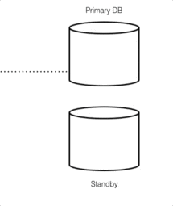
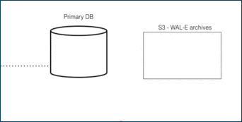
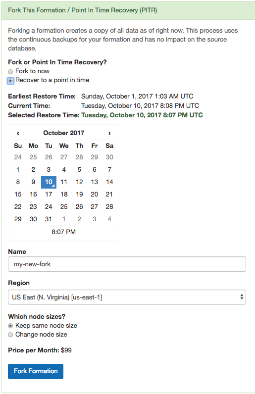

.. _ha:

Backup, Availability, and Replication
#####################################

In the real world, insurance is used to manage risk when a natural
disaster such as a hurricane or flood strikes. In the database world,
there are two critical methods of insurance. High Availability (HA)
replicates the latest database version virtually instantly. Disaster
Recovery (DR) offers continuous protection by saving every database
change, allowing database restoration to any point in time.

High availability and disaster recovery are both forms of data backups
that are mutually exclusive and inter-related. The difference between
them is that HA has a secondary reader database replica (often referred
to as stand-by or follower) ready to take over at any moment, but DR
just writes to cold storage (in the case of Amazon that’s S3) and has
latency in the time for the main database to recover data.

Citus Cloud continuously protects the cluster data against hardware
failure. To do this we perform backups every twenty-four hours, then
stream the write-ahead log (WAL) from PostgreSQL to S3 every 16 MB or 60
seconds, whichever is less. Even without high availability enabled you
won't lose any data. In the event of a complete infrastructure failure
we'll restore your back-up and replay the WAL to the exact moment before
your system crashed.

High-Availability (HA) Replication
==================================

In addition to continuous protection which is explained above, high
availability is available if your application requires less exposure
to downtime. We provision stand-bys if you select high availability
at provisioning time. This can be for your primary node, or for your
distributed nodes.

For HA, any data that is written to a primary database called the Writer
is instantly replicated onto a secondary database called the Reader in
real-time, through a stream called a
`WAL <https://www.postgresql.org/docs/9.4/static/wal-intro.html>`__ or
Write-Ahead-Log.

To ensure HA is functioning properly, Citus Cloud runs health checks
every 30 seconds. If the primary fails and data can’t be accessed after
six consecutive attempts, a failover is initiated. This means the
primary node will be replaced by the standby node and a new standby will
be created.

Disaster Recovery (DR)
======================

For DR, read-only data is replayed from colder storage. On AWS this is
from S3, and for Postgres this is downloaded in 16 MB pieces. On Citus
Cloud this happens via WAL-E, using precisely the same procedure as
creating a new standby for HA.
`WAL-E <https://github.com/wal-e/wal-e>`__ is an open source tool
initially developed by our team, for archiving PostgreSQL WAL (Write
Ahead Log) files quickly, continuously and with a low operational
burden.

This means we can restore your database by fetching the base backup and
replaying all of the WAL files on a fresh install in the event of
hardware failure, data corruption or other failure modes

On Citus Cloud prior to kicking off the DR recovery process, the AWS EC2
instance is automatically restarted. This process usually takes 7±2
minutes. If it restarts without any issues, the setup remains the same.
If the EC2 instance fails to restart, a new instance is created. This
happens at a rate of at least 30MB/second, so 512GB of data would take
around 5 hours.

Comparison of HA and DR
=======================

While some may be familiar many are not acutely aware of the
relationship between HA and DR.

Although it’s technically possible to have one without the other, they
are unified in that the HA streaming replication and DR archiving
transmit the same bytes.

For HA the primary “writer” database replicates data through streaming
replication to the secondary “reader” database. For DR, the same data is
read from S3. In both cases, the “reader” database downloads the WAL and
applies it incrementally.

Since DR and HA gets regularly used for upgrades and side-grades, the DR
system is maintained with care. We ourselves rely on it for releasing
new production features.

Disaster Recovery takes a little extra work but gives greater reliability
~~~~~~~~~~~~~~~~~~~~~~~~~~~~~~~~~~~~~~~~~~~~~~~~~~~~~~~~~~~~~~~~~~~~~~~~~

You might think that if HA provides virtually instant backup
reliability, so ‘Why bother with DR?’ There are some compelling reasons
to use DR in conjunction with HA including cost, reliability and
control.

From a cost efficiency perspective, since HA based on EBS and EC2 is a
mirrored database, you have to pay for every layer of redundancy added.
However, DR archives in S3 are often 10-30% of the monthly cost of a
database instance. And with Citus Cloud the S3 cost is already covered
for you in the standard price of your cluster.

From reliability perspective, S3 has proven to be up to a thousand times
more reliable than EBS and EC2, though a more reasonable range is ten to
a hundred times. S3 archives also have the advantage of immediate
restoration, even while teams try to figure out what’s going on.
Conversely, sometimes EBS volume availability can be down for hours with
uncertainty it will completely restore.

From a control perspective, using DR means a standby database can be
created while reducing the impact on the primary database. It also has
the capability of being able to recover a database from a previous
version.

Trade-offs between latency and reliability for backups
~~~~~~~~~~~~~~~~~~~~~~~~~~~~~~~~~~~~~~~~~~~~~~~~~~~~~~

There is a long history of trade-offs between latency and reliability,
dating back to when the gold standard for backups were on spools of
tape.

Writing data to and then reading data from S3 offers latencies that are
100 to 1,000 times longer than streaming bytes between two computers as
seen in streaming replication. However, S3's availability and durability
are both in excess of ten times better than an EBS volume.

On the other hand, the throughput of S3 is excellent: with parallelism,
and without downstream bottlenecks, one can achieve multi-gigabit
throughput in backup and WAL reading and writing.

How High Availability and Disaster Recovery is used for crash recovery
~~~~~~~~~~~~~~~~~~~~~~~~~~~~~~~~~~~~~~~~~~~~~~~~~~~~~~~~~~~~~~~~~~~~~~

When many customers entrust your company with their data, it is your
duty to keep it safe under all circumstances. So when the most severe
database crashes strike, you need to be ready to recover.

Our team is battle-hardened from years of experience as the original
Heroku Postgres team, managing over 1.5 million databases. Running at
that scale with constant risks of failure, meant that it was important
to automate recovery processes.

Such crashes are a nightmare. But crash recovery is a way to make sure
you sleep well at night by making sure none of your or your customers
data is lost and your downtime is minimal.

.. _cloud_pitr:

Point-in-Time Recovery
======================

While :ref:`cloud_forking` means making a copy of the database at the current moment, point-in-time recovery (PITR) means making a copy from a specific moment in the past. PITR acts as a time machine, allowing simple restoration from even the most severe data loss.

Suppose a customer deletes a record stored in your Citus cluster and you want to recover it, or an engineer drops a table by accident. Just navigate to the "Fork / PITR" tab in the Citus Cloud console and select the "Recover to a point in time" option:

Similar to forking, PITR creates a copy of your formation and leaves the original unaffected. It uses the same operations internally as forking does: base backups and WAL shipping. This means that performing PITR causes no extra load on the original database.

Citus Cloud stores base backups and WAL records for up to ten days, which limits the recovery period to that amount of time. The user interface will prevent you from going back further, and will show the earliest possible recovery time.

Note that Citus worker nodes have different base backup timings and sizes, so it can happen that one node restores faster than another. In general the recovery process begins with restoring base backups at roughly 30MB/second. When that is complete the Cloud Console will provide a progress meter as it replays transactions from the WAL. The length of time for this stage varies by the number of transactions that must be replayed.

.. raw:: html

  
