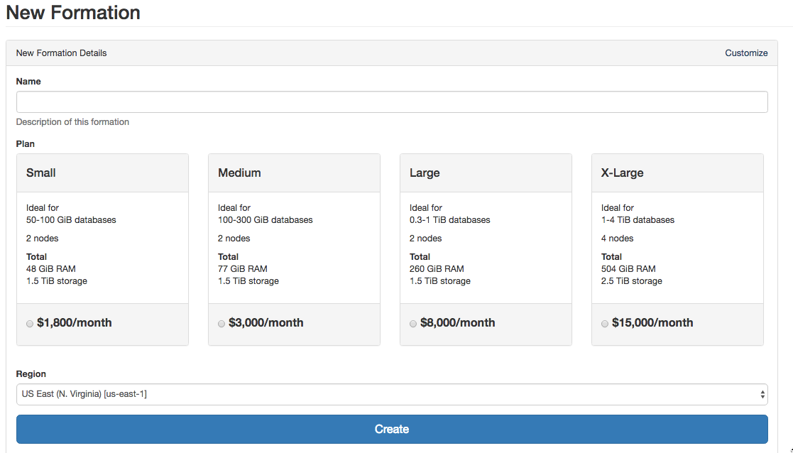
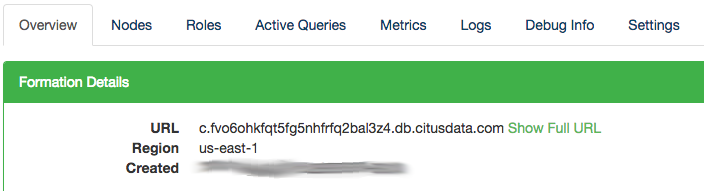
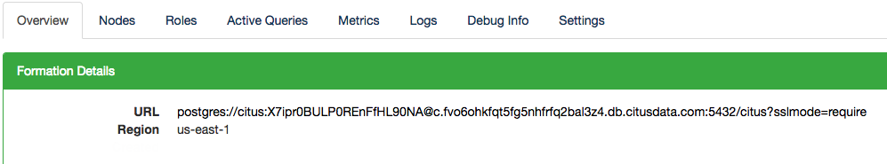
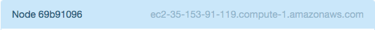

.. _cloud_overview:

Overview
########

.. NOTE::
   We are no longer onboarding new users to Citus Cloud on AWS. Of course, existing customers can continue to use Citus Cloud as they do today. If you’re new to Citus, the good news is, Citus is still available to you: as open source, as on-prem enterprise software, and in the cloud on Microsoft Azure, as a fully-integrated deployment option in Azure Database for PostgreSQL.
   
Citus Cloud is a fully managed hosted version of Citus Enterprise edition on top of AWS. Citus Cloud comes with the benefit of Citus allowing you to easily scale out your memory and processing power, without having to worry about keeping it up and running. We also offer a managed deployment on `Azure Database for PostgreSQL — Hyperscale (Citus) <https://docs.microsoft.com/azure/postgresql/>`_.

Provisioning
============

You can provision a new Citus cluster at `https://console.citusdata.com <https://console.citusdata.com>`_. When you login you'll be at the home of the dashboard, and from here you can click New Formation to begin your formation creation. 

Configuring Your Plan
---------------------

Citus Cloud plans vary based on the size of your primary node, size of your distributed nodes, number of distributed nodes and whether you have high availability or not. From within the Citus console you can configure your plan or you can preview what it might look like within the `pricing calculator <https://www.citusdata.com/pricing>`_.

The key items you'll care about for each node:

- Storage - All nodes come with 1 TB of storage
- Memory - The memory on each node varies based on the size of node you select
- Cores - The cores on each node varies based on the size of node you select

.. _cloud_regions:

Supported Regions
-----------------

Citus Cloud runs on top of Amazon Web Services. During provisioning you're able to select your database region. We currently support:

- US East (N. Virginia) [us-east-1]
- US East (Ohio) [us-east-2]
- Asia Pacific (Tokyo) [ap-northeast-1]
- Asia Pacific (Seoul) [ap-northeast-2]
- Asia Pacific (Singapore) [ap-southeast-1]
- Asia Pacific (Sydney) [ap-southeast-2]
- Asia Pacific (Mumbai) [ap-south-1]
- EU (Frankfurt) [eu-central-1]
- EU (Ireland) [eu-west-1]
- EU (London) [eu-west-2]
- EU (Paris) [eu-west-3]
- South America (São Paulo) [sa-east-1]
- US West (N. California) [us-west-1]
- US West (Oregon) [us-west-2]
- Canada (Central) [ca-central-1]

If there is an AWS region you do not see listed but would like for us to add support for please `contact us <https://www.citusdata.com/about/contact_us/>`_ and we'd be happy to look into it.

.. _connection:

Connecting
==========

Applications connect to Citus the same way they would PostgreSQL, using a `connection URI <https://www.postgresql.org/docs/current/static/libpq-connect.html#AEN45571>`_. This is a string which includes network and authentication information, and has the form:

::

  postgresql://[user[:password]@][host][:port][/dbname][?param1=value1&...]

The connection string for each Cloud Formation is provided on the Overview tab in Citus Console.

By default the URL displays only the hostname of the connection, but the full URL is available by clicking the "Show Full URL" link.

Notice how the end of the connection string contains ``?sslmode=require``. Citus Cloud accepts only SSL connections for security, so this url parameter is required. When connecting from an application framework such as Rails, Django, or Spring you may need to explicitly specify the sslmode as well.

Connecting Directly to a Worker
-------------------------------

The previous section shows how to get a connection string for the coordinator node. To connect a database client such as `psql <https://www.postgresql.org/docs/current/static/app-psql.html>`_ to an individual worker node instead, we'll need to create new a connection string by replacing the hostname in the coordinator connection string.

Under the "Nodes" tab in Cloud console each node lists its amazonaws.com hostname, like:

Replace the host in the coordinator connection string with this value, consulting the previous section for the connection string format. (As shown in the previous section, the hostname to be replaced will be immediately following an ``@`` sign.) Leave all other parameters unchanged. This will be the new connection string for the worker.
