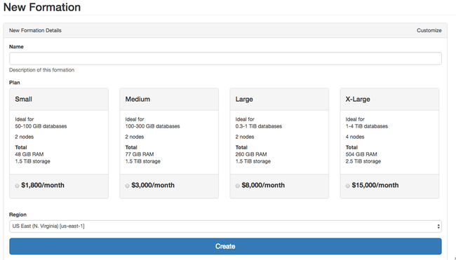

Citus Overview
==============

Citus Cloud is a fully managed hosted version of Citus Enterprise edition on top of AWS. Citus Cloud comes with the benefit of Citus allowing you to easily scale out your memory and processing power, without having to worry about keeping it up and running.

Provisioning
############

Once you've created your account at `https://console.citusdata.com <https://console.citusdata.com>`_ you can provision your Citus cluster. When you login you'll be at the home of the dashboard, and from here you can click New Formation to begin your formation creation. 

Configuring Your Plan
---------------------

Citus Cloud plans vary based on the size of your primary node, size of your distributed nodes, number of distributed nodes and whether you have high availability or not. From within the Citus console you can configure your plan or you can preview what it might look like within the `pricing calculator <https://console.citusdata.com/pricing>`_.

The key items you'll care about for each node:

- Storage - All nodes come with 512 GB of storage
- Memory - The memory on each node varies based on the size of node you select
- Cores - The cores on each node varies based on the size of node you select

High Availability
~~~~~~~~~~~~~~~~~

The high availability option on a cluster automatically provisions instance stand-bys. These stand-bys receive streaming updates directly from each of the leader nodes. We continuously monitor the leader nodes to ensure they're available and healthy. In the event of a failure we automatically switch to the stand-bys.

Note that your data is replicated to S3 with and without enabling high availability. This allows disaster recovery and reduces the risk of data loss. Although the data is safe either way, we suggest enabling high availability if you cannot tolerate up to one hour of downtime in the rare occurrence of an instance failure. We do not offer a SLA on uptime.

.. raw:: html

  
