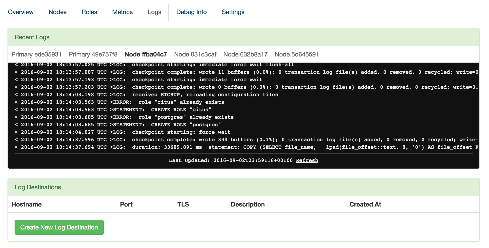

Logging
#######

What Is Logged
--------------

By default, Citus Cloud logs all errors and other useful information that happen on any of the Citus instances and makes it available to you.

The logs will contain the following messages:

* Citus and PostgreSQL errors
* Slow queries that take longer than 30 seconds
* `Checkpoint <https://www.postgresql.org/docs/9.6/static/wal-configuration.html>`_ statistics
* Temporary files that are written and bigger than 64 MB
* `Autovacuum <https://www.postgresql.org/docs/9.6/static/routine-vacuuming.html#AUTOVACUUM>`_ that takes more than 30 seconds

Recent Logs
-----------

The Citus Cloud dashboard automatically shows you the most recent 100 log lines from each of your servers. You don't need to configure anything to access this information.

External Log Destinations
-------------------------

For anything more than a quick look at your logs, we recommend setting up an external provider. Through this method the logs will transmit to a dedicated logging service and you can analyze and retain them according to your own preferences. To use an external provider, create a new logging destination in the Citus Cloud console. For instance, here is the new destination dialog filled in with Papertrail settings:

.. image:: ../images/citus_logs_add_log_form.png

Note that after creation, it might take up to five minutes for logging preferences to be applied. You'll then see logs show up in your chosen provider's dashboard.

The settings to use differ per provider. In the following tables we list settings verified to work for a number of popular providers.

Verified Provider Settings
~~~~~~~~~~~~~~~~~~~~~~~~~~

Replace :code:`<token>` with the custom token listed in the provider's web site. This token tells them the logs are yours.

**Papertrail**

+------------------+-------------------------+
| Hostname         | logs4.papertrailapp.com |
+------------------+-------------------------+
| Port             | 19493                   |
+------------------+-------------------------+
| TLS              | Yes                     |
+------------------+-------------------------+
| Protocol         | IETF Syslog             |
+------------------+-------------------------+
| Message Template |                         |
+------------------+-------------------------+

**Loggly**

+------------------+--------------------------------------------------------------------------------------------------+
| Hostname         | logs-01.loggly.com                                                                               |
+------------------+--------------------------------------------------------------------------------------------------+
| Port             | 514                                                                                              |
+------------------+--------------------------------------------------------------------------------------------------+
| TLS              | No                                                                                               |
+------------------+--------------------------------------------------------------------------------------------------+
| Protocol         | BSD Syslog over TCP                                                                              |
+------------------+--------------------------------------------------------------------------------------------------+
| Message Template | <${PRI}>1 ${ISODATE} ${HOST} ${PROGRAM} ${PID} ${MSGID} [<token>@41058 tag=\\"CITUS\\" ] $MSG\\n |
+------------------+--------------------------------------------------------------------------------------------------+

**Sumologic**

+------------------+---------------------------------------------------------------------------------+
| Hostname         | syslog.collection.us2.sumologic.com                                             |
+------------------+---------------------------------------------------------------------------------+
| Port             | 6514                                                                            |
+------------------+---------------------------------------------------------------------------------+
| TLS              | Yes                                                                             |
+------------------+---------------------------------------------------------------------------------+
| Protocol         | IETF Syslog                                                                     |
+------------------+---------------------------------------------------------------------------------+
| Message Template | <${PRI}>1 ${ISODATE} ${HOST} ${PROGRAM} ${PID} ${MSGID} [<token>@41123] $MSG\\n |
+------------------+---------------------------------------------------------------------------------+

**Logentries**

+------------------+--------------------------------+
| Hostname         | data.logentries.com            |
+------------------+--------------------------------+
| Port             | 80                             |
+------------------+--------------------------------+
| TLS              | No                             |
+------------------+--------------------------------+
| Protocol         | IETF Syslog                    |
+------------------+--------------------------------+
| Message Template | <token> $ISODATE $HOST $MSG\\n |
+------------------+--------------------------------+

**Other**

We support other providers that can receive syslog via the BSD or IETF protocols. Internally Citus Cloud uses syslog-ng, so check your providers configuration documentation for syslog-ng settings.

Please reach out if you encounter any issues.

.. raw:: html

  
