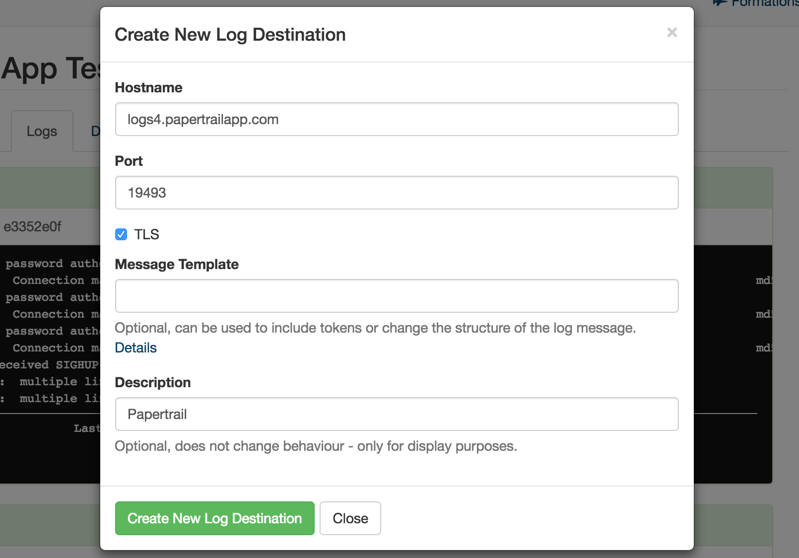

Logging
#######

What Is Logged
--------------

By default, Citus Cloud logs all errors and other useful information that happen on any of the Citus instances and makes it available to you.

The logs will contain the following messages:

* Citus and PostgreSQL errors
* Slow queries that take longer than 30 seconds
* `Checkpoint <https://www.postgresql.org/docs/9.6/static/wal-configuration.html>`_ statistics
* Temporary files that are written and bigger than 64 MB
* `Autovacuum <https://www.postgresql.org/docs/9.6/static/routine-vacuuming.html#AUTOVACUUM>`_ that takes more than 30 seconds

Recent Logs
-----------

The Citus Cloud dashboard automatically shows you the most recent 100 log lines from each of your servers. You don't need to configure anything to access this information.

External Log Destinations
-------------------------

For anything more than a quick look at your logs, we recommend setting up an external provider as a log destination. Through this method you'll receive
all logs using the Syslog protocol, and can analyze and retain them according to your own preferences.

Papertrail
~~~~~~~~~~

The process for setting up Papertrail, a common log provider, goes like this:

1. Determine Syslog host and port number (note that Citus only supports providers that can accept incoming Syslog data)

.. image:: ../images/cloud_logs_papertrail.png

2. Add a new log destination in your Citus Cloud dashboard in the "Logs" tab, like this:

For Papertrail leave Message Template empty. Other providers might require a token to be set - follow the syslog-ng instructions for the provider, if they make them available.

3. After creation, it might take up to 5 minutes for logging to be configured. You'll then see it show up in your favorite provider's dashboard.

Loggly
~~~~~~

Sumologic
~~~~~~~~~

Logentries
~~~~~~~~~~

Other
~~~~~

We likely also support other providers that can receive syslog. Please reach out if you encounter any issues.

.. raw:: html

  
