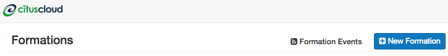
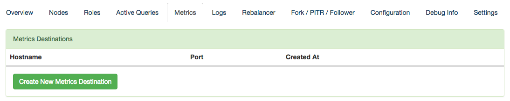
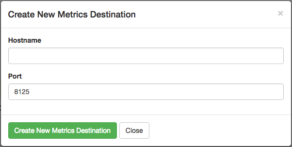

Monitoring
##########

Resources Usage
===============

Citus Cloud metrics enable you to get information about your cluster's health and performance. The "Metrics" tab of the Cloud Console provides graphs for a number of measurements, all viewable per node. Below are the metrics, broken into categories, with details about the less obvious ones.

Amazon EBS Volume Metrics
-------------------------

(A full description of the metrics reported by Citus Cloud for underlying EBS resources can be found in the AWS documentation about `I/O Characteristics and Monitoring <https://docs.aws.amazon.com/AWSEC2/latest/UserGuide/ebs-io-characteristics.html>`_.)

IOPS are a unit of measure representing input/output operations per second. The operations are measured in KiB, and the underlying drive technology determines the maximum amount of data that a volume type counts as a single I/O.

* Read IOPS

* Write IOPS

Volume queue length is the number of pending I/O requests for a device. Latency is the true end-to-end client time of an I/O operation, in other words, the time elapsed between sending an I/O and receiving an acknowledgement that the I/O read or write is complete.

* Average Queue Length (Count)

* Average Read Latency (Seconds)

* Average Write Latency (Seconds)

* Bytes Read / Second

* Bytes Written / Second

CPU and Network
---------------

* CPU Utilization (Percent)

* Network - Bytes In / Second

* Network - Bytes Out / Second

PostgreSQL Write-Ahead Log
--------------------------

* WAL Bytes Written / Second

Formation Events Feed
=====================

To monitor events in the life of a formation with outside tools via a standard format, we offer RSS feeds per organization. You can use a feed reader or RSS Slack integration (e.g. on an :code:`#ops` channel) to keep up to date.

On the upper right of the "Formations" list in the Cloud console, follow the "Formation Events" link to the RSS feed.

The feed includes entries for three types of events, each with the following details:

**Server Unavailable**

This is a notification of connectivity problems such as hardware failure.

*  Formation name
*  Formation url
*  Server

**Failover Scheduled**

For planned upgrades, or when operating a formation without high availability that experiences a failure, this event will appear to indicate a future planned failover event.

*  Formation name
*  Formation url
*  Leader
*  Failover at

For planned failovers, "failover at" will usually match your maintenance window. Note that the failover might happen at this point or shortly thereafter, once a follower is available and has caught up to the primary database.

**Failover**

Failovers happen to address hardware failure, as mentioned, and also for other reasons such as performing system software upgrades, or transferring data to a server with better hardware.

*  Formation name
*  Formation url
*  Leader
*  Situation
*  Follower

StatsD external reporting
=========================

Citus Cloud can send events to an external `StatsD <https://github.com/etsy/statsd>`_ server for detailed monitoring. Citus Cloud sends the following statsd metrics:

+---------------------------------------------+------------------------------------+
| Metric                                      | Notes                              |
+=============================================+====================================+
| citus.disk.data.total                       |                                    |
+---------------------------------------------+------------------------------------+
| citus.disk.data.used                        |                                    |
+---------------------------------------------+------------------------------------+
| citus.load.1                                | Load in past 1 minute              |
+---------------------------------------------+------------------------------------+
| citus.load.5                                | Load in past 5 minutes             |
+---------------------------------------------+------------------------------------+
| citus.load.15                               | Load in past 15 minutes            |
+---------------------------------------------+------------------------------------+
| citus.locks.granted.<mode>.<locktype>.count | See below                          |
+---------------------------------------------+------------------------------------+
| citus.mem.available                         |                                    |
+---------------------------------------------+------------------------------------+
| citus.mem.buffered                          |                                    |
+---------------------------------------------+------------------------------------+
| citus.mem.cached                            |                                    |
+---------------------------------------------+------------------------------------+
| citus.mem.commit_limit                      | Memory currently available to      |
|                                             | be allocated on the system         |
+---------------------------------------------+------------------------------------+
| citus.mem.committed_as                      | Total amount of memory estimated   |
|                                             | to complete the workload           |
+---------------------------------------------+------------------------------------+
| citus.mem.dirty                             | Amount of memory waiting to be     |
|                                             | written back to the disk           |
+---------------------------------------------+------------------------------------+
| citus.mem.free                              | Amount of physical RAM             |
|                                             | left unused                        |
+---------------------------------------------+------------------------------------+
| citus.mem.total                             | Total amount of physical RAM       |
+---------------------------------------------+------------------------------------+
| citus.pgbouncer_outbound.cl_active          | Active client connections          |
+---------------------------------------------+------------------------------------+
| citus.pgbouncer_outbound.cl_waiting         | Waiting client connections         |
+---------------------------------------------+------------------------------------+
| citus.pgbouncer_outbound.sv_active          | Active server connections          |
+---------------------------------------------+------------------------------------+
| citus.pgbouncer_outbound.sv_idle            | Idle server connections            |
+---------------------------------------------+------------------------------------+
| citus.pgbouncer_outbound.sv_used            | Server connections idle more       |
|                                             | than server_check_delay            |
+---------------------------------------------+------------------------------------+
| citus.postgres_connections.active           |                                    |
+---------------------------------------------+------------------------------------+
| citus.postgres_connections.idle             |                                    |
+---------------------------------------------+------------------------------------+
| citus.postgres_connections.unknown          |                                    |
+---------------------------------------------+------------------------------------+
| citus.postgres_connections.used             |                                    |
+---------------------------------------------+------------------------------------+

**Notes:**

* The ``citus.mem.*`` metrics are reported in kilobytes, and are also recorded in megabytes as ``system.mem.*``. Memory metrics come from ``/proc/meminfo``, and the `proc(5) <http://man7.org/linux/man-pages/man5/proc.5.html>`_ man page contains a description of each.
* The ``citus.load.*`` metrics are duplicated as ``system.load.*``.
* ``citus.locks.granted.*`` and ``citus.locks.not_granted.*`` use ``mode`` and ``locktype`` as present in Postgres' `pg_locks <https://www.postgresql.org/docs/current/static/view-pg-locks.html>`_ table.
* See the `pgBouncer docs <https://pgbouncer.github.io/usage.html#show-pools>`_ for more details about the pgbouncer_outbound metrics.

To send these metrics to a statsd server, use the "Create New Metrics Destination" button in the "Metrics" tab of Cloud Console.

Then fill in the host details in the resulting dialog box.

The statsd protocol is not encrypted, so we advise setting up :ref:`VPC peering <perimeter_controls>` between the server and your Citus Cloud cluster.

Example: Datadog with statsd
----------------------------

`Datadog <https://www.datadoghq.com/>`_ is a product which receives application metrics in the statsd protocol and makes them available in a web interface with sophisticated queries and reports. Here are the steps to connect it to Citus Cloud.

1. Sign up for a Datadog account and take note of your personal API key. It is available at https://app.datadoghq.com/account/settings#api
2. Launch a Linux server, for instance on EC2.
3. In that server, install the Datadog Agent. This is a program which listens for statsd input and translates it into Datadog API requests. In the server command line, run:

   .. code-block:: bash

      # substitute your own API key
      DD_API_KEY=1234567890 bash -c \
        "$(curl -L https://raw.githubusercontent.com/DataDog/datadog-agent/master/cmd/agent/install_script.sh)"

4. Configure the agent. (If needed, see Datadog `per-platform guides <https://app.datadoghq.com/account/settings#agent>`_)

   .. code-block:: bash

      cat - | sudo tee -a /etc/datadog-agent/datadog.yaml << CONF
      non_local_traffic: yes
      use_dogstatsd: yes
      dogstatsd_port: 8125
      dogstatsd_non_local_traffic: yes
      log_level: info
      log_file: /var/log/datadog/agent.log
      CONF

      # this is how to do it on ubuntu
      sudo systemctl restart datadog-agent

5. Fill in the agent server information as a new metrics destination in the Cloud Console. See the previous section for details.
6. The agent should now appear in the `Infrastructure <https://app.datadoghq.com/infrastructure>`_ section in Datadog.

   .. image:: ../images/datadog-infrastructure.png

Clicking the hostname link goes into a full dashboard of all the metrics, with the ability to write queries and set alerts.

Systemic Cloud Status
=====================

Any events affecting the Citus Cloud platform as a whole are recorded on `status.citusdata.com <https://status.citusdata.com/>`_.

.. raw:: html

  
