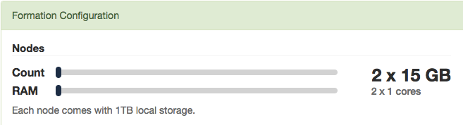
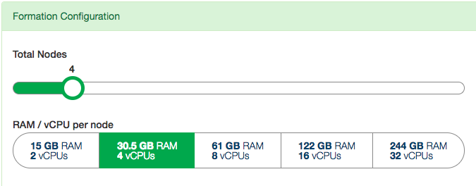
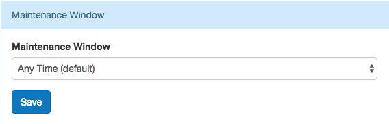
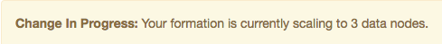
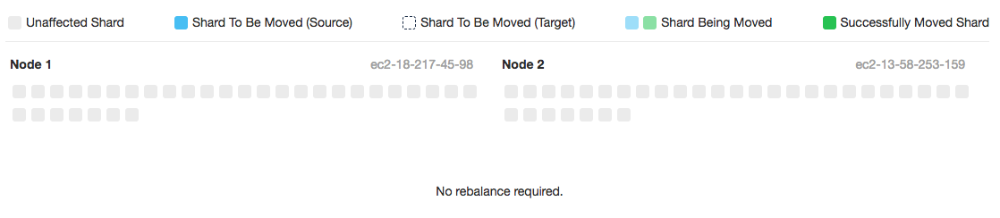
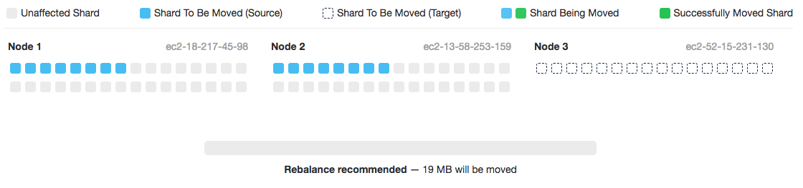
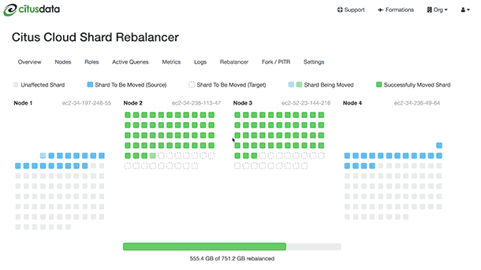

.. include:: deprecated.rst

.. _cloud_scaling:

Scaling
#######

Citus Cloud provides self-service scaling to deal with increased load. The web interface makes it easy to either add new worker nodes or increase existing nodes' memory and CPU capacity.

For most cases either approach to scaling is fine and will improve performance. However there are times you may want to choose one over the other. If the cluster is reaching its disk limit then adding more nodes is the best choice. Alternately, if there is still a lot of headroom on disk but performance is suffering, then scaling node RAM and processing power is the way to go.

Both adjustments are available in the formation configuration panel of the settings tab:

The slider, **Total Nodes**, scales out the cluster by adding new nodes. The **RAM** buttons scale it up by changing the instance size (RAM and CPU cores) of existing nodes.

For example, just drag the slider for node count:

After you adjust the slider and/or buttons and accept the changes, Citus Cloud begins applying the changes. Increasing the number of nodes will begin immediately, whereas increasing node instance size will wait for a time in the user-specified maintenance window.

A maintenance window specifies a preferred time for any maintenance tasks to be performed on your formation. When a window is set, changes to the formation (e.g. changing to a different worker size) will by default occur within this window, unless manually adjusted by Citus Cloud support. In addition, when a maintenance window is set, base backups on the node will start during the window.

Citus Cloud will display a popup message in the console while scaling actions have begun or are scheduled. The message will disappear when the action completes.

For instance, when adding nodes:

Or when waiting for node resize to begin in the maintenance window:

.. image:: ../images/cloud-scaling-up.png

Scaling Up (increasing node size)
=================================

Resizing node size works by creating a PostgreSQL follower for each node, where the followers are provisioned with the desired amount of RAM and CPU cores. It takes an average of forty minutes per hundred gigabytes of data for the primary nodes' data to be fully synchronized on the followers. After the synchronization is complete, Citus Cloud does a quick switchover from the existing primary nodes to their followers which takes about two minutes. The creation and switchover process uses the same well-tested replication mechanism that powers Cloud's :ref:`ha` feature. During the switchover period clients may experience errors and have to retry queries, especially cross-tenant queries hitting multiple nodes.

.. _scaling_out:

Scaling Out (adding new nodes)
==============================

Node addition completes in five to ten minutes, which is faster than node resizing because the new nodes are created without data. To take advantage of the new nodes you still must adjust manually rebalance the shards, meaning move some shards from existing nodes to the new ones.

Rebalancing
-----------

You can go to the "Rebalancer" tab in the Cloud console to see the shard balance across nodes. Ordinarily this page will show, "No rebalance required."

However if the shards could be placed more evenly, such as after a new node has been added to the cluster, the page will show a "Rebalance recommended."

For maximum control, the choice of when to run the shard rebalancer is left to the database administrator. Citus does not automatically rebalance on node creation. To start the shard rebalancer, connect to the cluster coordinator node with psql and run:

.. code-block:: postgres

  SELECT rebalance_table_shards('distributed_table_name');

.. note::

  The :code:`rebalance_table_shards` function rebalances all tables in the :ref:`colocation group <colocation_groups>` of the table named in its argument. Thus you do not have to call it for every single table, just call it on a representative table from each colocation group.

  Learn more about this function in :ref:`shard_rebalancing`.

Citus will output progress in both psql (saying which shards are moving) and graphically in the Cloud console:

The rebalance progress is also queryable in SQL with the :ref:`get_rebalance_progress() <get_rebalance_progress>` function.

.. _cloud_pgbouncer:

Scaling Connections (pgBouncer)
===============================

Each client connection to PostgreSQL consumes a noticeable amount of resources. To protect resource usage Citus Cloud enforces a hard limit of 300 concurrent connections to the coordinator node.

For further scaling we provide PgBouncer out of the box on Cloud. If your application requires more than 300 connections, change the port in the Cloud connection URL from 5432 to 6432. This will connect to PgBouncer rather than directly to the coordinator, allowing up to roughly two thousand simultaneous connections. The coordinator can still only process three hundred at a time, but more can connect and PgBouncer will queue them.

When connecting to PgBouncer you have:

- 1800 idle connections available
- 300 active connections to Citus available

To measure the number of active connections at a given time, run:

.. code-block:: postgresql

  SELECT COUNT(*)
    FROM pg_stat_activity
   WHERE state <> 'idle';

