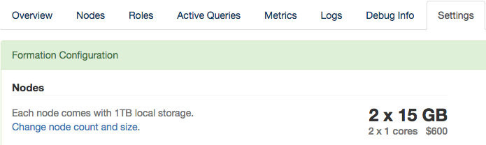
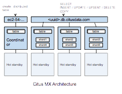
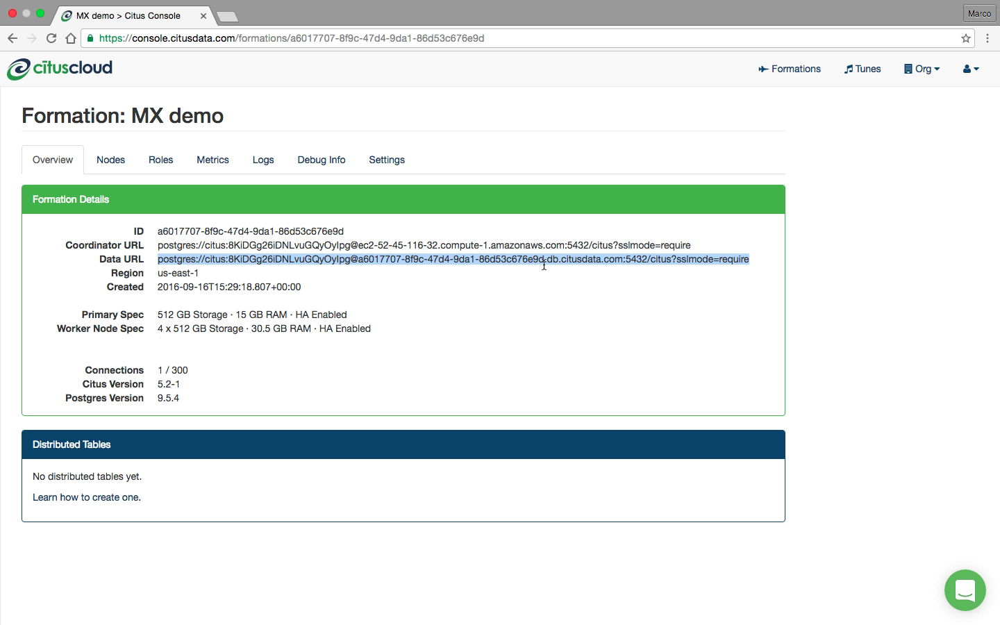

Performance
###########

.. _cloud_scaling:

Scaling
=======

Citus Cloud provides self-service scaling to deal with increased load. The web interface makes it easy to either add new worker nodes or increase existing nodes' memory and CPU capacity.

For most cases either approach to scaling is fine and will improve performance. However there are times you may want to choose one over the other. If the cluster is reaching its disk limit then adding more nodes is the best choice. Alternately, if there is still a lot of headroom on disk but performance is suffering, then scaling node RAM and processing power is the way to go.

Both adjustments are available in the formation configuration panel of the settings tab:

Clicking the node change link provides two sliders:

.. image:: ../images/cloud-nodes-slider.png

The first slider, **count**, scales out the cluster by adding new nodes. The second, **RAM**, scales it up by changing the instance size (RAM and CPU cores) of existing nodes.

For example, just drag the slider for node count:

.. image:: ../images/cloud-nodes-slider-2.png

After you adjust the sliders and accept the changes, Citus Cloud begins applying the changes. Increasing the number of nodes will begin immediately, whereas increasing node instance size will wait for a time in the user-specified maintenance window.

.. image:: ../images/cloud-maintenance-window.png

Citus Cloud will display a popup message in the console while scaling actions have begun or are scheduled. The message will disappear when the action completes.

For instance, when adding nodes:

.. image:: ../images/cloud-scaling-out.png

Or when waiting for node resize to begin in the maintenance window:

.. image:: ../images/cloud-scaling-up.png

Scaling Up (increasing node size)
---------------------------------

Resizing node size works by creating a PostgreSQL follower for each node, where the followers are provisioned with the desired amount of RAM and CPU cores. It takes an average of forty minutes per hundred gigabytes of data for the primary nodes' data to be fully synchronized on the followers. After the synchronization is complete, Citus Cloud does a quick switchover from the existing primary nodes to their followers which takes about two minutes. The creation and switchover process uses the same well-tested replication mechanism that powers Cloud's :ref:`ha` feature. During the switchover period clients may experience errors and have to retry queries, especially cross-tenant queries hitting multiple nodes.

.. _scaling_out:

Scaling Out (adding new nodes)
------------------------------

Node addition completes in five to ten minutes, which is faster than node resizing because the new nodes are created without data. To take advantage of the new nodes you still must adjust manually rebalance the shards, meaning move some shards from existing nodes to the new ones.

Citus does not automatically rebalance on node creation because shard rebalancing takes locks on rows whose shards are being moved, degrading write performance for other database clients. The slowdown isn't terribly severe because Citus moves data a shard (or a group of colocated shards) at a time while inserts to other shards can continue normally. However, for maximum control, the choice of when to run the shard rebalancer is left to the database administrator.

To start the shard rebalance, connect to the cluster coordinator node with psql and run:

.. code-block:: postgres

  SELECT rebalance_table_shards('distributed_table_name');

Citus will output the progress as it moves each shard.

.. note::

  The :code:`rebalance_table_shards` function rebalances all tables in the :ref:`colocation group <colocation_groups>` of the table named in its argument. Thus you do not have to call it for every single table, just call it on a representative table from each colocation group.

.. _mx:

Connections
===========

Each client connection to PostgreSQL consumes a noticeable amount of resources. To protect resource usage Citus Cloud enforces a hard limit of 300 concurrent connections to the coordinator node.

For further scaling we provide PgBouncer out of the box on Cloud. If your application requires more than 300 connections, change the port in the Cloud connection URL from 5432 to 6432. This will connect to PgBouncer rather than directly to the coordinator, allowing up to roughly two thousand simultaneous connections. The coordinator can still only process three hundred at a time, but more can connect and PgBouncer will queue them.

When connecting to PgBouncer you have:

- 1800 idle connections available
- 300 active connections to Citus available

To measure the number of active connections at a given time, run:

.. code-block:: postgresql

  SELECT COUNT(*)
    FROM pg_stat_activity
   WHERE state <> 'idle';

Masterless Mode (beta)
======================

Citus MX is a new version of Citus that adds the ability to use hash-distributed tables from any node in a Citus cluster, which allows you to scale out your query throughput by opening many connections across all the nodes. This is particularly useful for performing small reads and writes at a very high rate in a way that scales horizontally. Citus MX is currently available in private beta on `Citus Cloud <https://www.citusdata.com/product/cloud>`_.

Architecture
------------

In the Citus MX architecture, all nodes are PostgreSQL servers running the Citus extension. One node is acting as coordinator and the others as data nodes, each node also has a hot standby that automatically takes over in case of failure. The coordinator is the authoritative source of metadata for the cluster and data nodes store the actual data in shards. Distributed tables can only be created, altered, or dropped via the coordinator, but can be queried from any node. When making changes to a table (e.g. adding a column), the metadata for the distributed tables is propagated to the workers using PostgreSQL’s built-in 2PC mechanism and distributed locks. This ensures that the metadata is always consistent such that every node can run distributed queries in a reliable way.

Citus MX uses PostgreSQL’s own streaming replication, which allows a higher rate of writes on the shards as well as removing the need to perform all writes through a single leader node to ensure linearizability and consistency. From the Citus perspective, there is now only a single replica of each shard and it does not have to keep multiple replicas in sync, since streaming replication handles that. In the background, we monitor every node and automatically fail over to a hot standby in case of a failure.

Data Access
-----------

In Citus MX you can access your database in one of two ways: Either through the coordinator which allows you to create or change distributed tables, or via the data URL, which routes you to one of the data nodes on which you can perform regular queries on the distributed tables. These are also the nodes that hold the shards, the regular PostgreSQL tables in which the data is stored.

Supported operations on the coordinator are: Create/drop distributed table, shard rebalancer, DDL, DML, SELECT, COPY.

Supported operations on the data URL are: DML, SELECT, COPY.

If you connect to the data URL using `psql` and run `\\d`, then you will see all the distributed tables and some of the shards. Importantly, distributed tables are the same from all nodes, so it does not matter to which node you are routed when using the data URL when querying distributed tables. When performing a query on a distributed table, the right shard is determined based on the filter conditions and the query is forwarded to the node that stores the shard. If a query spans all the shards, it is parallelised across all the nodes.

For some advanced usages, you may want to perform operations on shards directly (e.g. add triggers). In that case, you can connect to each individual worker node rather than using the data URL. You can find the worker nodes hostnames by running `SELECT * FROM master_get_active_worker_nodes()` from any node and use the same credentials as the data URL.

A typical way of using MX is to manually set up tables via the coordinator and then making all queries via the data URL. An alternative way is to use the coordinator as your main application back-end, and use the data URL for data ingestion. The latter is useful if you also need to use some local PostgreSQL tables. We find both approaches to be viable in a production setting.

Scaling Out a Raw Events Table
------------------------------

A common source of high volume writes are various types of sensors reporting back measurements. This can include software-based sensors such as network telemetry, mobile devices, or hardware sensors in Internet-of-things applications. Below we give an example of how to set-up a write-scalable events table in Citus MX.

Since Citus is an PostgreSQL extension, you can use all the latest PostgreSQL 9.5 features, including JSONB and BRIN indexes. When sensors can generate different types of events, JSONB can be useful to represent different data structures. Brin indexes allow you to index data that is ordered by time in a compact way.

To create a distributed events table with a JSONB column and a BRIN index, we can run the following commands:

.. code::

  $ psql postgres://citus:pw@coordinator-host:5432/citus?sslmode=require

.. code:: sql

  CREATE TABLE events (
    device_id bigint not null,
    event_id uuid not null default uuid_generate_v4(),
    event_time timestamp not null default now(),
    event_type int not null default 0,
    payload jsonb,
    primary key (device_id, event_id)
  );
  CREATE INDEX event_time_idx ON events USING BRIN (event_time);
  SELECT create_distributed_table('events', 'device_id');

Once the distributed table is created, we can immediately start using it via the data URL and writes done on one node will immediately be visible from all the other nodes in a consistent way.

.. code::

  $ psql postgres://citus:pw@data-url:5432/citus?sslmode=require

.. code:: sql

  citus=> INSERT INTO events (device_id, payload)
  VALUES (12, '{"temp":"12.8","unit":"C"}');

  Time: 3.674 ms

SELECT queries that filter by a specific device_id are particularly fast, because Citus can route them directly to a single worker and execute them on a single shard.

.. code::

  $ psql postgres://citus:pw@data-url:5432/citus?sslmode=require

.. code:: sql

  citus=> SELECT event_id, event_time, payload FROM events WHERE device_id = 12 ORDER BY event_time DESC LIMIT 10;

  Time: 4.212 ms

As with regular Citus, you can also run analytical queries which are parallelized across the cluster:

.. code:: sql

  citus=>
  SELECT minute,
         min(temperature)::decimal(10,1) AS min_temperature,
         avg(temperature)::decimal(10,1) AS avg_temperature,
         max(temperature)::decimal(10,1) AS max_temperature
  FROM (
         SELECT date_trunc('minute', event_time) AS minute, (payload->>'temp')::float AS temperature
         FROM events WHERE event_time >= now() - interval '10 minutes'
  ) ev
  GROUP BY minute ORDER BY minute ASC;

  Time: 554.565

The ability to perform analytical SQL queries combined with high volume data ingestion uniquely positions Citus for real-time analytics applications.

An important aspect to consider is that horizontally scaling out your processing power ensures that indexes don’t necessarily become an ingestion bottleneck as your application grows. PostgreSQL has very powerful indexing capabilities and with the ability to scale out you can almost always get the desired read- and write-performance.

Limitations Compared to Citus
-----------------------------

All Citus 7.0 features are supported in Citus MX with the following exceptions:

Append-distributed tables currently cannot be made available from workers. They can still be used in the traditional way, with queries going through the coordinator. However, append-distributed tables already allowed you to :ref:`bulk_copy`.

When performing writes on a hash-distributed table with a bigserial column via the data URL, sequence numbers are no longer monotonic, but instead have the form <16-bit unique node ID><48-bit local sequence number> to ensure uniqueness. The coordinator node always has node ID 0, meaning it will generate sequence numbers as normal. Serial types smaller than bigserial cannot be used in distributed tables.
