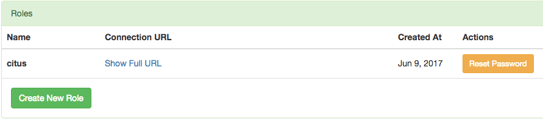
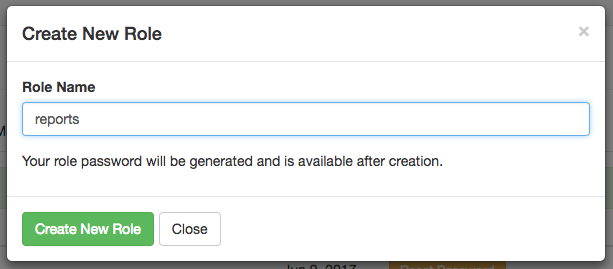
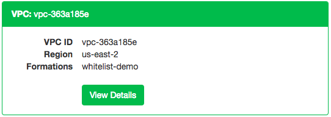
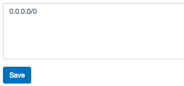

Security
########

Connecting with SSL
===================

For security Citus Cloud accepts only SSL connections, which is why the URL contains the :code:`?sslmode=require` parameter. Within the cluster, nodes also encrypt their communication with one another using SSL.

To avoid a man-in-the-middle attack when connecting to the coordinator node, clients can verify that the server certificate is correct. Download the official `Citus Cloud certificate <https://console.citusdata.com/citus.crt>`_ and refer to it in connection string parameters:

::

  ?sslrootcert=/location/to/citus.crt&sslmode=verify-full

The string may need to be quoted in your shell to preserve the ampersand.

.. note::

  Database clients must support SSL to connect to Citus Cloud. In particular :code:`psql` needs to be compiled :code:`--with-openssl` if building PostgreSQL from source.

Two-Factor Authentication
-------------------------

We support two factor authentication for all Citus accounts. You can enable it from within your Citus Cloud account. We support Google Authenticator and Authy as two primary apps for setting up your two factor authentication.

.. _cloud_roles:

Users and Permissions
=====================

As we saw above, every new Citus Cloud formation includes a user account called :code:`citus`. This account is great for creating tables and other DDL, but it has too much power for certain applications.

We'll want to create new roles for specialized purposes. For instance, a user with read-only access is perfect for a web/reporting tool. The Cloud console allows us to create a new user, and will set up a new password automatically. Go to the "Roles" tab and click "Create New Role."

It pops up a dialog where we will fill in the role name, which we can call :code:`reports`.

After creating the role on a fresh formation, there will be three roles:

.. code-block:: text

  ┌─[ RECORD 1 ]────────────────────────────────────────────────────────────┐
  │ Role name  │ citus                                                      │
  │ Attributes │                                                            │
  │ Member of  │ {reports}                                                  │
  ├─[ RECORD 2 ]────────────────────────────────────────────────────────────┤
  │ Role name  │ postgres                                                   │
  │ Attributes │ Superuser, Create role, Create DB, Replication, Bypass RLS │
  │ Member of  │ {}                                                         │
  ├─[ RECORD 3 ]────────────────────────────────────────────────────────────┤
  │ Role name  │ reports                                                    │
  │ Attributes │                                                            │
  │ Member of  │ {}                                                         │
  └────────────┴────────────────────────────────────────────────────────────┘

The new :code:`reports` role starts with no privileges, except "usage" on the public schema, meaning the ability to get a list of the tables etc inside. We have to specifically grant the role extra permissions to database objects. For instance, to allow read-only access to :code:`mytable`, connect to Citus as the :code:`citus` user with the connection string provided in the Cloud console and issue this command:

.. code-block:: postgresql

  -- run as the citus user

  GRANT SELECT ON mytable TO reports;

If ``mytable`` is in the public schema this will suffice. However if the table is in another schema, there is one more step. See :ref:`grant_usage` below.

You can confirm the privileges by consulting the information schema:

.. code-block:: postgresql

  SELECT grantee, privilege_type
    FROM information_schema.role_table_grants
   WHERE table_name = 'mytable';

::

  ┌─────────┬────────────────┐
  │ grantee │ privilege_type │
  ├─────────┼────────────────┤
  │ citus   │ INSERT         │
  │ citus   │ SELECT         │
  │ citus   │ UPDATE         │
  │ citus   │ DELETE         │
  │ citus   │ TRUNCATE       │
  │ citus   │ REFERENCES     │
  │ citus   │ TRIGGER        │
  │ reports │ SELECT         │
  └─────────┴────────────────┘

The PostgreSQL documentation has more detailed information about types of privileges you can `GRANT on database objects <https://www.postgresql.org/docs/current/static/sql-grant.html#SQL-GRANT-DESCRIPTION-OBJECTS>`_.

Citus Cloud also supports :ref:`rls` for greater control in a multi-tenant environment.

Granting Privileges in Bulk
---------------------------

Citus propagates single-table GRANT statements through the entire cluster, making them apply on all worker nodes. However GRANTs that are system-wide (e.g. for all tables in a schema) need to be applied individually to every data node using a Citus helper function.

.. code-block:: postgresql

  -- applies to the coordinator node
  GRANT SELECT ON ALL TABLES IN SCHEMA public TO reports;

  -- make it apply to workers as well
  SELECT run_command_on_workers(
    'GRANT SELECT ON ALL TABLES IN SCHEMA public TO reports;'
  );

.. _grant_usage:

Granting Access to Other Schemas
--------------------------------

By default, users cannot access objects in schemas they do not own. Note that by default, everyone has CREATE and USAGE privileges on the ``public`` schema. This allows all users that are able to connect to a given database to create objects in its ``public`` schema.

To allow object access in any other schema, the owner of the schema must grant the USAGE privilege on the schema.

.. code-block:: postgresql

  GRANT USAGE ON SCHEMA other_schema TO reports;

Even if the ``reports`` user has SELECT access on a table like ``other_schema.foo``, the user will not be able to select rows until they also have USAGE access on ``other_schema``.

Encryption at Rest
==================

All data within Citus Cloud is encrypted at rest, including data on the instance as well as all backups for disaster recovery. As mentioned in the connection section, we also require that you connect to your database with TLS.

.. _perimeter_controls:

Network Perimeter Controls
==========================

All Citus Cloud clusters run in their own isolated Amazon Virtual Private Cloud (VPC). In addition to the options discussed earlier, Citus Cloud provides the ability to further secure your cluster by limiting network access in two ways:

VPC Peering
-----------

VPC peering forms a network connection between two VPCs which routes traffic securely between them using private IPv4 addresses or IPv6 addresses. Instances in either VPC can communicate with each other as if they are within the same network. To set up a VPC peering connecting between an existing Citus Cloud formation and an Amazon VPC, open a support ticket and we will initiate the peering request.

IP Whitelisting
---------------

IP whitelisting restricts access to servers within a Citus Cloud cluster so that only designated IP addresses are able to connect to them, typically the addresses of application servers.

To enable IP whitelisting on your Citus Cloud formation, go to the VPCs tab in the Cloud Console:

Then find the VPC containing your formation and click View Details:

Finally, in the "IP Whitelist / Ingress Rules" tab, enter the allowable IP addresses or CIDR blocks, one per line.

The special address ``0.0.0.0/0`` means unrestricted access. Note that permitted connections still require a valid username and password to actually access your database.
