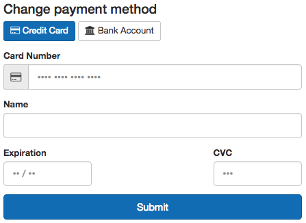

Support and Billing
###################

All Citus Cloud plans come with support included. Premium support including SLA around response time and phone escalation is available on a contract basis for customers that may need a more premium level of support.

Support
=======

Web based support is available on all Citus Cloud plans. You can open a `support inquiry <https://console.citusdata.com/support>`_ within the Citus Cloud console. Support response times for ticket classification of Citus Cloud are:

- Urgent (production database offline) - 1 hour response time
- High (production database impacted) - 4 hour response time
- Normal (general support) - 1 business day response time
- Low (general question) - 3 business days response time

Cloud Platform Status
=====================

Any events affecting the Citus Cloud platform as a whole are recorded on `status.citusdata.com <https://status.citusdata.com/>`_. This page shows a chart of recent uptime, as well as listing any past incidents.

Billing
=======

Pricing
-------

Citus Cloud bills on a per minute basis. We bill for a minimum of one hour of usage across all plans. Pricing varies based on the size and configuration of the cluster. A few factors that determine your price are:

- Size of your distributed nodes
- Number of distributed nodes
- Whether you have high availability enabled, both on the primary node and on distributed nodes
- Size of your primary node

You can see pricing of various configurations directly within our `pricing calculator <https://www.citusdata.com/pricing>`_.

Payments
--------

We accept payments through credit card or directly through bank ACH. To set up payment details, go to "Org" -> "Billing" in the main menu of the Cloud Console.

Then fill out the form for the desired payment option.

Credit Card Option
~~~~~~~~~~~~~~~~~~

Bank Account ACH
~~~~~~~~~~~~~~~~

.. image:: ../images/cloud-bill-ach.png

.. raw:: html

  
