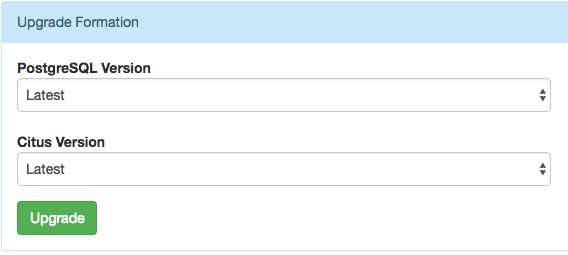
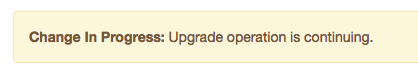
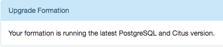

Upgrades
########

Regularly upgrading PostgreSQL and the Citus extension keeps you on top of all the latest features and bug fixes, and on Citus Cloud an upgrade is as easy as a few clicks of a button.  Just visit the Settings tab in the cloud console, and scroll down to the upgrade section:

.. note::

  We strongly recommend :ref:`forking <cloud_forking>` a formation and trying the upgrade on the fork before upgrading the production formation. It takes more time, but provides a dry run for the real upgrade.

You may want to set a maintenance window prior to starting an upgrade. Part of the upgrade process requires a few minutes of downtime, and setting a window will ensure that the downtime happens during a specific time of day. This option is available in the Settings tab of the cloud console.

.. image:: ../images/cloud-maintenance-window.png

When you do start the upgrade, Citus Cloud creates new servers for the coordinator and worker nodes with the requested software versions, and replays the write-ahead log from the original nodes to transfer data. This can take a fair amount of time depending on the amount of data in existing nodes. During the transfer, the formation overview tab will contain a notice:

When the new nodes have caught up (and during a maintenance window if one has been set), Citus Cloud switches over to the new nodes. During the period of redirection there may be a few minutes of downtime. After everything is done, the upgrade section in Settings will show:

If :ref:`high-availability replication <ha>` is enabled, Citus Cloud will automatically create new standby servers. However :ref:`follower replicas <cloud_followers>` will not receive the updates and must be manually destroyed and recreated.
