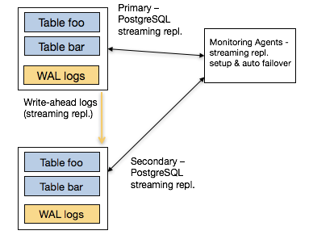
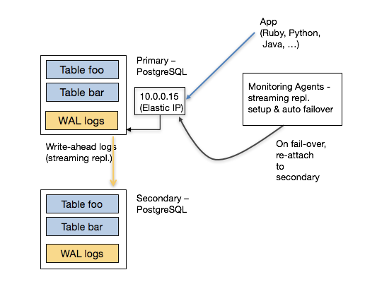
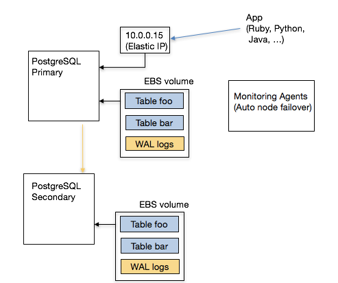
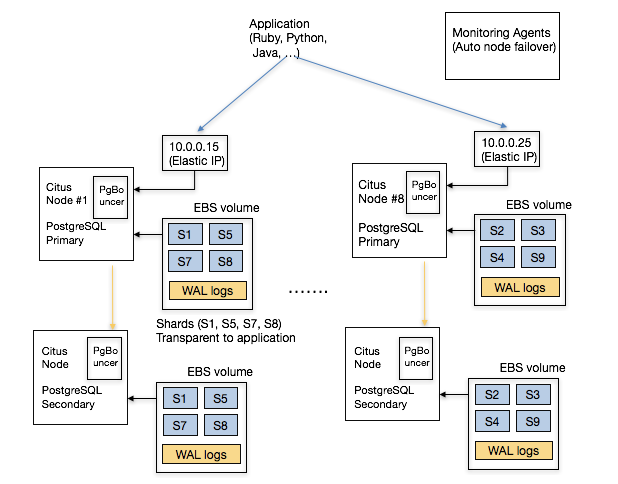
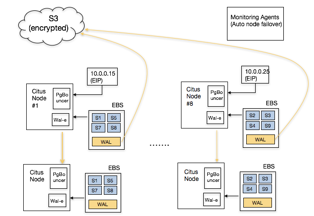
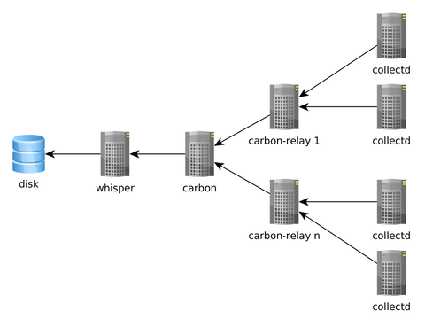
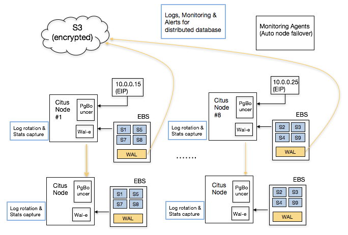

.. _why_cloud:

Why We Built Cloud
##################

One challenge associated with building a distributed relational database
(RDBMS) is that they require notable effort to deploy and operate. To
remove these operational barriers, we had been thinking about offering
Citus as a managed database for a long time.

Naturally, we were also worried that providing a native database
offering on AWS could split our startup’s focus and take up significant
engineering resources. (Honestly, if the founding engineers of the
Heroku PostgreSQL team didn’t join Citus, we might have decided to wait
on this.) Since making Citus Cloud publicly available, we are now more
bullish on the cloud then ever.

It turns out that targeting an important use case for your customers and
delivering it to them in a way that removes their pain points, matters
more than anything else. In this blog post, we’ll only focus on removing
operational pain points and not on use cases: Why is cloud changing the
way databases are delivered to customers? What AWS technologies Citus
Cloud is using to enable that in a unique way?

The following sections highlight our learnings from talking to hundreds
of prospective customers. Early on, we thought that our customers were
asking for something that was more magical than attainable -- Citus
should handle failovers in a way that’s transparent to the application,
elastically scale up and scale out, take automatic backups for disaster
recovery, have monitoring and alarms built in, and provide patches and
upgrades with no downtime.

We then started breaking down each customer conversation into smaller
pieces and found that our customers had seven operational pain points.
In the following, we’re going to talk about each one of these seven
points as a mini-learning. Although we describe these learnings in the
context of PostgreSQL, Citus, and AWS, they are also applicable to other
databases and cloud vendors.

Since Citus is an extension to PostgreSQL (not a fork), it makes sense
to start with a pain most PostgreSQL users have.

1. High Availability
~~~~~~~~~~~~~~~~~~~~

PostgreSQL provides `streaming
replication <https://www.postgresql.org/docs/current/static/warm-standby.html>`__
as a way to provide high availability since its v9.0 release. Streaming
replication works by designating one PostgreSQL instance as the primary
node. The primary node takes all writes and executes all changes against
the database. It then ships those changes to one or more secondary nodes
for them to apply.

When you talk to users who use streaming replication in production, they
express two pain points with it. The first is the complexity associated
with it: `it takes twelve
steps <https://wiki.postgresql.org/wiki/Streaming_Replication>`__ to
setup streaming replication, and you may also need to understand
concepts such as the number of wal segments and replication lag in the
process.

The second and more important one relates to auto failover. If the
primary node fails, how do you detect the failure and promote a
secondary to be the new primary? (In distributed systems, this is also
known as the leader election problem.) To enable this, you need a
monitoring component that watches the primary and secondary nodes and
reliably initiates their failovers.

A common way to do that is through integrating PostgreSQL streaming
replication with a distributed synchronization solution such as etcd or
ZooKeeper. In fact, open source solutions such as
`Governor <https://github.com/compose/governor>`__ and
`Patroni <https://github.com/zalando/patroni>`__ aim to do just that.
That said, this integration again comes with a complexity cost. You now
need to have someone in your organization who understands these systems
-- so that you can resolve any issues should they come up in production.

2. Effortless Failovers
~~~~~~~~~~~~~~~~~~~~~~~

Once the underlying HA solution provides auto failover capabilities, the
next question becomes this: "My PostgreSQL driver / ORM tool talks to an
IP address. When the primary node changes, do I need to add logic into
my application to detect this failover?"

PostgreSQL has a massive ecosystem that supports many programming
languages and frameworks. And most PostgreSQL clients don’t have a
mechanism to automatically retry different endpoints in case of a
failure. This either means that the user would need to implement this
logic into their application or the underlying database provides it for
them.

Fortunately, AWS provides powerful software defined networking (SDN)
primitives. You can therefore start by attaching an elastic IP to the
primary node. When your monitoring agent promotes a new secondary, you
can detach this elastic IP from the old primary and attach it to the
newly promoted machine. This way, the application doesn’t need to change
the endpoint it talks to -- it happens magically.

Having a powerful SDN stack also helps with consistency. When the
monitoring agent decides to failover the primary node, it can ask the
networking layer to no longer send traffic to the old primary. This is
also known as fencing -- making sure that you disabled the old primary
for all clients so that your data doesn’t diverge.

3. Vertical Scalability
~~~~~~~~~~~~~~~~~~~~~~~

Another feature request that we hear from customers is vertical
scalability. For example, you may want to instantly scale up CPU and
memory resources on your database before you scale out. AWS’ Elastic
Block Storage (EBS) enables you to quickly detach from one EC2 instance
and attach to another instance that has more resources.

EBS also provides security and availability benefits. When an EC2
instance observes a temporary failure, one for example requires an
instance restart, you don’t have any guarantees on whether you will get
the same instance back (or someone else will). With an EBS volume, you
can encrypt the data at rest and securely wipe out an EBS volume before
terminating it.

One known drawback to attaching storage over the network, instead of
using your local storage, is performance. If your working set doesn’t
fit into memory, your database will pay the penalty of constantly
fetching data over the network. Further, as your business grows, your
expectations from the underlying database will continue to increase. In
that case, you will need your database to scale out.

4. Horizontal Scalability
~~~~~~~~~~~~~~~~~~~~~~~~~

Deploying a distributed RDBMS into production requires a good
understanding of both relational databases and distributed systems. This
knowledge becomes important in two ways:

1. Data modeling: When you’re modeling your data for a distributed
   environment, you need to pick the right sharding keys for your tables
   for example.
2. Operational: You need to set up multiple instances and the networking
   layer between them. More importantly, you need to have an
   understanding of load management and networking so that you can take
   the right action.

Running your database on the cloud removes significant operational
burden associated with deploying a distributed RDBMS. In particular,
Citus Cloud can differentiate between temporary and permanent failures
by tracking historical networking data. It can also deprovision faulty
instances and start up new ones in their place, without any involvement
from the user. Further, if your database needs to more power, you can
elastically add more machines to your cluster.

Other operational benefits show themselves with high read/write
throughputs. For example, you may need your application to talk to
multiple endpoints instead of just one. In this case, Citus Cloud can
set up DNS in front of your database instances and configure
`PgBouncer <https://pgbouncer.github.io/>`__ to make sure that your
distributed database stays within reasonable connection limits. The
following shows a simplified architecture diagram.

5. Automatic Backups for Disaster Recovery
~~~~~~~~~~~~~~~~~~~~~~~~~~~~~~~~~~~~~~~~~~

If your relational database powers your core business, and acts as your
system of record, you need to take regular backups and store those
backups in a highly durable location. This way, when the unexpected
happens, you can resume your business and not lose it. Therefore, an
integrated solution for disaster recovery is among the top feature
requests prospective Citus customers ask for.

The thing about database backups is that they are hard to get right.
Fortunately, PostgreSQL has a rich ecosystem and comes with open source
technologies for automatic backups. For example,
`wal-e <https://github.com/wal-e/wal-e>`__ encrypts and continuously
archives your data to a durable storage service, such as S3. In other
words, wal-e make sure that your backup solution does the right thing,
and cloud service providers make sure that your backups don’t get lost.

For Citus backups, wal-e helps with part of the picture. Taking
distributed database backups are even harder. In this case, it helps
when the author of wal-e also happens to be part of the Citus Cloud
team. This way, when you deploy a Citus Cloud formation, we can
automatically set up regular backups for your distributed database.

6. Monitoring, Alerts, and Logging
~~~~~~~~~~~~~~~~~~~~~~~~~~~~~~~~~~

An important part of running a relational database in production
includes monitoring your database, alerting on anomalies, and setting up
a unified logging infrastructure. This seems simple at first, but
setting up this infrastructure usually takes time to set up and operate.

At a minimum, you need to decide on the type of metrics you’d like to
track. Some common ones include hardware metrics (such as CPU, memory,
network), OS level statistics (VM, RSS, page faults), PostgreSQL metrics
(pg\_stat views, table and index hit ratios), and active and long
running queries.

Once you decide on these metrics, you need to have a daemon that
periodically collects these metrics, a solution to serialize and store
these metrics, and a visualization layer to display them. A common stack
that accomplishes this can run collectd on database instances, Graphite
to store them, and Grafana to display them.

If you’re thinking of setting up a monitoring infrastructure for
PostgreSQL, two good resources to read are Compose’s blog post on
`monitoring
PostgreSQL <https://www.compose.com/articles/elephant-watching-monitoring-postgresql/>`__
and Sebastien’s presentation at PGConf.EU on `Watching
Elephants <https://wiki.postgresql.org/images/b/bc/Pgconfeu12-collectd%2Bpsql.pdf>`__.
It’s also worth looking at projects that take a more PostgreSQL centric
approach to monitoring, such as
`PgBadger <https://github.com/dalibo/pgbadger>`__ and
`pganalyze <https://pganalyze.com/>`__.

Naturally, setting up a monitoring and logging infrastructure for a
distributed RDBMS requires more effort than a single node one. In this
case, we were lucky to have pganalyze’s author as part of the Citus
Cloud team. We also only needed to provide this only on the AWS platform
and that helped us deliver production-grade monitoring much simple.

7. Auto-configure, patch, and upgrade
~~~~~~~~~~~~~~~~~~~~~~~~~~~~~~~~~~~~~

Most PostgreSQL power users have three more questions when it comes to
running their database in production: configuration, deploying security
and bug fix patches, and upgrading a database to a new version --
preferably with no downtime.

If you have a solid DBA, they are already turning these knobs for you
and deploying new versions without you knowing about it. If you don’t,
`The Accidental DBA <https://www.youtube.com/watch?v=qoQRGl_P2aQ>`__
tutorial provides a good introduction on these topics. That said, you
will need to keep on learning more as your database’s scale increases.
And with bigger scale, tuning the right settings in postgresql.conf,
deploying patches, and upgrading to newer versions will become more
important and require deeper database know-how.

Providing a database on the cloud significantly helps deploying patches
and new versions -- since Citus Cloud has hundreds of these machines
running in production, we can automate how to deploy new versions in the
way they should be. Citus Cloud can also override certain
postgresql.conf fields by examining the underlying hardware
configuration and workload characteristics.

Conclusion
~~~~~~~~~~

When we started Citus, we used to think that databases were about
databases and we just needed to scale out the RDBMS. After talking to
hundreds of customers, we realized that databases were also about native
integration with applications, use cases, and operations.

At Citus, as we provided better integration with PostgreSQL drivers and
tools, and focused on use cases, we started hearing more questions on
the operational components. The seven questions above became part of
everyday conversation.

And answering these questions without offering costly services and
training work was hard. When a prospective customer asked us about how
to handle failover without changing IP addresses, take automatic
backups, integrate with monitoring and logging tools, upgrade their
PostgreSQL version with no downtime, or elastically scale out their
cluster by adding more machines, we’d tell them about the work involved.
In fact, there were calls where we quoted $300K for the services work,
and never heard from that user again.

That’s the really exciting part about Citus Cloud. These days, when we
hear the same questions, we smile and ask our users to simply click a
button. Behind the covers, Citus Cloud deploys a production grade
distributed database, one that natively integrates with PostgreSQL. What
was once only accessible to large enterprises with solutions such as
Oracle RAC, is now becoming accessible to everyone with open source
technologies like PostgreSQL and
`Citus <https://github.com/citusdata/citus>`__, and the cloud.
