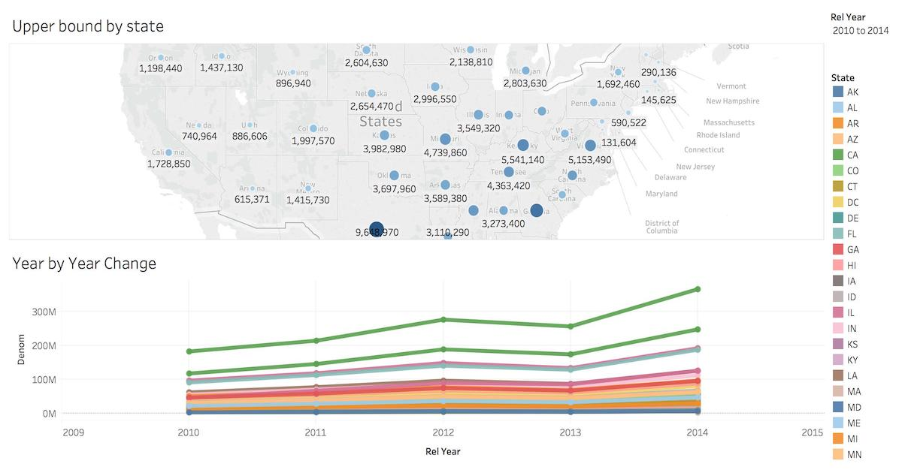

External Integrations
#####################

Ingesting Data from Kafka
=========================

Citus can leverage existing Postgres data ingestion tools. For instance, we can use a tool called `kafka-sink-pg-json <https://github.com/justonedb/kafka-sink-pg-json>`_ to copy JSON messages from a Kafka topic into a database table. As a demonstration, we'll create a ``kafka_test`` table and ingest data from the ``test`` topic with a custom mapping of JSON keys to table columns.

The easiest way to experiment with Kafka is using the `Confluent platform <https://www.confluent.io/product/confluent-platform/>`_, which includes Kafka, Zookeeper, and associated tools whose versions are verified to work together.

.. code-block:: bash

  # we're using Confluent 2.0 for kafka-sink-pg-json support
  curl -L http://packages.confluent.io/archive/2.0/confluent-2.0.0-2.11.7.tar.gz \
    | tar zx

  # Now get the jar and conf files for kafka-sink-pg-json
  mkdir sink
  curl -L https://github.com/justonedb/kafka-sink-pg-json/releases/download/v1.0.2/justone-jafka-sink-pg-json-1.0.zip -o sink.zip
  unzip -d sink $_ && rm $_

The download of kafka-sink-pg-json contains some configuration files. We want to connect to the coordinator Citus node, so we must edit the configuration file ``sink/justone-kafka-sink-pg-json-connector.properties``:

.. code-block:: sh

  # add to sink/justone-kafka-sink-pg-json-connector.properties

  # the kafka topic we will use
  topics=test

  # db connection info
  # use your own settings here
  db.host=localhost:5432
  db.database=postgres
  db.username=postgres
  db.password=bar

  # the schema and table we will use
  db.schema=public
  db.table=kafka_test

  # the JSON keys, and columns to store them
  db.json.parse=/@a,/@b
  db.columns=a,b

Notice ``db.columns`` and ``db.json.parse``. The elements of these lists match up, with the items in ``db.json.parse`` specifying where to find values inside incoming JSON objects.

.. note::

  The paths in ``db.json.parse`` are written in a language that allows some flexibility in getting values out of JSON. Given the following JSON,

  .. code-block:: json

    {
      "identity":71293145,
      "location": {
        "latitude":51.5009449,
        "longitude":-2.4773414
      },
      "acceleration":[0.01,0.0,0.0]
    }

  here are some example paths and what they match:

  * ``/@identity`` - the path to element 71293145.
  * ``/@location/@longitude`` - the path to element -2.4773414.
  * ``/@acceleration/#0`` - the path to element 0.01
  * ``/@location`` - the path to element ``{"latitude":51.5009449, "longitude":-2.4773414}``

Our own scenario is simple. Our events will be objects like ``{"a":1, "b":2}``. The parser will pull those values into eponymous columns.

Now that the configuration file is set up, it's time to prepare the database. Connect to the coordinator node with psql and run this:

.. code-block:: psql

  -- create metadata tables for kafka-sink-pg-json
  \i sink/install-justone-kafka-sink-pg-1.0.sql

  -- create and distribute target ingestion table
  create table kafka_test ( a int, b int );
  select create_distributed_table('kafka_test', 'a');

Start the Kafka machinery:

.. code-block:: bash

  # save some typing
  export C=confluent-2.0.0

  # start zookeeper
  $C/bin/zookeeper-server-start \
    $C/etc/kafka/zookeeper.properties

  # start kafka server
  $C/bin/kafka-server-start \
    $C/etc/kafka/server.properties

  # create the topic we'll be reading/writing
  $C/bin/kafka-topics --create --zookeeper localhost:2181   \
                      --replication-factor 1 --partitions 1 \
                      --topic test

Run the ingestion program:

.. code-block:: bash

  # the jar files for this are in "sink"
  export CLASSPATH=$PWD/sink/*

  # Watch for new events in topic and insert them
  $C/bin/connect-standalone \
    sink/justone-kafka-sink-pg-json-standalone.properties \
    sink/justone-kafka-sink-pg-json-connector.properties

At this point Kafka-Connect is watching the ``test`` topic, and will parse events there and insert them into ``kafka_test``. Let's send an event from the command line.

.. code-block:: bash

  echo '{"a":42,"b":12}' | \
    $C/bin/kafka-console-producer --broker-list localhost:9092 --topic test

After a small delay the new row will show up in the database.

::

  select * from kafka_test;

  ┌────┬────┐
  │ a  │ b  │
  ├────┼────┤
  │ 42 │ 12 │
  └────┴────┘

Caveats
-------

* At the time of this writing, kafka-sink-pg-json requires Kafka version 0.9 or earlier.
* The kafka-sink-pg-json connector config file does not provide a way to connect with SSL support, so this tool will not work with our :ref:`cloud_topic`, which requires secure connections.
* A malformed JSON string in the Kafka topic will cause the tool to become stuck. Manual intervention in the topic is required to process more events.

Ingesting Data from Spark
=========================

People sometimes use Spark to transform Kafka data, such as by adding computed values. In this section we'll see how to ingest Spark dataframes into a distributed Citus table.

First let's start a local Spark cluster. It has several moving parts, so the easiest way is to run the pieces with docker-compose.

.. code-block:: bash

  wget https://raw.githubusercontent.com/gettyimages/docker-spark/master/docker-compose.yml

  # this may require "sudo" depending on the docker daemon configuration
  docker-compose up

To do the ingestion into PostgreSQL, we'll be writing custom Scala code. We'll use the Scala Build Tool (SBT) to load dependencies and run our code, so `download SBT <https://www.scala-sbt.org/download.html>`_ and install it on your machine.

Next create a new directory for our project.

.. code-block:: bash

  mkdir sparkcitus

Create a file called ``sparkcitus/build.sbt`` to tell SBT our project configuration, and add this:

.. code-block:: scala

  // add this to build.sbt

  name := "sparkcitus"
  version := "1.0"

  scalaVersion := "2.10.4"

  resolvers ++= Seq(
    "Maven Central" at "http://central.maven.org/maven2/"
  )

  libraryDependencies ++= Seq(
    "org.apache.spark" %% "spark-core" % "2.2.1",
    "org.apache.spark" %% "spark-sql"  % "2.2.1",
    "org.postgresql"   %  "postgresql" % "42.2.2"
  )

Next create a helper Scala class for doing ingestion through JDBC. Add the following to ``sparkcitus/copy.scala``:

.. code-block:: scala

  import java.io.InputStream
  import java.sql.DriverManager
  import java.util.Properties

  import org.apache.spark.sql.{DataFrame, Row}
  import org.postgresql.copy.CopyManager
  import org.postgresql.core.BaseConnection

  object CopyHelper {

    def rowsToInputStream(rows: Iterator[Row]): InputStream = {
      val bytes: Iterator[Byte] = rows.map { row =>
        (row.toSeq
          .map { v =>
            if (v == null) {
              """\N"""
            } else {
              "\"" + v.toString.replaceAll("\"", "\"\"") + "\""
            }
          }
          .mkString("\t") + "\n").getBytes
      }.flatten

      new InputStream {
        override def read(): Int =
          if (bytes.hasNext) {
            bytes.next & 0xff // make the signed byte an unsigned int
          } else {
            -1
          }
      }
    }

    def copyIn(url: String, df: DataFrame, table: String):Unit = {
      var cols = df.columns.mkString(",")

      df.foreachPartition { rows =>
        val conn = DriverManager.getConnection(url)
        try {
          val cm = new CopyManager(conn.asInstanceOf[BaseConnection])
          cm.copyIn(
            s"COPY $table ($cols) " + """FROM STDIN WITH (NULL '\N', FORMAT CSV, DELIMITER E'\t')""",
            rowsToInputStream(rows))
          ()
        } finally {
          conn.close()
        }
      }
    }
  }

Continuing the setup, save some sample data into ``people.json``. Note the intentional lack of surrounding square brackets. Later we'll create a Spark dataframe from the data.

.. code-block:: js

  {"name":"Tanya Rosenau"   , "age": 24},
  {"name":"Rocky Slay"      , "age": 85},
  {"name":"Tama Erdmann"    , "age": 48},
  {"name":"Jared Olivero"   , "age": 42},
  {"name":"Gudrun Shannon"  , "age": 53},
  {"name":"Quentin Yoon"    , "age": 32},
  {"name":"Yanira Huckstep" , "age": 53},
  {"name":"Brendon Wesley"  , "age": 19},
  {"name":"Minda Nordeen"   , "age": 79},
  {"name":"Katina Woodell"  , "age": 83},
  {"name":"Nevada Mckinnon" , "age": 65},
  {"name":"Georgine Mcbee"  , "age": 56},
  {"name":"Mittie Vanetten" , "age": 17},
  {"name":"Lecia Boyett"    , "age": 37},
  {"name":"Tobias Mickel"   , "age": 69},
  {"name":"Jina Mccook"     , "age": 82},
  {"name":"Cassidy Turrell" , "age": 37},
  {"name":"Cherly Skalski"  , "age": 29},
  {"name":"Reita Bey"       , "age": 69},
  {"name":"Keely Symes"     , "age": 34}

Finally, create and distribute a table in Citus:

.. code-block:: sql

  create table spark_test ( name text, age integer );
  select create_distributed_table('spark_test', 'name');

Now we're ready to hook everything together. Start up ``sbt``:

.. code-block:: bash

  # run this in the sparkcitus directory

  sbt

Once inside sbt, compile the project and then go into the "console" which is a Scala repl that loads our code and dependencies:

.. code-block:: text

  sbt:sparkcitus> compile
  [success] Total time: 3 s

  sbt:sparkcitus> console
  [info] Starting scala interpreter...

  scala> 

Type these Scala commands into the console:

.. code-block:: scala

  // inside the sbt scala interpreter

  import org.apache.spark.sql.SparkSession

  // open a session to the Spark cluster
  val spark = SparkSession.builder().appName("sparkcitus").config("spark.master", "local").getOrCreate()

  // load our sample data into Spark
  val df = spark.read.json("people.json")

  // this is a simple connection url (it assumes Citus
  // is running on localhost:5432), but more complicated
  // JDBC urls differ subtly from Postgres urls, see:
  // https://jdbc.postgresql.org/documentation/head/connect.html
  val url = "jdbc:postgresql://localhost/postgres"

  // ingest the data frame using our CopyHelper class
  CopyHelper.copyIn(url, df, "spark_test")

This uses the CopyHelper to ingest the ionformation. At this point the data will appear in the distributed table.

.. note::

  Our method of ingesting the dataframe is straightforward but doesn't protect against Spark errors. Spark guarantees "at least once" semantics, i.e. a read error can cause a subsequent read to encounter previously seen data.

  A more complicated, but robust, approach is to use the custom Spark partitioner `spark-citus <https://github.com/koeninger/spark-citus>`_ so that partitions match up exactly with Citus shards. This allows running transactions directly on worker nodes which can rollback on read failure. See the presentation linked in that repository for more information.

Business Intelligence with Tableau
==================================

`Tableau <https://www.tableau.com/>`_ is a popular business intelligence and analytics tool for databases. Citus and Tableau provide a seamless experience for performing ad-hoc reporting or analysis.

You can now interact with Tableau using the following steps.

* Choose PostgreSQL from the "Add a Connection" menu.

  .. image:: ../images/tableau-add-connection.png
    :alt: postgres option selected in menu
* Enter the connection details for the coordinator node of your Citus cluster. (Note if you're connecting to our :ref:`cloud_topic` you must select "Require SSL.")

  .. image:: ../images/tableau-connection-details.png
    :alt: postgres connection details form
* Once you connect to Tableau, you will see the tables in your database. You can define your data source by dragging and dropping tables from the “Table” pane. Or, you can run a custom query through “New Custom SQL”.
* You can create your own sheets by dragging and dropping dimensions, measures, and filters. You can also create an interactive user interface with Tableau. To do this, Tableau automatically chooses a date range over the data. Citus can compute aggregations over this range in human real-time.

