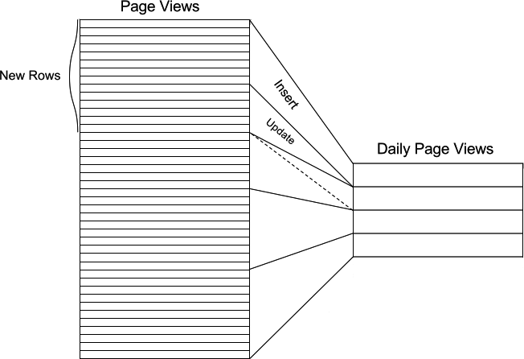

.. _dml:

Ingesting, Modifying Data (DML)
###############################

The following code snippets use the distributed tables example dataset, see :ref:`ddl`.

Inserting Data
--------------

Single row inserts
$$$$$$$$$$$$$$$$$$

To insert data into distributed tables, you can use the standard PostgreSQL `INSERT <http://www.postgresql.org/docs/9.6/static/sql-insert.html>`_ commands. As an example, we pick two rows randomly from the Github Archive dataset.

::

    INSERT INTO github_events VALUES (2489373118,'PublicEvent','t',24509048,'{}','{"id": 24509048, "url": "https://api.github.com/repos/SabinaS/csee6868", "name": "SabinaS/csee6868"}','{"id": 2955009, "url": "https://api.github.com/users/SabinaS", "login": "SabinaS", "avatar_url": "https://avatars.githubusercontent.com/u/2955009?", "gravatar_id": ""}',NULL,'2015-01-01 00:09:13'); 

    INSERT INTO github_events VALUES (2489368389,'WatchEvent','t',28229924,'{"action": "started"}','{"id": 28229924, "url": "https://api.github.com/repos/inf0rmer/blanket", "name": "inf0rmer/blanket"}','{"id": 1405427, "url": "https://api.github.com/users/tategakibunko", "login": "tategakibunko", "avatar_url": "https://avatars.githubusercontent.com/u/1405427?", "gravatar_id": ""}',NULL,'2015-01-01 00:00:24'); 

When inserting rows into distributed tables, the distribution column of the row being inserted must be specified. Based on the distribution column, Citus determines the right shard to which the insert should be routed to. Then, the query is forwarded to the right shard, and the remote insert command is executed on all the replicas of that shard.

Bulk loading
$$$$$$$$$$$$

Sometimes, you may want to bulk load several rows together into your distributed tables. To bulk load data from a file, you can directly use `PostgreSQL's \\COPY command <http://www.postgresql.org/docs/current/static/app-psql.html#APP-PSQL-META-COMMANDS-COPY>`_.

For example:

::

    \COPY github_events FROM 'github_events-2015-01-01-0.csv' WITH (format CSV)

.. note::

    There is no notion of snapshot isolation across shards, which means that a multi-shard SELECT that runs concurrently with a COPY might see it committed on some shards, but not on others. If the user is storing events data, he may occasionally observe small gaps in recent data. It is up to applications to deal with this if it is a problem (e.g.  exclude the most recent data from queries, or use some lock).

    If COPY fails to open a connection for a shard placement then it behaves in the same way as INSERT, namely to mark the placement(s) as inactive unless there are no more active placements. If any other failure occurs after connecting, the transaction is rolled back and thus no metadata changes are made.

INSERT INTO ... SELECT
$$$$$$$$$$$$$$$$$$$$$$

Citus is commonly used to scale out event data pipelines and populate real-time dashboards. These applications require fast queries across predefined aggregations of incoming data. One way to make these queries fast is calculating and saving aggregates ahead of time. This is called "rolling up" the data and it avoids the cost of processing raw data at run-time. As an extra benefit, rolling up timeseries data into hourly or daily statistics can also save space. Old data may be deleted when its full details are no longer needed and aggregates suffice.

INSERT INTO SELECT uses the results of a select query to populate a table. While PostgreSQL supports inserting from any table into any other, Citus requires the source and destination table to be `co-located <colocation_groups>`_.  To see the insert in action, consider a simple select statement which counts the number of web page views per page per day.

.. code-block:: postgres

  -- Assuming the existence of a "page_views" table

  SELECT view_time::date AS day, site_id, url,
         count(*) AS view_count
  FROM page_views
  GROUP BY view_time::date, site_id, url;

We can create a rollup table :code:`daily_page_views` to hold these results and fill it with the results of the previous query:

.. code-block:: postgres

  CREATE TABLE daily_page_views (
    site_id int,
    day date,
    url text,
    view_count bigint,
    primary key (site_id, day, url)
  );

  INSERT INTO daily_page_views (day, site_id, url, view_count)
    -- this is our original select query
    SELECT view_time::date AS day, site_id, url,
           count(*) AS view_count
    FROM page_views
    GROUP BY view_time::date, site_id, url;

These are the basics of using INSERT INTO SELECT on a single node database. Using it effectively in Citus for real-time analytics requires more understanding of Citus' distributed query execution. Citus implements INSERT INTO SELECT by pushing down the select query to each shard. When the destination table for inserted values is distributed by analogous column as the table being selected then the inserting and selecting can be "co-located" together on each shard. This minimizes network traffic between nodes and allows highly parallel execution.

To run rollups on Citus ensure that:

- The tables queried and inserted are distributed by analogous columns
- The select query includes the distribution column
- The insert statement includes the distribution column
- GROUP BY includes the distribution column

The example query shown above will work well if :code:`page_views` and :code:`daily_page_views` are distributed by :code:`site_id` column. Distributing our data per site allows rollup to scale as new sites are added to the system.

.. code-block:: postgres

  SELECT create_distributed_table('page_views', 'site_id');
  SELECT create_distributed_table('daily_page_views', 'site_id');

Rollups keep statistics queries fast but do require upkeep. New items must be periodically added or existing entries updated. In order that this periodic update be fast we need to do it *incrementally*, meaning without having to re-scan the entire underlying dataset (as, for instance, a materialized view would require). PostgreSQL's upsert feature is what we need, and it even parallelizes in Citus.

Suppose we have already rolled up visits happening before a certain timestamp (we'll call it :code:`$1`) and want to update the rollups to include more recent views. To do this we add a WHERE clause to select visits after the timestamp, and specify "ON CONFLICT" to adjust any daily view aggregates the new data affects. The latter is PostgreSQL's technique for doing `upserts <https://www.postgresql.org/docs/9.5/static/sql-insert.html#SQL-ON-CONFLICT>`_.

.. code-block:: postgres

  INSERT INTO daily_page_views (day, site_id, url, view_count)
    -- this is our original select query
    SELECT view_time::date AS day, site_id, url,
           count(*) AS view_count
    FROM page_views
    WHERE view_time >= $1
    GROUP BY view_time::date, site_id, url;
    ON CONFLICT (day, url, site_id) DO UPDATE SET
      view_count = daily_page_views.view_count + EXCLUDED.view_count;

There are a few things to be aware of when running distributed INSERT INTO SELECTs. First, Citus takes locks to ensure consistency when the :ref:`replication_factor` is greater than one. Specifying :code:`SET LOCAL citus.all_modifications_commutative TO on;` avoids strict locking and provides better throughput. It is only prudent to enable this setting when inserts are known to have no effect on an ongoing rollup.

Next, bear in mind that any functions in the select statement for insertion must be immutable. Stable functions are not allowed, and volatile functions are certainly not allowed. The PostgreSQL docs explain the difference between these `volatility categories <https://www.postgresql.org/docs/current/static/xfunc-volatility.html>`_. For example, inserting the value :code:`now()` across workers with replication factor greater than one would occur at different times across the replicas. One surprising way that stable functions can sneak in is through timestamps with timezones (:code:`timestamptz`). Functions dealing with timezones rely implicitly on the timezone configuration parameter and hence are marked stable rather than immutable.

Single-Shard Updates and Deletion
---------------------------------

You can also update or delete rows from your tables, using the standard PostgreSQL `UPDATE <http://www.postgresql.org/docs/9.6/static/sql-update.html>`_ and `DELETE <http://www.postgresql.org/docs/9.6/static/sql-delete.html>`_ commands.

::

    UPDATE github_events SET org = NULL WHERE repo_id = 24509048;
    DELETE FROM github_events WHERE repo_id = 24509048;

Currently, Citus requires that standard UPDATE or DELETE statements involve exactly one shard. This means commands must include a WHERE qualification on the distribution column that restricts the query to a single shard. Such qualifications usually take the form of an equality clause on the table’s distribution column. To update or delete across shards see the section below.

Cross-Shard Updates and Deletion
--------------------------------

The most flexible way to modify or delete rows throughout a Citus cluster is the master_modify_multiple_shards command. It takes a regular SQL statement as argument and runs it on all workers:

::

  SELECT master_modify_multiple_shards(
    'DELETE FROM github_events WHERE repo_id IN (24509048, 24509049)');

This uses a two-phase commit to remove or update data safely everywhere. Unlike the standard UPDATE statement, Citus allows it to operate on more than one shard. To learn more about the function, its arguments and its usage, please visit the :ref:`user_defined_functions` section of our documentation.

Maximizing Write Performance
----------------------------

Both INSERT and UPDATE/DELETE statements can be scaled up to around 50,000 queries per second on large machines. However, to achieve this rate, you will need to use many parallel, long-lived connections and consider how to deal with locking. For more information, you can consult the :ref:`scaling_data_ingestion` section of our documentation.
