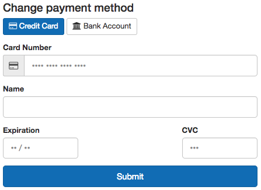

:orphan:

.. Declare these images as dependencies so that
.. sphinx copies them. It can't detect them in
.. the raw html code where they appear in other docs

.. image:: ../images/citus-docs-og-logo.png
  :width: 0%

