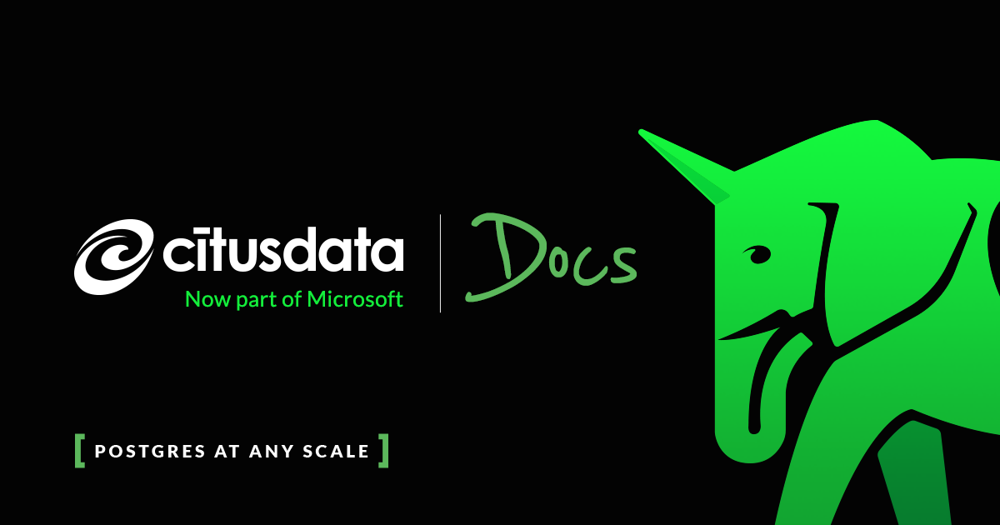

:orphan:

.. Declare these images as dependencies so that
.. sphinx copies them. It can't detect them in
.. the raw html code where they appear in other docs

.. image:: ../images/icons/number-one.png
  :width: 0%
.. image:: ../images/icons/use-cases.png
  :width: 0%
.. image:: ../images/icons/migrating.png
  :width: 0%
.. image:: ../images/icons/cloud.png
  :width: 0%
.. image:: ../images/icons/reference.png
  :width: 0%

.. image:: ../images/logo.png
  :width: 0%

.. image:: ../images/cloud-bill-credit.png
  :width: 0%

