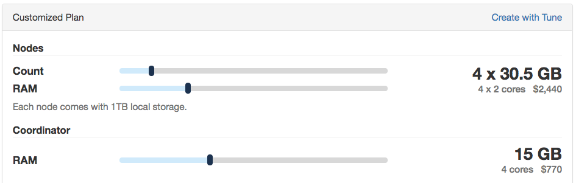

:orphan:

.. _citus_write_throughput_benchmark:

Benchmark Setup with Citus and pgbench
--------------------------------------

In this section, we provide step by step instructions to benchmark Citus' write throughput. For these benchmark steps, we use `Citus Cloud <https://www.citusdata.com/cloud>`_ to create test clusters, and a standard benchmarking tool called `pgbench  <https://www.postgresql.org/docs/current/static/pgbench.html>`_.

.. NOTE::

   We are no longer onboarding new users to Citus Cloud on AWS. If you’re new
   to Citus, the good news is, Citus is still available to you: as open source,
   and in the cloud on Microsoft Azure, as a fully-integrated deployment option.

   See :ref:`cloud_topic`.

If you're interested in general throughput numbers based on these tests, you can also find them in :ref:`scaling_data_ingestion`.

Create Citus Cluster
~~~~~~~~~~~~~~~~~~~~

The easiest way to start a Citus Cluster is by vising the Citus Cloud dashboard. This dashboard allows you to choose different coordinator and worker node configurations and charges you by the hour. Once you picked your desired cluster setup, click on the "Create New Formation" button.

A pop-up will ask you the AWS region (US East, US West) where your formation will be created. Please remember the region where you created your Citus Cloud formation. We will use it in the next step.

Please note that Citus Cloud automatically tunes your cluster based on your hardware configuration. If you're planning to run the following steps on your own cluster, you will need to manully increase :code:`max_connections = 300` on the coordinator and worker nodes.

Create an Instance to Run pgbench
~~~~~~~~~~~~~~~~~~~~~~~~~~~~~~~~~~

pgbench is a standard benchmarking tool provided by PostgreSQL. pgbench repeatedly runs given SQL commands and measures the number of completed transactions per second.

Since pgbench itself consumes CPU power, we recommend running it on a separate machine than those running your Citus cluster. pgbench's own documentation also points out that putting it on the same machine as the tested database can skew test results.

In these tests, we're therefore going to create a separate EC2 instance to run pgbench, and place the instance in the same AWS region as our Citus cluster. We will also use a large EC2 (m4.16xlarge) instance to ensure pgbench itself doesn't become the performance bottleneck.

Install pgbench
~~~~~~~~~~~~~~~

Once we create a new EC2 instance, we need to install pgbench on this instance. Please note that pgbench 10 will run across all Citus versions and that the instructions below assume that you're using pgbench 10.

* For **Debian** based system:

  .. code-block:: bash

    sudo sh -c 'echo "deb http://apt.postgresql.org/pub/repos/apt/ $(lsb_release -cs)-pgdg main" > /etc/apt/sources.list.d/pgdg.list'
    sudo apt-get install wget ca-certificates
    wget --quiet -O - https://www.postgresql.org/media/keys/ACCC4CF8.asc | sudo apt-key add -
    sudo apt-get update
    sudo apt-get install postgresql-10

* For **RedHat** based system:

  Follow the `yum installation guide <https://www.postgresql.org/download/linux/redhat/>`_.

Benchmark INSERT Throughput
---------------------------

Initialize and Distribute Tables
~~~~~~~~~~~~~~~~~~~~~~~~~~~~~~~~

Before we start, we need to tell pgbench to initialize the benchmarking environment by creating test tables. Then, we need to connect to the Citus coordinator node and distribute the table that we're going to run INSERT benchmarks on.

To initialize the test environment and distribute the related table, you need to get a connection string to the cluster. You can get this connection string from your Citus Cloud dashboard. Then, you need to run the following two commands

.. code-block:: bash

  pgbench -i connection_string_to_coordinator

  psql connection_string_to_coordinator -c "SELECT create_distributed_table('pgbench_history', 'aid');"

Create SQL File for pgbench
~~~~~~~~~~~~~~~~~~~~~~~~~~~~~~~~~~~~

pgbench runs the given SQL commands repeatedly and reports results. For this benchmark run, we will use the INSERT command that comes with pgbench.

To create the related SQL commands, create a file named insert.sql and paste the following lines into it

.. code-block:: psql

  \set nbranches :scale
  \set ntellers 10 * :scale
  \set naccounts 100000 * :scale
  \set aid random(1, :naccounts)
  \set bid random(1, :nbranches)
  \set tid random(1, :ntellers)
  \set delta random(-5000, 5000)
  INSERT INTO pgbench_history (tid, bid, aid, delta, mtime) VALUES (:tid, :bid, :aid, :delta, CURRENT_TIMESTAMP);

Benchmark INSERT commands
~~~~~~~~~~~~~~~~~~~~~~~~~

By default, pgbench opens a single connection to the database and sends INSERT commands through this connection. To benchmark write throughput, we're going to open parallel connections to the database and issue concurrent commands. In particular, we're going to use pgbench's -j parameter to specify the number of concurrent threads and -c parameter to specify the number of concurrent connections. We will also set the duration for our tests to 30 seconds using the -T parameter.

To run pgbench with these parameters, simply type

.. code-block:: bash

  pgbench connection_string_to_coordinator -j 64 -c 256 -f insert.sql -T 30

Please note that these parameters open 256 concurrent connections to Citus. If you're running Citus on your own instances, you will need to increase the default max_connections setting.

.. _citus_update_throughput_benchmark:

Benchmark UPDATE Throughput
---------------------------

Initialize and Distribute Tables
~~~~~~~~~~~~~~~~~~~~~~~~~~~~~~~~

Before we start, we need to tell pgbench to initialize the benchmarking environment by creating test tables. Then, we need to connect to the Citus coordinator node and distribute the table that we're going to run UPDATE benchmarks on.

To initialize the test environment and distribute the related table, you need to get a connection string to the cluster. You can get this connection string from your Citus Cloud dashboard. Then, you need to run the following two commands

.. code-block:: bash

  pgbench -i connection_string_to_coordinator

  # INSERT and UPDATE tests run on different distributed tables
  psql connection_string_to_coordinator -c "SELECT create_distributed_table('pgbench_accounts', 'aid');"

Create SQL File for pgbench
~~~~~~~~~~~~~~~~~~~~~~~~~~~~~~~~~~~~

pgbench runs the given SQL commands repeatedly and reports results. For this benchmark run, we will use one of the UPDATE commands that comes with pgbench.

To create the related SQL commands, create a file named update.sql and paste the following lines into it

.. code-block:: psql

  \set naccounts 100000 * :scale
  \set aid random(1, :naccounts)
  \set delta random(-5000, 5000)
  UPDATE pgbench_accounts SET abalance = abalance + :delta WHERE aid = :aid;

Benchmark UPDATE commands
~~~~~~~~~~~~~~~~~~~~~~~~~

By default, pgbench opens a single connection to the database and sends UPDATE commands through this connection. To benchmark write throughput, we're going to open parallel connections to the database and issue concurrent commands. In particular, we're going to use pgbench's -j parameter to specify the number of concurrent threads and -c parameter to specify the number of concurrent connections. We will also set the duration for our tests to 30 seconds using the -T parameter.

To run pgbench with these parameters, simply type

.. code-block:: bash

  pgbench connection_string_to_coordinator -j 64 -c 256 -f update.sql -T 30

Please note that these parameters open 256 concurrent connections to Citus. If you're running Citus on your own instances, you will need to increase the default max_connections setting.
