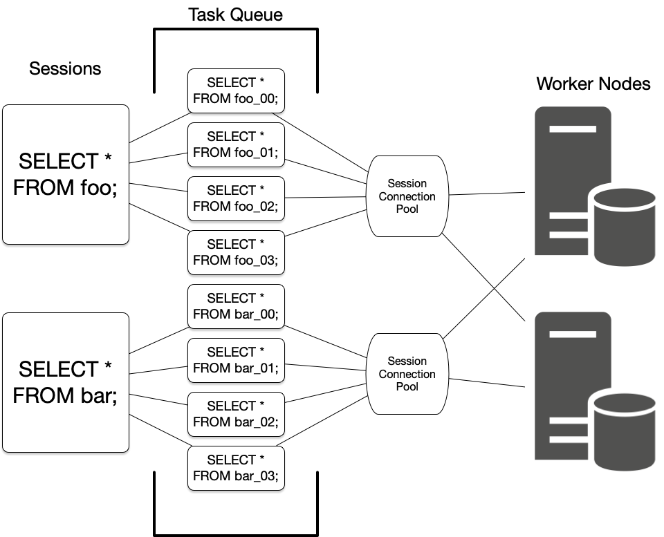

.. _citus_concepts:

Concepts
########

.. _distributed_arch:

Nodes
=====

Citus is a PostgreSQL `extension <https://www.postgresql.org/docs/current/static/external-extensions.html>`_ that allows commodity database servers (called *nodes*) to coordinate with one another in a "shared nothing" architecture. The nodes form a *cluster* that allows PostgreSQL to hold more data and use more CPU cores than would be possible on a single computer. This architecture also allows the database to scale by simply adding more nodes to the cluster.

Coordinator and Workers
-----------------------

Every cluster has one special node called the *coordinator* (the others are known as workers). Applications send their queries to the coordinator node which relays it to the relevant workers and accumulates the results.

For each query, the coordinator either *routes* it to a single worker node, or *parallelizes* it across several depending on whether the required data lives on a single node or multiple.  The coordinator knows how to do this by consulting its metadata tables. These Citus-specific tables track the DNS names and health of worker nodes, and the distribution of data across nodes. For more information, see our :ref:`metadata_tables`.

Distributed Data
================

.. _table_types:

Table Types
-----------

There are three types of tables in a Citus cluster, each used for different purposes.

Type 1: Distributed Tables
~~~~~~~~~~~~~~~~~~~~~~~~~~

The first type, and most common, is *distributed* tables. These appear to be normal tables to SQL statements, but are horizontally *partitioned* across worker nodes.

Here the rows of ``table`` are stored in tables ``table_1001``, ``table_1002`` etc on the workers. The component worker tables are called *shards*.

Citus runs not only SQL but DDL statements throughout a cluster, so changing the schema of a distributed table cascades to update all the table's shards across workers. 

To learn how to create a distributed table, see :ref:`ddl`.

.. _dist_column:

Distribution Column
!!!!!!!!!!!!!!!!!!!

Citus uses algorithmic sharding to assign rows to shards. This means the assignment is made deterministically -- in our case based on the value of a particular table column called the *distribution column.* The cluster administrator must designate this column when distributing a table. Making the right choice is important for performance and functionality, as described in the general topic of :ref:`Distributed Data Modeling <distributed_data_modeling>`.

Type 2: Reference Tables
~~~~~~~~~~~~~~~~~~~~~~~~

A reference table is a type of distributed table whose entire contents are concentrated into a single shard which is replicated on every worker. Thus queries on any worker can access the reference information locally, without the network overhead of requesting rows from another node. Reference tables have no distribution column because there is no need to distinguish separate shards per row.

Reference tables are typically small, and are used to store data that is relevant to queries running on any worker node. For example, enumerated values like order statuses, or product categories.

When interacting with a reference table we automatically perform two-phase commits (`2PC <https://en.wikipedia.org/wiki/Two-phase_commit_protocol>`_) on transactions. This means that Citus makes sure your data is always in a consistent state, regardless of whether you are writing, modifying, or deleting it.

The :ref:`reference_tables` section talks more about these tables and how to create them.

Type 3: Local Tables
~~~~~~~~~~~~~~~~~~~~

When you use Citus, the coordinator node you connect to and interact with is a regular PostgreSQL database with the Citus extension installed. Thus you can create ordinary tables and choose not to shard them. This is useful for small administrative tables that don't participate in join queries. An example would be users table for application login and authentication.

Creating standard PostgreSQL tables is easy because it's the default. It’s what you get when you run CREATE TABLE. In almost every Citus deployment we see standard PostgreSQL tables co-existing with distributed and reference tables. Indeed, Citus itself uses local tables to hold cluster metadata, as mentioned earlier.

.. _shards:

Shards
------

The previous section described a shard as containing a subset of the rows of a distributed table in a smaller table within a worker node. This section gets more into the technical details.

The :ref:`pg_dist_shard <pg_dist_shard>` metadata table on the coordinator contains a row for each shard of each distributed table in the system. The row matches a shardid with a range of integers in a hash space (shardminvalue, shardmaxvalue):

.. code-block:: sql

    SELECT * from pg_dist_shard;
     logicalrelid  | shardid | shardstorage | shardminvalue | shardmaxvalue 
    ---------------+---------+--------------+---------------+---------------
     github_events |  102026 | t            | 268435456     | 402653183
     github_events |  102027 | t            | 402653184     | 536870911
     github_events |  102028 | t            | 536870912     | 671088639
     github_events |  102029 | t            | 671088640     | 805306367
     (4 rows)

If the coordinator node wants to determine which shard holds a row of ``github_events``, it hashes the value of the distribution column in the row, and checks which shard's range contains the hashed value. (The ranges are defined so that the image of the hash function is their disjoint union.)

Shard Placements
~~~~~~~~~~~~~~~~

Suppose that shard 102027 is associated with the row in question. This means the row should be read or written to a table called ``github_events_102027`` in one of the workers. Which worker? That is determined entirely by the metadata tables, and the mapping of shard to worker is known as the shard *placement*.

Joining some :ref:`metadata tables <metadata_tables>` gives us the answer. These are the types of lookups that the coordinator does to route queries. It rewrites queries into fragments that refer to the specific tables like ``github_events_102027``, and runs those fragments on the appropriate workers.

.. code-block:: sql

  SELECT
      shardid,
      node.nodename,
      node.nodeport
  FROM pg_dist_placement placement
  JOIN pg_dist_node node
    ON placement.groupid = node.groupid
   AND node.noderole = 'primary'::noderole
  WHERE shardid = 102027;

::

  ┌─────────┬───────────┬──────────┐
  │ shardid │ nodename  │ nodeport │
  ├─────────┼───────────┼──────────┤
  │  102027 │ localhost │     5433 │
  └─────────┴───────────┴──────────┘

In our example of ``github_events`` there were four shards. The number of shards is configurable per table at the time of its distribution across the cluster. The best choice of shard count depends on your use case, see :ref:`prod_shard_count`.

Finally note that Citus allows shards to be replicated for protection against data loss using PostgreSQL streaming replication. Streaming replication to back up the entire database of each node to a follower database. This is transparent and does not require the involvement of Citus metadata tables.

Co-Location
-----------

Since shards can be placed on nodes as desired, it makes sense to place shards containing related rows of related tables together on the same nodes. That way join queries between them can avoid sending as much information over the network, and can be performed inside a single Citus node.

One example is a database with stores, products, and purchases. If all three tables contain -- and are distributed by -- a store_id column, then all queries restricted to a single store can run efficiently on a single worker node. This is true even when the queries involve any combination of these tables.

For a full explanation and examples of this concept, see :ref:`colocation`.

Parallelism
-----------

Spreading queries across multiple machines allows more queries to run at once, and allows processing speed to scale by adding new machines to the cluster. Additionally splitting a single query into fragments as described in the previous section boosts the processing power devoted to it. The latter situation achieves the greatest *parallelism,* meaning utilization of CPU cores.

Queries reading or affecting shards spread evenly across many nodes are able to run at "real-time" speed. Note that the results of the query still need to pass back through the coordinator node, so the speedup is most apparent when the final results are compact, such as aggregate functions like counting and descriptive statistics.

:ref:`citus_query_processing` explains more about how queries are broken into fragments and how their execution is managed.

.. _query_execution:

Query Execution
===============

When executing multi-shard queries, Citus must balance the gains from
parallelism with the overhead from database connections (network latency and
worker node resource usage). To configure Citus' query execution for best
results with your database workload, it helps to understand how Citus manages
and conserves database connections between the coordinator node and worker
nodes.

Citus transforms each incoming multi-shard query session into per-shard queries
called tasks. It queues the tasks, and runs them once it's able to obtain
connections to the relevant worker nodes. For queries on distributed tables
``foo`` and ``bar``, here's a diagram of the connection management:

The coordinator node has a connection pool for each session. Each query (such
as ``SELECT * FROM foo`` in the diagram) is limited to opening at most
:ref:`max_adaptive_executor_pool_size` simultaneous connections for its tasks
per worker.  That setting is configurable at the session level, for priority
management.

It can be faster to execute short tasks sequentially over the same connection
rather than establishing new connections for them in parallel. Long running
tasks, on the other hand, benefit from more immediate parallelism.

To balance the needs of short and long tasks, Citus uses
:ref:`executor_slow_start_interval`. That setting specifies a delay between
connection attempts for the tasks in a multi-shard query. When a query first
queues tasks, the tasks can acquire just one connection. At the end of each
interval where there are pending connections, Citus increases the number of
simultaneous connections it will open.  The slow start behavior can be disabled
entirely by setting the GUC to 0.

When a task finishes using a connection, the session pool will hold the
connection open for later. Caching the connection avoids the overhead of
connection reestablishment between coordinator and worker. However, each pool
will hold no more than :ref:`max_cached_conns_per_worker` idle connections open
at once, to limit idle connection resource usage in the worker.

Finally, the setting :ref:`max_shared_pool_size` acts as a fail-safe. It
limits the total connections per worker between all tasks.

For recommendations about tuning these parameters to match your workload, see
:ref:`connection_management`.
