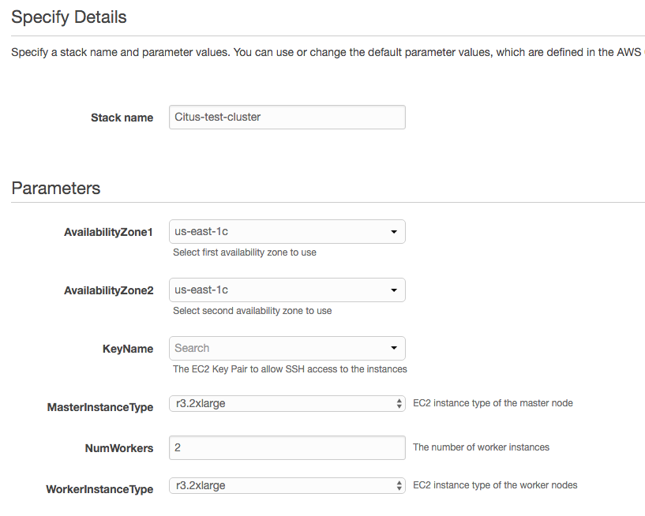
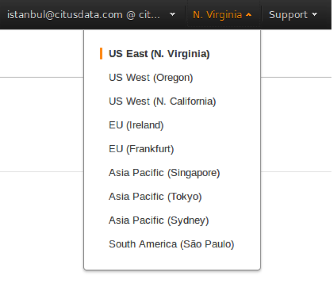
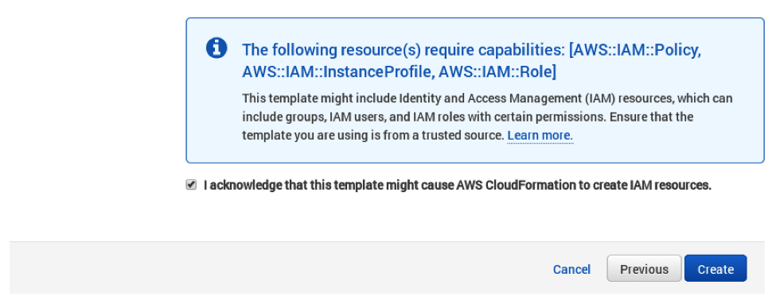
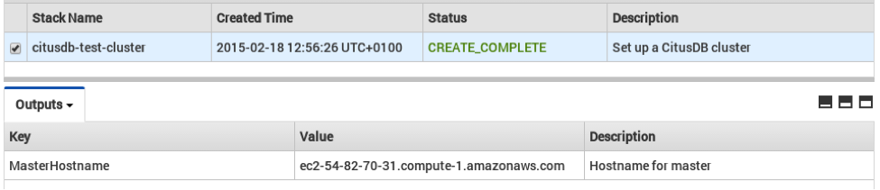

.. _multi_machine_aws:

Amazon Web Services
===================

This section describes the steps needed to set up a Citus cluster on AWS using the CloudFormation console.

To simplify the process of setting up a Citus cluster on `EC2 <http://aws.amazon.com/ec2/>`_, AWS users can use AWS CloudFormation. The CloudFormation template for Citus enables users to start a Citus cluster on AWS in just a few clicks, with also cstore_fdw extension for columnar storage is pre-installed. The template automates the installation and configuration process so that the users don’t need to do any extra configuration steps while installing Citus.

Please ensure that you have an active AWS account and an `Amazon EC2 key pair <http://docs.aws.amazon.com/AWSEC2/latest/UserGuide/ec2-key-pairs.html>`_ before proceeding with the next steps.

**Introduction**

`CloudFormation <http://aws.amazon.com/cloudformation/>`_ lets you create a "stack" of AWS resources, such as EC2 instances and security groups, from a template defined in a JSON file. You can create multiple stacks from the same template without conflict, as long as they have unique stack names.

Below, we explain in detail the steps required to setup a multi-node Citus cluster on AWS.

**1. Start a Citus cluster**

To begin, you can start a Citus cluster using CloudFormation by clicking `here <https://console.aws.amazon.com/cloudformation/home?region=us-east-1#/stacks/new?stackName=Citus&templateURL=https:%2F%2Fcitus-deployment.s3.amazonaws.com%2Faws%2Fcitus5%2Fcloudformation%2Fcitus5.json>`_. This will take you directly to the AWS CloudFormation console.

Note: You might need to login to AWS at this step if you aren’t already logged in.

**2. Select Citus template**

You will see select template screen. Citus template is already selected, just click Next.

**3. Fill the form with details about your cluster**

In the form, pick a unique name for your stack. You can customize your cluster setup by setting availability zones, number of workers and the instance types. You also need to fill in the AWS keypair which you will use to access the cluster.

Note: Please ensure that you choose unique names for all your clusters. Otherwise, the cluster creation may fail with the error “Template_name template already created”.

Note: If you want to launch a cluster in a region other than US East, you can update the region in the top-right corner of the AWS console as shown below.

**4. Acknowledge IAM capabilities**

The next screen displays Tags and a few advanced options. For simplicity, we use the default options and click Next.

Finally, you need to acknowledge IAM capabilities, which give the master node limited access to the EC2 APIs to obtain the list of worker IPs. Your AWS account needs to have IAM access to perform this step. After ticking the checkbox, you can click on Create.

**5. Cluster launching**

After the above steps, you will be redirected to the CloudFormation console. You can click the refresh button on the top-right to view your stack. In about 10 minutes, stack creation will complete and the hostname of the master node will appear in the Outputs tab. 

Note: Sometimes, you might not see the outputs tab on your screen by default. In that case, you should click on “restore” from the menu on the bottom right of your screen.
 

**Troubleshooting:**

You can use the cloudformation console shown above to monitor your cluster.

If something goes wrong during set-up, the stack will be rolled back but not deleted. In that case, you can either use a different stack name or delete the old stack before creating a new one with the same name.

**6. Login to the cluster**

Once the cluster creation completes, you can immediately connect to the master node using SSH with username ec2-user and the keypair you filled in. For example:

::

	ssh -i your-keypair.pem ec2-user@ec2-54-82-70-31.compute-1.amazonaws.com

**7. Ready to use the cluster**

At this step, you have completed the installation process and are ready to use the Citus cluster. You can now login to the master node and start executing commands. The command below, when run in the psql shell, should output the worker nodes mentioned in the pg_worker_list.conf.

::

	/usr/pgsql-9.5/bin/psql -h localhost -d postgres
	select * from master_get_active_worker_nodes();

**8. Cluster notes**

The template automatically tunes the system configuration for Citus and sets up RAID on the SSD drives where appropriate, making it a great starting point even for production systems.

The database and its configuration files are stored in /data/base. So, to change any configuration parameters, you need to update the postgresql.conf file at /data/base/postgresql.conf.

Similarly to restart the database, you can use the command:

::

	/usr/pgsql-9.5/bin/pg_ctl -D /data/base -l logfile restart

Note: You typically want to avoid making changes to resources created by CloudFormation, such as terminating EC2 instances. To shut the cluster down, you can simply delete the stack in the CloudFormation console.
