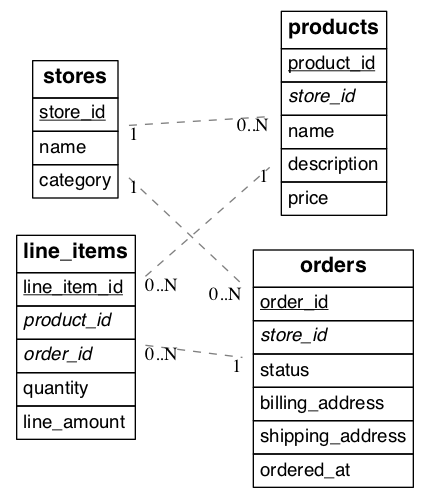
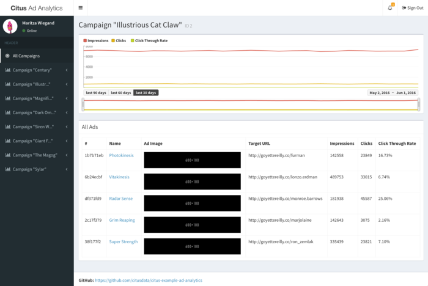

.. _transitioning_mt:

Migrating an existing relational store to Citus sometimes requires adjusting the schema and queries for optimal performance. Citus extends PostgreSQL with distributed functionality, but it is not a drop-in replacement that scales out all workloads. A performant Citus cluster involves thinking about the data model, tooling, and choice of SQL features used.

Migration tactics differ between the two main Citus use cases of multi-tenant applications and real-time analytics. The former requires fewer data model changes so we'll begin there.

Multi-tenant Data Model
=======================

Citus is well suited to hosting B2B multi-tenant application data. In this model application tenants share a Citus cluster and a schema. Each tenant's table data is stored in a shard determined by a configurable tenant id column. Citus pushes queries down to run directly on the relevant tenant shard in the cluster, spreading out the computation. Once queries are routed this way they can be executed without concern for the rest of the cluster. These queries can use the full features of SQL, including joins and transactions, without running into the inherent limitations of a distributed system.

This section will explore how to model for the multi-tenant scenario, including necessary adjustments to the schema and queries.

.. _mt_schema_migration:

Schema Migration
----------------

Transitioning from a standalone database instance to a sharded multi-tenant system requires identifying and modifying three types of tables which we may term *per-tenant*, *reference*, and *global*. The distinction hinges on whether the tables have (or reference) a column serving as tenant id. The concept of tenant id depends on the application and who exactly are considered its tenants.

Consider an example multi-tenant application similar to Etsy or Shopify where each tenant is a store. Here's a portion of a simplified schema:

   (Underlined items are primary keys, italicized items are foreign keys.)

In our example each store is a natural tenant. This is because storefronts benefit from dedicated processing power for their customer data, and stores do not need to access each other's sales or inventory. The tenant id is in this case the store id. We want to distribute data in the cluster in such a way that rows from the above tables in our schema reside on the same node whenever the rows share a store id.

The first step is preparing the tables for distribution. Citus requires that primary keys contain the distribution column, so we must modify the primary keys of these tables and make them compound including a store id. Making primary keys compound will require modifying the corresponding foreign keys as well.

In our example the stores and products tables are already in perfect shape. The orders table needs slight modification: updating the primary and foreign keys to include store_id. The line_items table needs the biggest change. Being normalized, it lacks a store id. We must add that column, and include it in the primary key constraint.

Here are SQL commands to accomplish these changes:

.. code-block:: sql

  BEGIN;

  -- denormalize line_items by including store_id

  ALTER TABLE line_items ADD COLUMN store_id uuid;

  -- drop simple primary keys (cascades to foreign keys)

  ALTER TABLE products   DROP CONSTRAINT products_pkey CASCADE;
  ALTER TABLE orders     DROP CONSTRAINT orders_pkey CASCADE;
  ALTER TABLE line_items DROP CONSTRAINT line_items_pkey CASCADE;

  -- recreate primary keys to include would-be distribution column

  ALTER TABLE products   ADD PRIMARY KEY (store_id, product_id);
  ALTER TABLE orders     ADD PRIMARY KEY (store_id, order_id);
  ALTER TABLE line_items ADD PRIMARY KEY (store_id, line_item_id);

  -- recreate foreign keys to include would-be distribution column

  ALTER TABLE line_items ADD CONSTRAINT line_items_store_fkey
    FOREIGN KEY (store_id) REFERENCES stores (store_id);
  ALTER TABLE line_items ADD CONSTRAINT line_items_product_fkey
    FOREIGN KEY (store_id, product_id) REFERENCES products (store_id, product_id);
  ALTER TABLE line_items ADD CONSTRAINT line_items_order_fkey
    FOREIGN KEY (store_id, order_id) REFERENCES orders (store_id, order_id);

  COMMIT;

When the job is complete our schema will look like this:

.. figure:: ../images/erd/mt-after.png
   :alt: Schema after migration

   (Underlined items are primary keys, italicized items are foreign keys.)

We call the tables considered so far *per-tenant* because querying them for our use case requires information for only one tenant per query. Their rows are distributed across the cluster according to the hashed values of their tenant ids.

There are other types of tables to consider during a transition to Citus. Some are system-wide tables such as information about site administrators. We call them *global* tables and they do not participate in join queries with the per-tenant tables and may remain on the Citus coordinator node unmodified.

Another kind of table are those which join with per-tenant tables but which aren't naturally specific to any one tenant. We call them *reference* tables. Two examples are shipping regions and product categories. We advise that you add a tenant id to these tables and duplicate the original rows, once for each tenant. This ensures that reference data is co-located with per-tenant data and quickly accessible to queries.

Backfilling Tenant ID
---------------------

Once the schema is updated and the per-tenant and reference tables are distributed across the cluster it's time to copy data from the original database into Citus. Most per-tenant tables can be copied directly from source tables. However line_items was denormalized with the addition of the store_id column. We have to "backfill" the correct values into this column.

We join orders and line_items to output the data we need including the backfilled store_id column. The results can go into a file for later import into Citus.

.. code-block:: sql

  -- This query gets line item information along with matching store_id values.
  -- You can save the result to a file for later import into Citus.

  SELECT orders.store_id AS store_id, line_items.*
    FROM line_items, orders
   WHERE line_items.order_id = orders.order_id

To learn how to ingest datasets such as the one generated above into a Citus cluster, see :ref:`dml`.

.. _mt_query_migration:

Query Migration
---------------

To execute queries efficiently for a specific tenant Citus needs to route them to the appropriate node and run them there. Thus every query must identify which tenant it involves. For simple select, update, and delete queries this means that the *where* clause must filter by tenant id.

Suppose we want to get the details for an order. It used to suffice to filter by order_id. However once orders are distributed by store_id we must include that in the where filter as well.

.. code-block:: sql

  -- before
  SELECT * FROM orders WHERE order_id = 123;

  -- after
  SELECT * FROM orders WHERE order_id = 123 AND store_id = 42;

Likewise insert statements must always include a value for the tenant id column. Citus inspects that value for routing the insert command.

When joining tables make sure to filter by tenant id. For instance here is how to inspect how many awesome wool pants a given store has sold:

.. code-block:: sql

  -- One way is to include store_id in the join and also
  -- filter by it in one of the queries

  SELECT sum(l.quantity)
    FROM line_items l
   INNER JOIN products p
      ON l.product_id = p.product_id
     AND l.store_id = p.store_id
   WHERE p.name='Awesome Wool Pants'
     AND l.store_id='8c69aa0d-3f13-4440-86ca-443566c1fc75'

  -- Equivalently you omit store_id from the join condition
  -- but filter both tables by it. This may be useful if
  -- building the query in an ORM

  SELECT sum(l.quantity)
    FROM line_items l
   INNER JOIN products p ON l.product_id = p.product_id
   WHERE p.name='Awesome Wool Pants'
     AND l.store_id='8c69aa0d-3f13-4440-86ca-443566c1fc75'
     AND p.store_id='8c69aa0d-3f13-4440-86ca-443566c1fc75'

Validating Query Migration
~~~~~~~~~~~~~~~~~~~~~~~~~~

With large and complex application code-bases, certain queries generated by the application can often be overlooked, and thus won't have a tenant_id filter on them. Citus' parallel executor will still execute these queries successfully, and so, during testing, these queries remain hidden since the application still works fine. However, if a query doesn't contain the tenant_id filter, Citus' executor will hit every shard in parallel, but only one will return any data.  This consumes resources needlessly, and may exhibit itself as a problem only when one moves to a higher-throughput production environment.

To prevent encoutering such issues only after launching in production, one can set a config value to log queries which hit more than one shard. In a properly configured and migrated multi-tenant application, each query should only hit one shard at a time.

During testing, one can configure the following:

.. code-block:: sql

  -- adjust for your own database's name of course

  ALTER DATABASE citus SET citus.multi_task_query_log_level = 'error';

Citus will then error out if it encounters queries which are going to hit more than one shard. Erroring out during testing allows the application developer to find and migrate such queries.

During a production launch, one can configure the same setting to log, instead of error out:

.. code-block:: sql

  ALTER DATABASE citus SET citus.multi_task_query_log_level = 'log';

The :ref:`configuration parameter section <multi_task_logging>` has more info on supported values for this setting.

.. _app_migration:

App Migration
-------------

.. _rails_migration:

Ruby on Rails
~~~~~~~~~~~~~

Above, we discussed the framework-agnostic database changes required
for using Citus in the multi-tenant use case. This section investigates
specifically how to migrate multi-tenant Rails applications to a
Citus storage backend. We'll use the `activerecord-multi-tenant
<https://github.com/citusdata/activerecord-multi-tenant>`__ Ruby gem for
easier scale-out.

This Ruby gem has evolved from our experience working with customers
scaling out their multi-tenant apps. It patches some restrictions
that ActiveRecord and Rails currently have when it comes to automatic
query building. It is based on the excellent `acts\_as\_tenant
<https://github.com/ErwinM/acts_as_tenant>`__ library, and extends it
for the particular use-case of a distributed multi-tenant database like
Citus.

Preparing to scale-out a multi-tenant application
*************************************************

Initially you’ll often start out with all tenants placed on a single
database node, and using a framework like Ruby on Rails and ActiveRecord
to load the data for a given tenant when you serve a web request that
returns the tenant’s data.

ActiveRecord makes a few assumptions about the data storage that limit
your scale-out options. In particular, ActiveRecord introduces a pattern
where you normalize data and split it into many distinct models each
identified by a single ``id`` column, with multiple ``belongs_to``
relationships that tie objects back to a tenant or customer:

.. code-block:: ruby

  # typical pattern with multiple belongs_to relationships

  class Customer < ActiveRecord::Base
    has_many :sites
  end
  class Site < ActiveRecord::Base
    belongs_to :customer
    has_many :page_views
  end
  class PageView < ActiveRecord::Base
    belongs_to :site
  end

The tricky thing with this pattern is that in order to find all page
views for a customer, you'll have to query for all of a customer's sites
first. This becomes a problem once you start sharding data, and in
particular when you run UPDATE or DELETE queries on nested models like
page views in this example.

There are a few steps you can take today, to make scaling out easier in
the future:

**1. Introduce a column for the tenant\_id on every record that belongs
to a tenant**

In order to scale out a multi-tenant model, it's essential you can locate
all records that belong to a tenant quickly. The easiest way to achieve
this is to simply add a ``tenant_id`` column (or “customer\_id” column,
etc) on every object that belongs to a tenant, and backfilling your
existing data to have this column set correctly.

When you move to a distributed multi-tenant database like Citus in the
future, this will be a required step - but if you've done this before,
you can simply COPY over your data, without doing any additional data
modification.

**2. Use UNIQUE constraints which include the tenant\_id**

Unique and foreign-key constraints on values other than the tenant\_id
will present a problem in any distributed system, since it’s difficult
to make sure that no two nodes accept the same unique value. Enforcing
the constraint would require expensive scans of the data across all
nodes.

To solve this problem, for the models which are logically related
to a store (the tenant for our app), you should add store\_id to
the constraints, effectively scoping objects unique inside a given
store. This helps add the concept of tenancy to your models, thereby
making the multi-tenant system more robust.

For example, Rails creates a primary key by default, that only includes
the ``id`` of the record:

::

  Indexes:
      "page_views_pkey" PRIMARY KEY, btree (id)

You should modify that primary key to also include the tenant\_id:

.. code-block:: sql

  ALTER TABLE page_views DROP CONSTRAINT page_views_pkey;
  ALTER TABLE page_views ADD PRIMARY KEY(id, customer_id);

An exception to this rule might be an email or username column on a
users table (unless you give each tenant their own login page), which is
why, once you scale out, we typically recommend these to be split out
from your distributed tables and placed as a local table on the Citus
coordinator node.

**3. Include the tenant\_id in all queries, even when you can locate an
object using its own object\_id**

The easiest way to run a typical SQL query in a distributed system
without restrictions is to always access data that lives on a single
node, determined by the tenant you are accessing.

For this reason, once you use a distributed system like Citus, we
recommend you always specify both the tenant\_id and an object’s own ID
for queries, so the coordinator can locate your data quickly, and can
route the query to a single shard - instead of going to each shard in
the system individually and asking the shard whether it knows the given
object\_id.

Updating the Rails Application
******************************

You can get started by including ``gem 'activerecord-multi-tenant'``
into your Gemfile, running ``bundle install``, and then annotating your
ActiveRecord models like this:

.. code-block:: ruby

  class PageView < ActiveRecord::Base
    multi_tenant :customer
    # ...
  end

In this case ``customer`` is the tenant model, and your ``page_views``
table needs to have a ``customer_id`` column that references the
customer the page view belongs to.

The `activerecord-multi-tenant
<https://github.com/citusdata/activerecord-multi-tenant>`__ Gem aims to
make it easier to implement the above data changes in a typical Rails
application.

As mentioned in the beginning, by adding ``multi_tenant :customer``
annotations to your models, the library automatically takes care of
including the tenant\_id with all queries.

In order for that to work, you’ll always need to specify which tenant
you are accessing, either by specifying it on a per-request basis:

.. code-block:: ruby

  class ApplicationController < ActionController::Base
    # Opt-into the "set_current_tenant" controller helpers by specifying this:
    set_current_tenant_through_filter

    before_filter :set_customer_as_tenant

    def set_customer_as_tenant
      customer = Customer.find(session[:current_customer_id])
      set_current_tenant(customer) # Set the tenant
    end
  end

Or by wrapping your code in a block, e.g. for background and maintenance
tasks:

.. code-block:: ruby

  customer = Customer.find(session[:current_customer_id])
  # ...
  MultiTenant.with(customer) do
    site = Site.find(params[:site_id])

    # Modifications automatically include tenant_id
    site.update! last_accessed_at: Time.now

    # Queries also include tenant_id automatically
    site.page_views.count
  end

Once you are ready to use a distributed multi-tenant database like
Citus, all you need is a few adjustments to your migrations, and you're
good to go:

.. code-block:: ruby

  class InitialTables < ActiveRecord::Migration
    def up
      create_table :page_views, partition_key: :customer_id do |t|
        t.references :customer, null: false
        t.references :site, null: false

        t.text :url, null: false
        ...
        t.timestamps null: false
      end
      create_distributed_table :page_views, :account_id
    end

    def down
      drop_table :page_views
    end
  end

Note the ``partition_key: :customer_id``, something that's
added to Rails' ``create_table`` by our library, which ensures
that the primary key includes the tenant\_id column, as well as
``create_distributed_table`` which enables Citus to scale out the data
to multiple nodes.

Example Application
*******************

If you are interested in a more complete
example, check out our `reference app
<https://github.com/citusdata/citus-example-ad-analytics>`__ that
showcases a simplified sample SaaS application for ad analytics.

As you can see in the screenshot, most data is associated to the
currently logged in customer - even though this is complex analytical
data, all data is accessed in the context of a single customer or
tenant.

Django
~~~~~~

At the start of this section we discussed the framework-agnostic database changes required for using Citus in the multi-tenant use case. This section investigates specifically how to migrate multi-tenant Django applications to a Citus storage backend.

Preparing to scale-out a multi-tenant application
*************************************************

Initially you’ll often start with all tenants placed on a single database node, and using a framework like Django to load the data for a given tenant when you serve a web request that returns the tenant’s data.

Django's typical conventions make a few assumptions about the data storage that limit scale-out options. In particular, the ORM introduces a pattern where you normalize data and split it into many distinct models each identified by a single ``id`` column (usually added implicitly by the ORM). For instance, consider this simplified model:

.. code-block:: python

  from django.utils import timezone
  from django.db import models

  class Store(models.Model):
      name = models.CharField(max_length=255)
      url = models.URLField()

  class Product(models.Model):
      name = models.CharField(max_length=255)
      description = models.TextField()
      price = models.DecimalField(max_digits=6, decimal_places=2),
      quantity = models.IntegerField()
      store = models.ForeignKey(Store)

  class Purchase(models.Model):
      ordered_at = models.DateTimeField(default=timezone.now)
      billing_address = models.TextField()
      shipping_address = models.TextField()

      product = models.ForeignKey(Product)

The tricky thing with this pattern is that in order to find all purchases for a store, you'll have to query for all of a store's products first. This becomes a problem once you start sharding data, and in particular when you run UPDATE or DELETE queries on nested models like purchases in this example.

**1. Introduce a column for the store\_id on every record that belongs to a store**

In order to scale out a multi-tenant model, it's essential that you can locate all records that belong to a store quickly. The easiest way to achieve this is to simply add a :code:`store_id` column on every object that belongs to a store, and backfill your existing data to have this column set correctly.

**2. Use UNIQUE constraints which include the store\_id**

Unique and foreign-key constraints on values other than the tenant\_id
will present a problem in any distributed system, since it’s difficult
to make sure that no two nodes accept the same unique value. Enforcing
the constraint would require expensive scans of the data across all
nodes.

To solve this problem, for the models which are logically related
to a store (the tenant for our app), you should add store\_id to
the constraints, effectively scoping objects unique inside a given
store. This helps add the concept of tenancy to your models, thereby
making the multi-tenant system more robust.

Let's begin by adjusting our model definitions and have Django generate a new migration for the two changes discussed.

.. code-block:: python

  from django.utils import timezone
  from django.db import models

  class Store(models.Model):
    name = models.CharField(max_length=255)
    url = models.URLField()

  class Product(models.Model):
    name = models.CharField(max_length=255)
    description = models.TextField()
    price = models.DecimalField(max_digits=6, decimal_places=2),
    quantity = models.IntegerField()
    store = models.ForeignKey(Store)

    class Meta(object):                  # added
      unique_together = ["id", "store"]  #

  class Purchase(models.Model):
    ordered_at = models.DateTimeField(default=timezone.now)
    billing_address = models.TextField()
    shipping_address = models.TextField()

    product = models.ForeignKey(
      Product,
      db_constraint=False                # added
    )
    store = models.ForeignKey(Store)     # added

    class Meta(object):                  # added
      unique_together = ["id", "store"]  #

Create a migration to reflect the change: :code:`./manage.py makemigrations`.

Next we need some custom migrations to adapt the existing key structure in the database for compatibility with Citus. To keep these migrations separate from the ones for the ordinary application, we'll make a new citus application in the same Django project.

.. code-block:: bash

  # Make a new sub-application in the project
  django-admin startapp citus

Edit :code:`appname/settings.py` and add :code:`'citus'` to the array :code:`INSTALLED_APPS`.

Next we'll add a custom migration to remove simple primary keys which will become composite: :code:`./manage.py makemigrations citus --empty --name remove_simple_pk`. Edit the result to look like this:

.. code-block:: python

  from __future__ import unicode_literals
  from django.db import migrations

  class Migration(migrations.Migration):
    dependencies = [
      ('appname', '<name of latest migration>')
    ]

    operations = [
      # Django considers "id" the primary key of these tables, but
      # the database mustn't, because the primary key will be composite
      migrations.RunSQL(
        "ALTER TABLE mtdjango_product DROP CONSTRAINT mtdjango_product_pkey;",
        "ALTER TABLE mtdjango_product ADD CONSTRAINT mtdjango_product_pkey PRIMARY KEY (store_id, id)"
      ),
      migrations.RunSQL(
        "ALTER TABLE mtdjango_purchase DROP CONSTRAINT mtdjango_purchase_pkey;",
        "ALTER TABLE mtdjango_purchase ADD CONSTRAINT mtdjango_purchase_pkey PRIMARY KEY (store_id, id)"
      ),
    ]

Next, we'll make one to tell Citus to mark tables for distribution. :code:`./manage.py makemigrations citus --empty --name distribute_tables`. Edit the result to look like this:

.. code-block:: python

  from __future__ import unicode_literals
  from django.db import migrations

  class Migration(migrations.Migration):
    dependencies = [
      # leave this as it was generated
    ]

    operations = [
      migrations.RunSQL(
        "SELECT create_distributed_table('mtdjango_store','id')"
      ),
      migrations.RunSQL(
        "SELECT create_distributed_table('mtdjango_product','store_id')"
      ),
      migrations.RunSQL(
        "SELECT create_distributed_table('mtdjango_purchase','store_id')"
      ),
    ]

Finally, we'll establish a composite foreign key. :code:`./manage.py makemigrations citus --empty --name composite_fk`.

.. code-block:: python

  from __future__ import unicode_literals
  from django.db import migrations

  class Migration(migrations.Migration):
    dependencies = [
      # leave this as it was generated
    ]

    operations = [
      migrations.RunSQL(
        """
            ALTER TABLE mtdjango_purchase
            ADD CONSTRAINT mtdjango_purchase_product_fk
            FOREIGN KEY (store_id, product_id)
            REFERENCES mtdjango_product (store_id, id)
            ON DELETE CASCADE;
        """,
        "ALTER TABLE mtdjango_purchase DROP CONSTRAINT mtdjango_purchase_product_fk"
      ),
    ]

Apply the migrations by running :code:`./manage.py migrate`.

**3. Disable server-side cursors**

Edit your database configuration in your `settings.py` file to include the following parameter:

.. code-block:: python

  DATABASES = {
    'default': {
        'DISABLE_SERVER_SIDE_CURSORS': True
    },
  }

At this point the Django application models are ready to work with a Citus backend. You can continue by importing data to the new system and modifying controllers as necessary to deal with the model changes.

Updating the Django Application
*******************************

To simplify queries in the Django application, Citus has developed a Python library called `django-multitenant <https://github.com/citusdata/django-multitenant>`_ (still in beta as of this writing). Include :code:`django-multitenant` in the :code:`requirements.txt` package file for your project, and then modify your models.

First, include the library in models.py:

.. code-block:: python

  from django_multitenant import *

Next, change the base class for each model from :code:`models.Model` to :code:`TenantModel`, and add a property specifying the name of the tenant id. For instance, to continue the earlier example:

.. code-block:: python

  class Store(TenantModel):
    tenant_id = 'id'
    # ...

  class Product(TenantModel):
    tenant_id = 'store_id'
    # ...

  class Purchase(TenantModel):
    tenant_id = 'store_id'
    # ...

No extra database migration is necessary beyond the steps in the previous section. The library allows application code to easily scope queries to a single tenant. It automatically adds the correct SQL filters to all statements, including fetching objects through relations.

For instance:

.. code-block:: python

  # set the current tenant to the first store
  s = Store.objects.all()[0]
  set_current_tenant(s)

  # now this count query applies only to Products for that store
  Product.objects.count()

  # Find purchases for risky products in the current store
  Purchase.objects.filter(product__description='Dangerous Toy')

In the context of an application controller, the current tenant object can be stored as a SESSION variable when a user logs in, and controller actions can :code:`set_current_tenant` to this value.

Real-Time Analytics Data Model
==============================

In this model multiple worker nodes calculate aggregate data in parallel for applications such as analytic dashboards. This scenario requires greater interaction between Citus nodes than the multi-tenant case and the transition from a standalone database varies more per application.

In general you can distribute the tables from an existing schema by following the advice in :ref:`performance_tuning`. This will provide a baseline from which you can measure and interactively improve performance. For more migration guidance please `contact us <https://www.citusdata.com/about/contact_us>`_.
