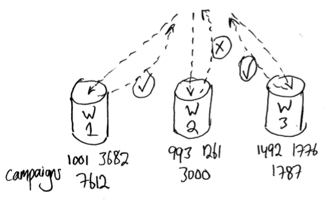
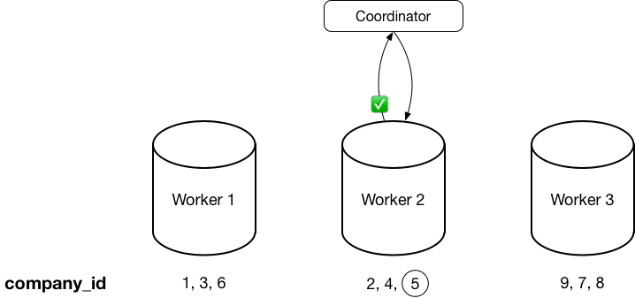
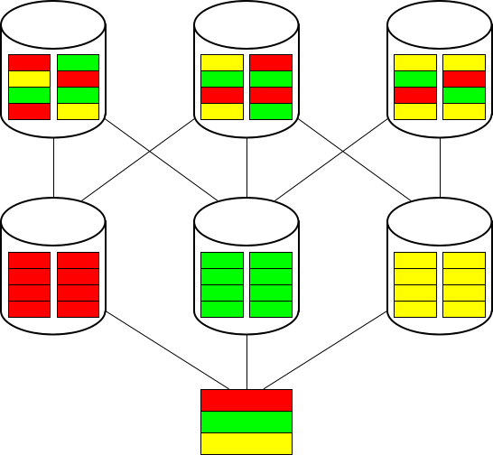
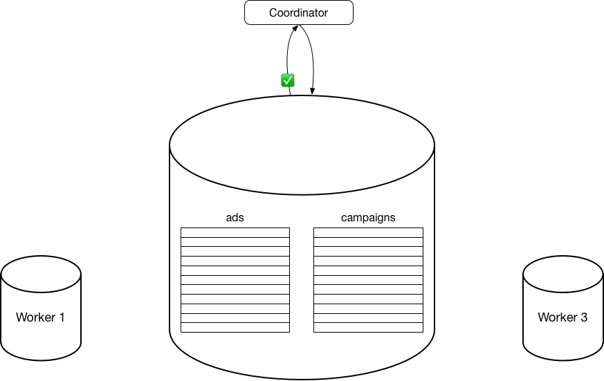

.. highlight:: postgresql

Multi-tenant Applications
#########################

.. contents::

*Estimated read time: 30 minutes*

Many companies with web applications cater not to end users, but to other businesses with customers of their own. When many clients with similar needs are expected, it makes sense to run a single instance of the application to handle all the clients.

A software-as-a-service (SaaS) provider, for example, can run one instance of its application on one instance of a database and provide web access to multiple customers. In such a scenario, each tenant's data can be isolated and kept invisible to other tenants. This is efficient in two ways. First application improvements apply to all clients. Second, sharing a database between tenants uses hardware efficiently.

Using Citus, multi-tenant applications can be written as if they are connecting to a single PostgreSQL database, when in fact the database is a horizontally scalable cluster of machines. Client code requires minimal modifications and can continue to use full SQL capabilities.

This guide takes a sample multi-tenant application and describes how to model it for scalability with Citus. Along the way we examine typical challenges for multi-tenant applications like per-tenant customization, isolating tenants from noisy neighbors, and scaling hardware to accommodate more data. PostgreSQL and Citus provide the tools to handle these challenges, so let's get building.

Let's Make an App – Ad Analytics
--------------------------------

We'll build the back-end for an application that tracks online advertising performance and provides an analytics dashboard on top. It's a natural fit for a multi-tenant SaaS application because each company running ad campaigns is concerned with the performance of only its own ads. The queries' requests for data are partitioned per company.

Before jumping ahead to all that, let's consider a simplified schema for this application, designed for use on a single-machine PostgreSQL database. The application must keep track of multiple companies, each of which runs advertising campaigns. Campaigns have many ads, and each ad has associated records of its clicks and impressions.

Here is a schema designed for single-node PostgreSQL. We'll make some minor changes later, which allow us to effectively partition and isolate the data in a distributed environment.

::

  CREATE TABLE companies (
    id bigserial PRIMARY KEY,
    name text NOT NULL,
    image_url text,
    created_at timestamp without time zone NOT NULL,
    updated_at timestamp without time zone NOT NULL
  );

  CREATE TABLE campaigns (
    id bigserial PRIMARY KEY,
    company_id bigint REFERENCES companies (id),
    name text NOT NULL,
    cost_model text NOT NULL,
    state text NOT NULL,
    monthly_budget bigint,
    blacklisted_site_urls text[],
    created_at timestamp without time zone NOT NULL,
    updated_at timestamp without time zone NOT NULL
  );

  CREATE TABLE ads (
    id bigserial PRIMARY KEY,
    campaign_id bigint REFERENCES campaigns (id),
    name text NOT NULL,
    image_url text,
    target_url text,
    impressions_count bigint DEFAULT 0,
    clicks_count bigint DEFAULT 0,
    created_at timestamp without time zone NOT NULL,
    updated_at timestamp without time zone NOT NULL
  );

  CREATE TABLE clicks (
    id bigserial PRIMARY KEY,
    ad_id bigint REFERENCES ads (id),
    clicked_at timestamp without time zone NOT NULL,
    site_url text NOT NULL,
    cost_per_click_usd numeric(20,10),
    user_ip inet NOT NULL,
    user_data jsonb NOT NULL
  );

  CREATE TABLE impressions (
    id bigserial PRIMARY KEY,
    ad_id bigint REFERENCES ads (id),
    seen_at timestamp without time zone NOT NULL,
    site_url text NOT NULL,
    cost_per_impression_usd numeric(20,10),
    user_ip inet NOT NULL,
    user_data jsonb NOT NULL
  );

This schema supports querying the performance of ads and campaigns. It is designed for a single-machine database, and will require modification in a distributed environment. To see why, we must become familiar with how Citus distributes data and executes queries.

Applications connect to a certain PostgreSQL server in the Citus cluster called the *coordinator node.* The connection is established using an ordinary PostgreSQL `connection URI <https://www.postgresql.org/docs/current/static/libpq-connect.html#AEN45527>`_. However the actual data and processing is stored on and will happen in other machines called *worker nodes.*

The coordinator examines each client query and determines to which tenant it pertains. The coordinator then routes the query for processing to the worker node which holds that tenant. When the worker's results are ready, the coordinator forwards it to the application.

Distributing Data in the Cluster
--------------------------------

Using Citus effectively requires choosing the right pattern for distributing data and doing processing across workers. Citus runs fastest when the data distribution minimizes network overhead for the application's most common queries. This happens when related data items are stored together on the same worker node. In multi-tenant applications all data for a given tenant should be stored on the same worker. (Multiple tenants can be stored on the same worker for better hardware utilization, but no single tenant's data should span multiple workers.)

Citus stores rows in groups called *shards*, where each shard is placed on a worker node. The bundling of rows into shards is determined by the value of a special column in each table called the *distribution column*. (This column is chosen by the database administrator for each table.) When reading or writing a row in a distributed table, Citus uses the value in the distribution column to determine which shard -- and hence worker node -- holds the row. For a more technical description of this process, see :ref:`hash_space`.

Returning to the ad analytics application, let's consider the options for choosing table distribution columns, and the consequences of our choice. The performance of Citus must be evaluated in terms of specific queries.  Consider a simple query to determine the total campaign budget for company five.

::

  SELECT sum(monthly_budget)
    FROM campaigns
   WHERE company_id = 5;

This is a typical query for a multi-tenant application because it restricts the results to data from a single company, by the presence of the where-clause filter `where company_id = 5`. Each tenant, in this case an advertising company, will be accessing only their own data.

Any column of the :code:`campaigns` table could be its distribution column, but let's compare how this query performs for either of two options: :code:`id` and :code:`company_id`.

If we distribute by the campaign id, then campaign shards will be spread across multiple workers irrespective of company. Finding the total budget for a company requires asking all workers for their local total and calculating a final sum the coordinator.

If we distribute by :code:`company_id`, on the other hand, then Citus can detect by the presence of :code:`WHERE company_id = 5` that all relevant information will be on a single worker. Citus can route the entire query to that worker for execution and pass the results through verbatim.

This aggregate query favors distribution by :code:`company_id`. JOIN queries differ even more dramatically.

.. note::

  In our normalized schema above, the :code:`ads` table does not have a :code:`company_id` column because it can retrieve that information through the :code:`campaigns` table. To distribute the :code:`ads` table by company id, we will need to add the :code:`company_id` column to it. The query below assumes we have done this, and we'll talk more about this technique later.

::

  -- running campaigns which receive the most clicks and impressions
  -- for a single tenant

  SELECT campaigns.id, campaigns.name, campaigns.monthly_budget,
         sum(impressions_count) as total_impressions,
         sum(clicks_count) as total_clicks
  FROM ads, campaigns
  WHERE ads.company_id = campaigns.company_id
  AND campaigns.company_id = 5
  AND campaigns.state = 'running'
  GROUP BY campaigns.id, campaigns.name, campaigns.monthly_budget
  ORDER BY total_impressions, total_clicks;

For this query, distributing by campaign id is quite bad. Workers must use a lot of network traffic to pull related information together for the join, in a process called *repartitioning.*

Routing the query for execution in a single worker avoids the overhead, and is possible when distributing by :code:`company_id`. The placement of related information together on a worker is called :ref:`co-location <colocation>`.

The key idea is to think of your schema hierarchically -- e.g. impressions are for ads, ads are in campaigns, campaigns belong to companies -- and pick the item at the top of the hierarchy as the sharding key. In B2B scenarios, this would typically be your customer or business. This provides two benefits:

* All tables will be related to the concept of tenant.  This ensures all tables are co-located.
* Since the application is multi-tenant, all queries will be scoped to a tenant. This means they will be routed to a single node, as data for a tenant will be on a single node.

These properties dramatically reduce the cost associated
with distributed transactions, joins, and foreign key constraints.  It also allows PostgreSQL to optimize a single-tenant query as it sees appropriate.

Routing queries to a worker node allows full support for PostgreSQL transactions and enforcement of foreign keys. These are features typically lacking in NoSQL distributed databases.

Preparing Tables for Distribution
---------------------------------

In the previous section we identified the correct distribution column for multi-tenant applications: the tenant id. We also saw that some tables designed for a single machine PostgreSQL instance may need to be denormalized by the addition of this column.

We will need to modify our schema, but there is one other caveat to note about distributed systems. Enforcing uniqueness or foreign key constraints in Citus requires that they include the distribution column. Our tables don't currently do that, for instance in the ads table we specify

::

  -- not efficiently enforceable

  campaign_id bigint REFERENCES campaigns (id)

This constraint includes only the campaign id, not the company (tenant) id. If we don't include the tenant id in the primary or foreign keys, Citus will need to check all worker nodes to enforce uniqueness on each index, which does not scale well. Adding tenant id to your keys allows Citus to perform the check at a shard level which can be completely enforced on the worker nodes.

Putting it all together, here are all the changes needed in the schema to prepare the tables for distribution by :code:`company_id`. Notice how all primary/foreign keys include the distribution column.

::

  CREATE TABLE companies (
    id bigserial PRIMARY KEY,
    name text NOT NULL,
    image_url text,
    created_at timestamp without time zone NOT NULL,
    updated_at timestamp without time zone NOT NULL
  );

  CREATE TABLE campaigns (
    id bigserial,       -- was: PRIMARY KEY
    company_id bigint REFERENCES companies (id),
    name text NOT NULL,
    cost_model text NOT NULL,
    state text NOT NULL,
    monthly_budget bigint,
    blacklisted_site_urls text[],
    created_at timestamp without time zone NOT NULL,
    updated_at timestamp without time zone NOT NULL,
    PRIMARY KEY (company_id, id) -- added
  );

  CREATE TABLE ads (
    id bigserial,       -- was: PRIMARY KEY
    company_id bigint,  -- added
    campaign_id bigint, -- was: REFERENCES campaigns (id)
    name text NOT NULL,
    image_url text,
    target_url text,
    impressions_count bigint DEFAULT 0,
    clicks_count bigint DEFAULT 0,
    created_at timestamp without time zone NOT NULL,
    updated_at timestamp without time zone NOT NULL,
    PRIMARY KEY (company_id, id),         -- added
    FOREIGN KEY (company_id, campaign_id) -- added
      REFERENCES campaigns (company_id, id)
  );

  CREATE TABLE clicks (
    id bigserial,        -- was: PRIMARY KEY
    company_id bigint,   -- added
    ad_id bigint,        -- was: REFERENCES ads (id),
    clicked_at timestamp without time zone NOT NULL,
    site_url text NOT NULL,
    cost_per_click_usd numeric(20,10),
    user_ip inet NOT NULL,
    user_data jsonb NOT NULL,
    PRIMARY KEY (company_id, id),      -- added
    FOREIGN KEY (company_id, ad_id)    -- added
      REFERENCES ads (company_id, id)
  );

  CREATE TABLE impressions (
    id bigserial,         -- was: PRIMARY KEY
    company_id bigint,    -- added
    ad_id bigint,         -- was: REFERENCES ads (id),
    seen_at timestamp without time zone NOT NULL,
    site_url text NOT NULL,
    cost_per_impression_usd numeric(20,10),
    user_ip inet NOT NULL,
    user_data jsonb NOT NULL,
    PRIMARY KEY (company_id, id),       -- added
    FOREIGN KEY (company_id, ad_id)     -- added
      REFERENCES ads (company_id, id)
  );

Distributing Tables, Ingesting Data
-----------------------------------

.. note::

  This guide is designed so you can follow along in your own Citus database. Use one of these alternatives to spin up a database:

  * Run Citus locally using :ref:`single_machine_docker`, or
  * Provision a cluster using `Citus Cloud <https://console.citusdata.com/users/sign_up>`_

  You'll run the SQL commands using psql:

  * **Docker**: :code:`docker exec -it citus_master psql -U postgres`
  * **Cloud**: :code:`psql "connection-string"` where the connection string for your formation is available in the Cloud Console.

  In either case psql will be connected to the coordinator node for the cluster.

At this point feel free to follow along in your own Citus cluster by `downloading <https://examples.citusdata.com/tutorial/schema.sql>`_ and executing the SQL to create the schema. Once the schema is ready, we can tell Citus to create shards on the workers. From the coordinator node, run:

::

  SELECT create_distributed_table('companies',   'id');
  SELECT create_distributed_table('campaigns',   'company_id');
  SELECT create_distributed_table('ads',         'company_id');
  SELECT create_distributed_table('clicks',      'company_id');
  SELECT create_distributed_table('impressions', 'company_id');

The :ref:`create_distributed_table` function informs Citus that a table should be distributed and that future incoming queries to those tables should be planned for distributed execution. The function also creates shards for the table on worker nodes, allowing queries to be routed there.

The next step is loading sample data into the cluster.

.. code-block:: bash

  # download and ingest datasets from the shell

  for dataset in companies campaigns ads clicks impressions; do
    curl -O https://examples.citusdata.com/tutorial/${dataset}.csv
  done

.. note::

  **If you are using Docker,** you should use the :code:`docker cp` command to copy the files into the Docker container.

  .. code-block:: bash

    docker cp companies.csv citus_master:.
    docker cp campaigns.csv citus_master:.
    docker cp ads.csv citus_master:.

Being an extension of PostgreSQL, Citus supports bulk loading with the COPY command. Use it to ingest the data you downloaded, and make sure that you specify the correct file path if you downloaded the file to some other location.

.. code-block:: psql

  \copy companies
    from 'companies.csv' with csv;
  \copy campaigns
    from 'campaigns.csv' with csv;
  \copy ads (id, company_id, campaign_id, name, image_url, target_url,
             impressions_count, clicks_count, created_at, updated_at)
    from 'ads.csv' with csv;
  \copy clicks
    from 'clicks.csv' with csv;
  \copy impressions
    from 'impressions.csv' with csv;

Querying the Cluster
--------------------

Multi-tenant applications in Citus can run any SQL queries, as long as the queries include the tenant id as a filter condition. For instance, consider a simple query to find the top campaigns with highest budget for company five.

::

  -- Top ten campaigns with highest budget for a company

  SELECT name, cost_model, state, monthly_budget
    FROM campaigns
   WHERE company_id = 5
  ORDER BY monthly_budget DESC
  LIMIT 10;

Updates work too. Let's double the budget for all campaigns!

::

  UPDATE campaigns
  SET monthly_budget = monthly_budget*2
  WHERE company_id = 5;

In all these queries, the filter routes SQL execution directly inside a worker. Full SQL support is available once queries are "pushed down" to a worker like this. For example, how about transactions in our distributed database? No problem:

::

  -- transactionally remove campaign 46 and all its ads

  BEGIN;
  DELETE from campaigns where id = 46 AND company_id = 5;
  DELETE from ads where campaign_id = 46 AND company_id = 5;
  COMMIT;

When people scale applications with NoSQL databases they often miss the lack of transactions and joins. We already saw a join query when discussing distribution columns, but here's another to combine information from campaigns and ads.

::

  -- Total campaign budget vs expense this month

  SELECT camp.monthly_budget,
         CASE cost_model
         WHEN 'cost_per_click' THEN
           clicks_count
         ELSE
           impressions_count
         END AS billable_events
  FROM campaigns camp
  JOIN ads a ON (
        a.campaign_id = camp.id
    AND a.company_id = camp.company_id)
  WHERE camp.company_id = 5;

Sharing Data Between Tenants
----------------------------

Up until now all tables have been distributed by :code:`company_id`, but sometimes there is data that can be shared by all tenants, and doesn't "belong" to any tenant in particular. For instance all companies using this example ad platform might want to get geographical information for their audience based on IP addresses. In a single machine database this could be accomplished by a lookup table for geo-ip, like the following. (A real table would probably use PostGIS but bear with the simplified example.)

::

  CREATE TABLE geo_ips (
    addrs cidr NOT NULL PRIMARY KEY,
    latlon point NOT NULL
      CHECK (-90  <= latlon[0] AND latlon[0] <= 90 AND
             -180 <= latlon[1] AND latlon[1] <= 180)
  );
  CREATE INDEX ON geo_ips USING gist (addrs inet_ops);

Joining clicks with this table can produce, for example, the locations of everyone who clicked on ad 456.

::

  SELECT latlon
    FROM geo_ips, clicks c
   WHERE addrs >> c.user_ip
     AND c.clicked_at > current_date - INTERVAL '1 day'
     AND c.company_id = 5
     AND c.ad_id = 456;

In Citus we need to find a way to co-locate the :code:`geo_ips` table with clicks for every company. One way would be to add a :code:`company_id` column to :code:`geo_ips` and duplicate the data in the table for every company. This approach is not optimal because it introduces the burden of keeping the data synchronized between the companies if and when it changes. A more convenient way is by designating :code:`geo_ips` as a *reference table.*

Reference tables in Citus have exactly one shard, and it is replicated across all worker nodes. This co-locates the information for all tenants' queries. It does require reserving space for a copy of the data on all nodes, but automatically stays in sync during reference table updates. To make a reference table, call :ref:`create_reference_table <create_reference_table>` for a table on the coordinator node:

::

  -- Make synchronized copies of geo_ips on all workers

  SELECT create_reference_table('geo_ips');

After doing this, the join query (presented earlier) on :code:`geo_ips` and :code:`clicks` will perform efficiently.

Online Changes to the Schema
----------------------------

Citus propagates most DDL statements fron the coordinator node to the workers. This allows the database administrator to alter the database even during use and after tables are distributed in the cluster. Citus uses a two-phase commit protocol to make sure updates happen consistently.

For example, the advertisements in this application could use a text caption. We can add a column to the table by issuing the standard SQL on the coordinator:

::

  ALTER TABLE ads
    ADD COLUMN caption text;

This updates all the shards as well. Once this command finishes, the Citus cluster will accept queries that read or write data in the new :code:`caption` column.

For a fuller explanation of which DDL commands propagate through the cluster, see :ref:`ddl_prop_support`.

Per-Tenant Customization
========================

Given that all tenants share a common schema and hardware infrastructure, how can we accommodate tenants which want to store information not needed by others? For example, one of the tenant applications using our advertising database may want to store tracking cookie information with clicks, whereas another tenant may care about browser agents. Traditionally databases using a shared schema approach for multi-tenancy have resorted to creating a fixed number of pre-allocated "custom" columns, or having external "extension tables." However PostgreSQL provides a much easier way with its unstructured column types, notably `JSONB <https://www.postgresql.org/docs/current/static/datatype-json.html>`_.

Notice that our schema already has a JSONB field in :code:`clicks` called :code:`user_data`. Each tenant can use it for flexible storage.

Supposing company 5 uses the field to track the user agent ad clicks, they can later query to find which browsers click most often:

.. code-block:: postgresql

  SELECT
    user_data->>'browser' AS browser,
    count(*) AS count
  FROM clicks
  WHERE company_id = 5
  GROUP BY user_data->>'browser'
  ORDER BY count DESC
  LIMIT 10;

The database administrator can even create a `partial index <https://www.postgresql.org/docs/current/static/indexes-partial.html>`_ to improve speed for an individual tenant's query patterns. Here is one to improve company 5's filters for browser information:

.. code-block:: postgresql

  CREATE INDEX click_user_data_browser
  ON clicks ((user_data->>'browser'))
  WHERE company_id = 5;

Scaling Hardware Resources
--------------------------

Multi-tenant databases should be designed for future scale as business grows or tenants want to store more data. Citus can scale out easily by adding new machines without having to make any changes or take application downtime.

Being able to rebalance data in the Citus cluster allows you to grow your data size or number of customers and improve performance on demand. Adding new machines allows you to keep data in memory even when it is much larger than what a single machine can store.

Also, if data increases for only a few large tenants, then you can isolate those particular tenants to separate nodes for better performance.

.. note::

  This section assumes you are using Citus Cloud and have created the schema and loaded data as described earlier. Additionally the Citus Cloud "Dev Plan" will not work because it does not allow scaling nodes; you must use a "Customized Plan."

We're going to learn to add a new worker node to the Citus cluster and redistribute some of the data onto it for increased processing power.

First log in to the `Citus Console <https://console.citusdata.com/>`_ and open the "Settings" tab. If you are using a "Customized Plan" on Cloud, you will see the current number of worker nodes and their RAM capacity:

.. image:: ../images/cloud-formation-configuration.png

To add nodes, click "Change node count and size." A slider will appear for both the count and size. In this section we'll be changing only the count. You can learn more about other options in the [Cloud Scaling] section.

.. image:: ../images/cloud-nodes-slider.png

Drag the slider to increase node count by one, and click "Resize Formation." While the node is added the Cloud Console will display a message at the top of the screen:

.. note::

  Don't forget that even when this process finishes there is more to do! The new node will be available in the system, but at this point no tenants are stored on it so **Citus will not yet run any queries there**.

Node addition takes around five minutes. Refresh the browser until the change-in-progress message disappears. Next select the "Nodes" tab in the Cloud Console. You should see three nodes listed. Notice how the new node has no data on it (data size = 0 bytes):

.. image:: ../images/cloud-node-stats.png

To bring the node into play we can ask Citus to rebalance the shards. This operation moves shards between the currently active nodes to attempt to equalize the amount of data on each. Rebalancing preserves :ref:`colocation`, which means we can tell Citus to rebalance the :code:`companies` table and it will take the hint and rebalance the other tables which are distributed by :code:`company_id`.

::

  -- Spread data evenly between the nodes

  SELECT rebalance_table_shards('companies');

As it executes, the command outputs notices of each shard it moves:

.. code-block:: text

  NOTICE:  00000: Moving shard [id] from [host:port] to [host:port] ...

Refreshing the Nodes tab in the Cloud Console shows that the new node now contains data! It can now help processing requests for some of the tenants.

Dealing with Big Tenants
------------------------

The previous section describes a general-purpose way to scale a cluster as the number of tenants increases. However there's another technique that becomes important when individual tenants get especially large compared to the others.

As the number of tenants increases, the size of tenant data typically tends to follow a Zipfian distribution. This means there are a few very large tenants, and many smaller ones. Hosting a large tenant together with small ones on a single worker node can degrade the performance for all of them. Standard shard rebalancing won't prevent this mixing of tenants.

To improve resource allocation and make guarantees of tenant QoS it is worthwhile to move large tenants to dedicated nodes.  Citus Enterprise Edition and Citus Cloud provide the tools to do this. The process happens in two phases: 1) isolating the tenant’s data to a new dedicated shard, then 2) moving the shard to the desired node.

In our case, let's imagine that our old friend company id=5 is very large. The first step in isolating it from other tenants is to make a new shard dedicated entirely to that company.

::

  SELECT isolate_tenant_to_new_shard('companies', 5, 'CASCADE');

The output is the shard id dedicated to hold :code:`company_id=5`:

::

  ┌─────────────────────────────┐
  │ isolate_tenant_to_new_shard │
  ├─────────────────────────────┤
  │                      102240 │
  └─────────────────────────────┘

The optional :code:`CASCADE` parameter to :ref:`isolate_tenant_to_new_shard` makes a dedicated shard not only for the :code:`companies` table but for any other tables which are co-located with it. In our case that would be all the other tables except the reference table. If you recall, these tables are distributed by :code:`company_id` and are thus in the same co-location group. (Note that the shards created for the other tables each have their own shard id, they do not share id 102240.)

Creating shards is only half the battle. The new shards -- one per table -- live on the worker nodes from which their data originated. For true hardware isolation we can move them to a separate node in the Citus cluster.

Create a new node as described in the previous section. Take note of its hostname as shown in the Nodes tab of the Cloud Console. We'll move the newly created shards to the new node.

::

  -- find the node currently holding the new shard

  SELECT nodename, nodeport
    FROM pg_dist_shard_placement
   WHERE shardid = 102240;

  -- move the shard to your choice of worker
  -- (it will also move any shards created with the CASCADE option)

  SELECT master_move_shard_placement(
    102240,
    'source_host', source_port,
    'dest_host', dest_port);

You can confirm the shard movement by querying :ref:`pg_dist_shard_placement <placements>` again.

Where to Go From Here
---------------------

Foo, that's where!
