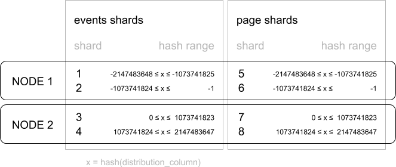

.. _distributed_data_modeling:

Choosing Distribution Column
============================

Citus uses the distribution column in distributed tables to assign table rows to shards. Choosing the distribution column for each table is **one of the most important** modeling decisions because it determines how data is spread across nodes.

If the distribution columns are chosen correctly, then related data will group together on the same physical nodes, making queries fast and adding support for all SQL features. If the columns are chosen incorrectly, the system will run needlessly slowly, and won't be able to support all SQL features across nodes.

This section gives distribution column tips for the two most common Citus scenarios. It concludes by going in depth on "co-location," the desirable grouping of data on nodes.

.. _distributing_by_tenant_id:

Multi-Tenant Apps
-----------------

The multi-tenant architecture uses a form of hierarchical database modeling to distribute queries across nodes in the distributed cluster. The top of the data hierarchy is known as the *tenant id*, and needs to be stored in a column on each table. Citus inspects queries to see which tenant id they involve and routes the query to a single worker node for processing, specifically the node which holds the data shard associated with the tenant id. Running a query with all relevant data placed on the same node is called :ref:`colocation`.

The following diagram illustrates co-location in the multi-tenant data model. It contains two tables, Accounts and Campaigns, each distributed by :code:`account_id`. The shaded boxes represent shards, each of whose color represents which worker node contains it. Green shards are stored together on one worker node, and blue on another.  Notice how a join query between Accounts and Campaigns would have all the necessary data together on one node when restricting both tables to the same account_id.

.. figure:: ../images/mt-colocation.png
   :alt: co-located tables in multi-tenant architecture

To apply this design in your own schema the first step is identifying what constitutes a tenant in your application. Common instances include company, account, organization, or customer. The column name will be something like :code:`company_id` or :code:`customer_id`. Examine each of your queries and ask yourself: would it work if it had additional WHERE clauses to restrict all tables involved to rows with the same tenant id? Queries in the multi-tenant model are usually scoped to a tenant, for instance queries on sales or inventory would be scoped within a certain store.

Best Practices
^^^^^^^^^^^^^^

* **Partition distributed tables by a common tenant_id column.**
  For instance, in a SaaS application where tenants are companies, the tenant_id will likely be company_id.

* **Convert small cross-tenant tables to reference tables.**
  When multiple tenants share a small table of information, distribute it as a :ref:`reference table <reference_tables>`.

* **Restrict filter all application queries by tenant_id.**
  Each query should request information for one tenant at a time.

Read the :ref:`mt_use_case` guide for a detailed example of building this kind of application.

.. _distributing_by_entity_id:

Real-Time Apps
--------------

While the multi-tenant architecture introduces a hierarchical structure and uses data co-location to route queries per tenant, real-time architectures depend on specific distribution properties of their data to achieve highly parallel processing.

We use "entity id" as a term for distribution columns in the real-time model, as opposed to tenant ids in the multi-tenant model. Typical entites are users, hosts, or devices.

Real-time queries typically ask for numeric aggregates grouped by date or category. Citus sends these queries to each shard for partial results and assembles the final answer on the coordinator node. Queries run fastest when as many nodes contribute as possible, and when no single node must do a disproportionate amount of work.

Best Practices
^^^^^^^^^^^^^^

* **Choose a column with high cardinality as the distribution column.**
  For comparison, a "status" field on an order table with values "new," "paid," and "shipped" is a poor choice of distribution column because it assumes only those few values. The number of distinct values limits the number of shards that can hold the data, and the number of nodes that can process it. Among columns with high cardinality, it is good additionally to choose those that are frequently used in group-by clauses or as join keys.

* **Choose a column with even distribution.**
  If you distribute a table on a column skewed to certain common values, then data in the table will tend to accumulate in certain shards. The nodes holding those shards will end up doing more work than other nodes.

* **Distribute fact and dimension tables on their common columns.**
  Your fact table can have only one distribution key. Tables that join on another key will not be co-located with the fact table. Choose one dimension to co-locate based on how frequently it is joined and the size of the joining rows. 

* **Change some dimension tables into reference tables.**
  If a dimension table cannot be co-located with the fact table, you can improve query performance by distributing copies of the dimension table to all of the nodes in the form of a :ref:`reference table <reference_tables>`.

Read the :ref:`rt_use_case` guide for a detailed example of building this kind of application.

.. _distributing_hash_time:

Timeseries Data
---------------

In a time-series workload, applications query recent information while archiving old information.

The most common mistake in modeling timeseries information in Citus is using the timestamp itself as a distribution column. A hash distribution based on time will distribute times seemingly at random into different shards rather than keeping ranges of time together in shards. However queries involving time generally reference ranges of time (for example the most recent data), so such a hash distribution would lead to network overhead.

Best Practices
^^^^^^^^^^^^^^

* **Do not choose a timestamp as the distribution column.**
  Choose a different distribution column. In a multi-tenant app, use the tenant id, or in a real-time app use the entity id.
* **Use PostgreSQL table partitioning for time instead.**
  Use table partitioning to break a big table of time-ordered data into multiple inherited tables with each containing different time ranges. Distributing a Postgres-partitioned table in Citus creates shards for the inherited tables.

Read the :ref:`timeseries` guide for a detailed example of building this kind of application.

.. _colocation:

Table Co-Location
-----------------

Relational databases are the first choice of data store for many applications due to their enormous flexibility and reliability. Historically the one criticism of relational databases is that they can run on only a single machine, which creates inherent limitations when data storage needs outpace server improvements. The solution to rapidly scaling databases is to distribute them, but this creates a performance problem of its own: relational operations such as joins then need to cross the network boundary. Co-location is the practice of dividing data tactically, where one keeps related information on the same machines to enable efficient relational operations, but takes advantage of the horizontal scalability for the whole dataset.

The principle of data co-location is that all tables in the database have a common distribution column and are sharded across machines in the same way, such that rows with the same distribution column value are always on the same machine, even across different tables. As long as the distribution column provides a meaningful grouping of data, relational operations can be performed within the groups.

.. _hash_space:

Data co-location in Citus for hash-distributed tables
^^^^^^^^^^^^^^^^^^^^^^^^^^^^^^^^^^^^^^^^^^^^^^^^^^^^^

The Citus extension for PostgreSQL is unique in being able to form a distributed database of databases. Every node in a Citus cluster is a fully functional PostgreSQL database and Citus adds the experience of a single homogenous database on top. While it does not provide the full functionality of PostgreSQL in a distributed way, in many cases it can take full advantage of features offered by PostgreSQL on a single machine through co-location, including full SQL support, transactions and foreign keys.

In Citus a row is stored in a shard if the hash of the value in the distribution column falls within the shard’s hash range. To ensure co-location, shards with the same hash range are always placed on the same node even after rebalance operations, such that equal distribution column values are always on the same node across tables.

A distribution column that we’ve found to work well in practice is tenant ID in multi-tenant applications. For example, SaaS applications typically have many tenants, but every query they make is specific to a particular tenant. While one option is providing a database or schema for every tenant, it is often costly and impractical as there can be many operations that span across users (data loading, migrations, aggregations, analytics, schema changes, backups, etc). That becomes harder to manage as the number of tenants grows.

A practical example of co-location
^^^^^^^^^^^^^^^^^^^^^^^^^^^^^^^^^^

Consider the following tables which might be part of a multi-tenant web analytics SaaS:

.. code-block:: postgresql

  CREATE TABLE event (
    tenant_id int,
    event_id bigint,
    page_id int,
    payload jsonb,
    primary key (tenant_id, event_id)
  );

  CREATE TABLE page (
    tenant_id int,
    page_id int,
    path text,
    primary key (tenant_id, page_id)
  );

Now we want to answer queries that may be issued by a customer-facing dashboard, such as: “Return the number of visits in the past week for all pages starting with ‘/blog’ in tenant six.”

Using Regular PostgreSQL Tables
^^^^^^^^^^^^^^^^^^^^^^^^^^^^^^^

If our data was in a single PostgreSQL node, we could easily express our query using the rich set of relational operations offered by SQL:

.. code-block:: postgresql

  SELECT page_id, count(event_id)
  FROM
    page
  LEFT JOIN  (
    SELECT * FROM event
    WHERE (payload->>'time')::timestamptz >= now() - interval '1 week'
  ) recent
  USING (tenant_id, page_id)
  WHERE tenant_id = 6 AND path LIKE '/blog%'
  GROUP BY page_id;

As long the `working set <https://en.wikipedia.org/wiki/Working_set>`_ for this query fits in memory, this is an appropriate solution for many application since it offers maximum flexibility. However, even if you don’t need to scale yet, it can be useful to consider the implications of scaling out on your data model.

Distributing tables by ID
^^^^^^^^^^^^^^^^^^^^^^^^^

As the number of tenants and the data stored for each tenant grows, query times will typically go up as the working set no longer fits in memory or CPU becomes a bottleneck. In this case, we can shard the data across many nodes using Citus. The first and most important choice we need to make when sharding is the distribution column. Let’s start with a naive choice of using :code:`event_id` for the event table and :code:`page_id` for the :code:`page` table:

.. code-block:: postgresql

  -- naively use event_id and page_id as distribution columns

  SELECT create_distributed_table('event', 'event_id');
  SELECT create_distributed_table('page', 'page_id');

Given that the data is dispersed across different workers, we cannot simply perform a join as we would on a single PostgreSQL node. Instead, we will need to issue two queries:

Across all shards of the page table (Q1):

.. code-block:: postgresql

  SELECT page_id FROM page WHERE path LIKE '/blog%' AND tenant_id = 6;

Across all shards of the event table (Q2):

.. code-block:: postgresql

  SELECT page_id, count(*) AS count
  FROM event
  WHERE page_id IN (/*…page IDs from first query…*/)
    AND tenant_id = 6
    AND (payload->>'time')::date >= now() - interval '1 week'
  GROUP BY page_id ORDER BY count DESC LIMIT 10;

Afterwards, the results from the two steps need to be combined by the application.

The data required to answer the query is scattered across the shards on the different nodes and each of those shards will need to be queried:

.. image:: ../images/colocation-inefficient-queries.png

In this case the data distribution creates substantial drawbacks:

* Overhead from querying each shard, running multiple queries
* Overhead of Q1 returning many rows to the client
* Q2 becoming very large
* The need to write queries in multiple steps, combine results, requires changes in the application

A potential upside of the relevant data being dispersed is that the queries can be parallelised, which Citus will do. However, this is only beneficial if the amount of work that the query does is substantially greater than the overhead of querying many shards. It’s generally better to avoid doing such heavy lifting directly from the application, for example by :ref:`pre-aggregating <rollups>` the data.

Distributing tables by tenant
^^^^^^^^^^^^^^^^^^^^^^^^^^^^^

Looking at our query again, we can see that all the rows that the query needs have one dimension in common: :code:`tenant_id`. The dashboard will only ever query for a tenant’s own data. That means that if data for the same tenant are always co-located on a single PostgreSQL node, our original query could be answered in a single step by that node by performing a join on :code:`tenant_id` and :code:`page_id`.

In Citus, rows with the same distribution column value are guaranteed to be on the same node. Each shard in a distributed table effectively has a set of co-located shards from other distributed tables that contain the same distribution column values (data for the same tenant). Starting over, we can create our tables with :code:`tenant_id` as the distribution column.

.. code-block:: postgresql

  -- co-locate tables by using a common distribution column
  SELECT create_distributed_table('event', 'tenant_id');
  SELECT create_distributed_table('page', 'tenant_id', colocate_with => 'event');

In this case, Citus can answer the same query that you would run on a single PostgreSQL node without modification (Q1):

.. code-block:: postgresql

  SELECT page_id, count(event_id)
  FROM
    page
  LEFT JOIN  (
    SELECT * FROM event
    WHERE (payload->>'time')::timestamptz >= now() - interval '1 week'
  ) recent
  USING (tenant_id, page_id)
  WHERE tenant_id = 6 AND path LIKE '/blog%'
  GROUP BY page_id;

Because of the tenantid filter and join on tenantid, Citus knows that the entire query can be answered using the set of co-located shards that contain the data for that particular tenant, and the PostgreSQL node can answer the query in a single step, which enables full SQL support.

.. image:: ../images/colocation-better-query.png

In some cases, queries and table schemas will require minor modifications to ensure that the tenant_id is always included in unique constraints and join conditions. However, this is usually a straightforward change, and the extensive rewrite that would be required without having co-location is avoided.

While the example above queries just one node because there is a specific tenant_id = 6 filter, co-location also allows us to efficiently perform distributed joins on tenant_id across all nodes, be it with SQL limitations.

Co-location means better feature support
^^^^^^^^^^^^^^^^^^^^^^^^^^^^^^^^^^^^^^^^

The full list of Citus features that are unlocked by co-location are:

* Full SQL support for queries on a single set of co-located shards
* Multi-statement transaction support for modifications on a single set of co-located shards
* Aggregation through INSERT..SELECT
* Foreign keys
* Distributed outer joins

Data co-location is a powerful technique for providing both horizontal scale and supporting relational data models. The cost of migrating or building applications using a distributed database that enables relational operations through co-location is often substantially lower than moving to a restrictive data model (e.g. NoSQL) and unlike a single-node database it can scale out with the size of your business. For more information about migrating an existing database see :ref:`Transitioning to a Multi-Tenant Data Model <transitioning_mt>`.

.. _query_performance:

Query Performance
^^^^^^^^^^^^^^^^^

Citus parallelizes incoming queries by breaking it into multiple fragment queries ("tasks") which run on the worker shards in parallel. This allows Citus to utilize the processing power of all the nodes in the cluster and also of individual cores on each node for each query. Due to this parallelization, you can get performance which is cumulative of the computing power of all of the cores in the cluster leading to a dramatic decrease in query times versus PostgreSQL on a single server.

Citus employs a two stage optimizer when planning SQL queries. The first phase involves converting the SQL queries into their commutative and associative form so that they can be pushed down and run on the workers in parallel. As discussed in previous sections, choosing the right distribution column and distribution method allows the distributed query planner to apply several optimizations to the queries. This can have a significant impact on query performance due to reduced network I/O.

Citus’s distributed executor then takes these individual query fragments and sends them to worker PostgreSQL instances. There are several aspects of both the distributed planner and the executor which can be tuned in order to improve performance. When these individual query fragments are sent to the workers, the second phase of query optimization kicks in. The workers are simply running extended PostgreSQL servers and they apply PostgreSQL's standard planning and execution logic to run these fragment SQL queries. Therefore, any optimization that helps PostgreSQL also helps Citus. PostgreSQL by default comes with conservative resource settings; and therefore optimizing these configuration settings can improve query times significantly.

We discuss the relevant performance tuning steps in the :ref:`performance_tuning` section of the documentation.
