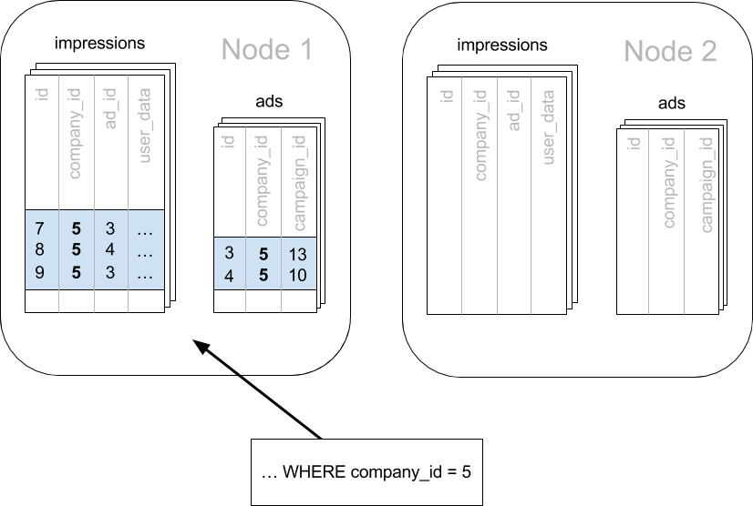
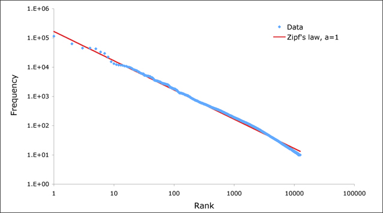

.. highlight:: postgresql

.. _mt_use_case:

Multi-tenant Applications
=========================

.. contents::
   :backlinks: none

*Estimated read time: 30 minutes*

If you're building a Software-as-a-service (SaaS) application, you probably already have the notion of tenancy built into your data model. Typically, most information relates to tenants / customers / accounts and the database tables capture this natural relation.

For SaaS applications, each tenant's data can be stored together in a single database instance and kept isolated from and invisible to other tenants. This is efficient in three ways. First, application improvements apply to all clients. Second, sharing a database between tenants uses hardware efficiently. Last, it is much simpler to manage a single database for all tenants than a different database server for each tenant.

However, a single relational database instance has traditionally had trouble scaling to the volume of data needed for a large multi-tenant application. Developers were forced to relinquish the benefits of the relational model when data exceeded the capacity of a single database node.

Citus allows users to write multi-tenant applications as if they are connecting to a single PostgreSQL database, when in fact the database is a horizontally scalable cluster of machines. Client code requires minimal modifications and can continue to use full SQL capabilities.

This guide takes a sample multi-tenant application and describes how to model it for scalability with Citus. Along the way we examine typical challenges for multi-tenant applications like isolating tenants from noisy neighbors, scaling hardware to accommodate more data, and storing data that differs across tenants. PostgreSQL and Citus provide all the tools needed to handle these challenges, so let's get building.

Let's Make an App – Ad Analytics
--------------------------------

We'll build the back-end for an application that tracks online advertising performance and provides an analytics dashboard on top. It's a natural fit for a multi-tenant application because user requests for data concern one company (their own) at a time. Code for the full example application is `available <https://github.com/citusdata/citus-example-ad-analytics>`_ on Github.

Let's start by considering a simplified schema for this application. The application must keep track of multiple companies, each of which runs advertising campaigns. Campaigns have many ads, and each ad has associated records of its clicks and impressions.

Here is the example schema. We'll make some minor changes later, which allow us to effectively distribute and isolate the data in a distributed environment.

::

  CREATE TABLE companies (
    id bigserial PRIMARY KEY,
    name text NOT NULL,
    image_url text,
    created_at timestamp without time zone NOT NULL,
    updated_at timestamp without time zone NOT NULL
  );

  CREATE TABLE campaigns (
    id bigserial PRIMARY KEY,
    company_id bigint REFERENCES companies (id),
    name text NOT NULL,
    cost_model text NOT NULL,
    state text NOT NULL,
    monthly_budget bigint,
    blacklisted_site_urls text[],
    created_at timestamp without time zone NOT NULL,
    updated_at timestamp without time zone NOT NULL
  );

  CREATE TABLE ads (
    id bigserial PRIMARY KEY,
    campaign_id bigint REFERENCES campaigns (id),
    name text NOT NULL,
    image_url text,
    target_url text,
    impressions_count bigint DEFAULT 0,
    clicks_count bigint DEFAULT 0,
    created_at timestamp without time zone NOT NULL,
    updated_at timestamp without time zone NOT NULL
  );

  CREATE TABLE clicks (
    id bigserial PRIMARY KEY,
    ad_id bigint REFERENCES ads (id),
    clicked_at timestamp without time zone NOT NULL,
    site_url text NOT NULL,
    cost_per_click_usd numeric(20,10),
    user_ip inet NOT NULL,
    user_data jsonb NOT NULL
  );

  CREATE TABLE impressions (
    id bigserial PRIMARY KEY,
    ad_id bigint REFERENCES ads (id),
    seen_at timestamp without time zone NOT NULL,
    site_url text NOT NULL,
    cost_per_impression_usd numeric(20,10),
    user_ip inet NOT NULL,
    user_data jsonb NOT NULL
  );

There are modifications we can make to the schema which will give it a performance boost in a distributed environment like Citus. To see how, we must become familiar with how Citus distributes data and executes queries.

Scaling the Relational Data Model
---------------------------------

The relational data model is great for applications. It protects data integrity, allows flexible queries, and accommodates changing data. Traditionally the only problem was that relational databases weren't considered capable of scaling to the workloads needed for big SaaS applications. Developers had to put up with NoSQL databases -- or a collection of backend services -- to reach that size.

With Citus you can keep your data model *and* make it scale. Citus appears to applications as a single PostgreSQL database, but it internally routes queries to an adjustable number of physical servers (nodes) which can process requests in parallel.

Multi-tenant applications have a nice property that we can take advantage of: queries usually always request information for one tenant at a time, not a mix of tenants. For instance, when a salesperson is searching prospect information in a CRM, the search results are specific to his employer; other businesses' leads and notes are not included.

Because application queries are restricted to a single tenant, such as a store or company, one approach for making multi-tenant application queries fast is to store *all* data for a given tenant on the same node. This minimizes network overhead between the nodes and allows Citus to support all your application's joins, key constraints and transactions efficiently. With this, you can scale across multiple nodes without having to totally re-write or re-architect your application.

We do this in Citus by making sure every table in our schema has a column to clearly mark which tenant owns which rows. In the ad analytics application the tenants are companies, so we must ensure all tables have a :code:`company_id` column.

We can tell Citus to use this column to read and write rows to the same node when the rows are marked for the same company. In Citus' terminology :code:`company_id` will be the *distribution column*, which you can learn more about in :ref:`Distributed Data Modeling <distributed_data_modeling>`.

Preparing Tables and Ingesting Data
-----------------------------------

In the previous section we identified the correct distribution column for our multi-tenant application: the company id. Even in a single-machine database it can be useful to denormalize tables with the addition of company id, whether it be for row-level security or for additional indexing. The extra benefit, as we saw, is that including the extra column helps for multi-machine scaling as well.

The schema we have created so far uses a separate :code:`id` column as primary key for each table. Citus requires that primary and foreign key constraints include the distribution column. This requirement makes enforcing these constraints much more efficient in a distributed environment as only a single node has to be checked to guarantee them.

In SQL, this requirement translates to making primary and foreign keys composite by including :code:`company_id`. This is compatible with the multi-tenant case because what we really need there is to ensure uniqueness on a per-tenant basis.

Putting it all together, here are the changes which prepare the tables for distribution by :code:`company_id`.

::

  CREATE TABLE companies (
    id bigserial PRIMARY KEY,
    name text NOT NULL,
    image_url text,
    created_at timestamp without time zone NOT NULL,
    updated_at timestamp without time zone NOT NULL
  );

  CREATE TABLE campaigns (
    id bigserial,       -- was: PRIMARY KEY
    company_id bigint REFERENCES companies (id),
    name text NOT NULL,
    cost_model text NOT NULL,
    state text NOT NULL,
    monthly_budget bigint,
    blacklisted_site_urls text[],
    created_at timestamp without time zone NOT NULL,
    updated_at timestamp without time zone NOT NULL,
    PRIMARY KEY (company_id, id) -- added
  );

  CREATE TABLE ads (
    id bigserial,       -- was: PRIMARY KEY
    company_id bigint,  -- added
    campaign_id bigint, -- was: REFERENCES campaigns (id)
    name text NOT NULL,
    image_url text,
    target_url text,
    impressions_count bigint DEFAULT 0,
    clicks_count bigint DEFAULT 0,
    created_at timestamp without time zone NOT NULL,
    updated_at timestamp without time zone NOT NULL,
    PRIMARY KEY (company_id, id),         -- added
    FOREIGN KEY (company_id, campaign_id) -- added
      REFERENCES campaigns (company_id, id)
  );

  CREATE TABLE clicks (
    id bigserial,        -- was: PRIMARY KEY
    company_id bigint,   -- added
    ad_id bigint,        -- was: REFERENCES ads (id),
    clicked_at timestamp without time zone NOT NULL,
    site_url text NOT NULL,
    cost_per_click_usd numeric(20,10),
    user_ip inet NOT NULL,
    user_data jsonb NOT NULL,
    PRIMARY KEY (company_id, id),      -- added
    FOREIGN KEY (company_id, ad_id)    -- added
      REFERENCES ads (company_id, id)
  );

  CREATE TABLE impressions (
    id bigserial,         -- was: PRIMARY KEY
    company_id bigint,    -- added
    ad_id bigint,         -- was: REFERENCES ads (id),
    seen_at timestamp without time zone NOT NULL,
    site_url text NOT NULL,
    cost_per_impression_usd numeric(20,10),
    user_ip inet NOT NULL,
    user_data jsonb NOT NULL,
    PRIMARY KEY (company_id, id),       -- added
    FOREIGN KEY (company_id, ad_id)     -- added
      REFERENCES ads (company_id, id)
  );

You can learn more about migrating your own data model in :ref:`multi-tenant schema migration <mt_schema_migration>`.

Try it Yourself
~~~~~~~~~~~~~~~

.. note::

  This guide is designed so you can follow along in your own Citus database. This tutorial assumes that you already have Citus installed and running.
  If you don't have Citus running, you can setup Citus locally using one of the options from :ref:`development`.

  You'll run the SQL commands using psql and connect to the Coordinator node:

  * **Docker**: :code:`docker exec -it citus psql -U postgres`

At this point feel free to follow along in your own Citus cluster by `downloading <https://examples.citusdata.com/mt_ref_arch/schema.sql>`_ and executing the SQL to create the schema. Once the schema is ready, we can tell Citus to create shards on the workers. From the coordinator node, run:

::

  SELECT create_distributed_table('companies',   'id');
  SELECT create_distributed_table('campaigns',   'company_id');
  SELECT create_distributed_table('ads',         'company_id');
  SELECT create_distributed_table('clicks',      'company_id');
  SELECT create_distributed_table('impressions', 'company_id');

The :ref:`create_distributed_table` function informs Citus that a table should be distributed among nodes and that future incoming queries to those tables should be planned for distributed execution. The function also creates shards for the table on worker nodes, which are low-level units of data storage Citus uses to assign data to nodes.

The next step is loading sample data into the cluster from the command line.

.. code-block:: bash

  # download and ingest datasets from the shell

  for dataset in companies campaigns ads clicks impressions geo_ips; do
    curl -O https://examples.citusdata.com/mt_ref_arch/${dataset}.csv
  done

.. note::

  **If you are using Docker,** you should use the :code:`docker cp` command to copy the files into the Docker container.

  .. code-block:: bash

    for dataset in companies campaigns ads clicks impressions geo_ips; do
      docker cp ${dataset}.csv citus:.
    done

Being an extension of PostgreSQL, Citus supports bulk loading with the COPY command. Use it to ingest the data you downloaded, and make sure that you specify the correct file path if you downloaded the file to some other location. Back inside psql run this:

.. code-block:: psql

  \copy companies from 'companies.csv' with csv
  \copy campaigns from 'campaigns.csv' with csv
  \copy ads from 'ads.csv' with csv
  \copy clicks from 'clicks.csv' with csv
  \copy impressions from 'impressions.csv' with csv

Integrating Applications
------------------------

Here's the good news: once you have made the slight schema modification outlined earlier, your application can scale with very little work. You'll just connect the app to Citus and let the database take care of keeping the queries fast and the data safe.

Any application queries or update statements which include a filter on :code:`company_id` will continue to work exactly as they are. As mentioned earlier, this kind of filter is common in multi-tenant apps. When using an Object-Relational Mapper (ORM) you can recognize these queries by methods such as :code:`where` or :code:`filter`.

ActiveRecord:

.. code-block:: ruby

  Impression.where(company_id: 5).count

Django:

.. code-block:: py

  Impression.objects.filter(company_id=5).count()

Basically when the resulting SQL executed in the database contains a :code:`WHERE company_id = :value` clause on every table (including tables in JOIN queries), then Citus will recognize that the query should be routed to a single node and execute it there as it is. This makes sure that all SQL functionality is available. The node is an ordinary PostgreSQL server after all.

Also, to make it even simpler, you can use our `activerecord-multi-tenant <https://github.com/citusdata/activerecord-multi-tenant>`_ library for Rails, or `django-multitenant <https://github.com/citusdata/django-multitenant>`_ for Django which will automatically add these filters to all your queries, even the complicated ones. Check out our migration guides for :ref:`rails_migration` and :ref:`django_migration`.

This guide is framework-agnostic, so we'll point out some Citus features using SQL. Use your imagination for how these statements would be expressed in your language of choice.

Here is a simple query and update operating on a single tenant.

.. code-block:: sql

  -- campaigns with highest budget

  SELECT name, cost_model, state, monthly_budget
    FROM campaigns
   WHERE company_id = 5
   ORDER BY monthly_budget DESC
   LIMIT 10;

  -- double the budgets!

  UPDATE campaigns
     SET monthly_budget = monthly_budget*2
   WHERE company_id = 5;

A common pain point for users scaling applications with NoSQL databases is the lack of transactions and joins. However, transactions work as you'd expect them to in Citus:

.. code-block:: sql

  -- transactionally reallocate campaign budget money

  BEGIN;

  UPDATE campaigns
     SET monthly_budget = monthly_budget + 1000
   WHERE company_id = 5
     AND id = 40;

  UPDATE campaigns
     SET monthly_budget = monthly_budget - 1000
   WHERE company_id = 5
     AND id = 41;

  COMMIT;

As a final demo of SQL support, we have a query which includes aggregates and window functions and it works the same in Citus as it does in PostgreSQL. The query ranks the ads in each campaign by the count of their impressions.

.. code-block:: sql

  SELECT a.campaign_id,
         RANK() OVER (
           PARTITION BY a.campaign_id
           ORDER BY a.campaign_id, count(*) desc
         ), count(*) as n_impressions, a.id
    FROM ads as a
    JOIN impressions as i
      ON i.company_id = a.company_id
     AND i.ad_id      = a.id
   WHERE a.company_id = 5
  GROUP BY a.campaign_id, a.id
  ORDER BY a.campaign_id, n_impressions desc;

In short when queries are scoped to a tenant then inserts, updates, deletes, complex SQL, and transactions all work as expected.

.. _mt_ref_tables:

Sharing Data Between Tenants
----------------------------

Up until now all tables have been distributed by :code:`company_id`, but sometimes there is data that can be shared by all tenants, and doesn't "belong" to any tenant in particular. For instance, all companies using this example ad platform might want to get geographical information for their audience based on IP addresses. In a single machine database this could be accomplished by a lookup table for geo-ip, like the following. (A real table would probably use PostGIS but bear with the simplified example.)

.. code-block:: sql

  CREATE TABLE geo_ips (
    addrs cidr NOT NULL PRIMARY KEY,
    latlon point NOT NULL
      CHECK (-90  <= latlon[0] AND latlon[0] <= 90 AND
             -180 <= latlon[1] AND latlon[1] <= 180)
  );
  CREATE INDEX ON geo_ips USING gist (addrs inet_ops);

To use this table efficiently in a distributed setup, we need to find a way to co-locate the :code:`geo_ips` table with clicks for not just one -- but every -- company. That way, no network traffic need be incurred at query time. We do this in Citus by designating :code:`geo_ips` as a :ref:`reference table <reference_tables>`.

.. code-block:: sql

  -- Make synchronized copies of geo_ips on all workers

  SELECT create_reference_table('geo_ips');

Reference tables are replicated across all worker nodes, and Citus automatically keeps them in sync during modifications. Notice that we call :ref:`create_reference_table <create_reference_table>` rather than :code:`create_distributed_table`.

Now that :code:`geo_ips` is established as a reference table, load it with example data:

.. code-block:: psql

  \copy geo_ips from 'geo_ips.csv' with csv

Now joining clicks with this table can execute efficiently. We can ask, for example, the locations of everyone who clicked on ad 290.

.. code-block:: sql

  SELECT c.id, clicked_at, latlon
    FROM geo_ips, clicks c
   WHERE addrs >> c.user_ip
     AND c.company_id = 5
     AND c.ad_id = 290;

Online Changes to the Schema
----------------------------

Another challenge with multi-tenant systems is keeping the schemas for all the tenants in sync. Any schema change needs to be consistently reflected across all the tenants. In Citus, you can simply use standard PostgreSQL DDL commands to change the schema of your tables, and Citus will propagate them from the coordinator node to the workers using a two-phase commit protocol.

For example, the advertisements in this application could use a text caption. We can add a column to the table by issuing the standard SQL on the coordinator:

.. code-block:: sql

  ALTER TABLE ads
    ADD COLUMN caption text;

This updates all the workers as well. Once this command finishes, the Citus cluster will accept queries that read or write data in the new :code:`caption` column.

For a fuller explanation of how DDL commands propagate through the cluster, see :ref:`ddl_prop_support`.

When Data Differs Across Tenants
--------------------------------

Given that all tenants share a common schema and hardware infrastructure, how can we accommodate tenants which want to store information not needed by others? For example, one of the tenant applications using our advertising database may want to store tracking cookie information with clicks, whereas another tenant may care about browser agents. Traditionally databases using a shared schema approach for multi-tenancy have resorted to creating a fixed number of pre-allocated "custom" columns, or having external "extension tables." However, PostgreSQL provides a much easier way with its unstructured column types, notably `JSONB <https://www.postgresql.org/docs/current/static/datatype-json.html>`_.

Notice that our schema already has a JSONB field in :code:`clicks` called :code:`user_data`. Each tenant can use it for flexible storage.

Suppose company five includes information in the field to track whether the user is on a mobile device. The company can query to find who clicks more, mobile or traditional visitors:

.. code-block:: postgresql

  SELECT
    user_data->>'is_mobile' AS is_mobile,
    count(*) AS count
  FROM clicks
  WHERE company_id = 5
  GROUP BY user_data->>'is_mobile'
  ORDER BY count DESC;

The database administrator can even create a `partial index <https://www.postgresql.org/docs/current/static/indexes-partial.html>`_ to improve speed for an individual tenant's query patterns. Here is one to improve company 5's filters for clicks from users on mobile devices:

.. code-block:: postgresql

  CREATE INDEX click_user_data_is_mobile
  ON clicks ((user_data->>'is_mobile'))
  WHERE company_id = 5;

Additionally, PostgreSQL supports `GIN indices <https://www.postgresql.org/docs/current/static/gin-intro.html>`_ on JSONB. Creating a GIN index on a JSONB column will create an index on every key and value within that JSON document. This speeds up a number of `JSONB operators <https://www.postgresql.org/docs/current/static/functions-json.html#FUNCTIONS-JSONB-OP-TABLE>`_ such as :code:`?`, :code:`?|`, and :code:`?&`.

.. code-block:: postgresql

  CREATE INDEX click_user_data
  ON clicks USING gin (user_data);

  -- this speeds up queries like, "which clicks have
  -- the is_mobile key present in user_data?"

  SELECT id
    FROM clicks
   WHERE user_data ? 'is_mobile'
     AND company_id = 5;

Scaling Hardware Resources
--------------------------

Multi-tenant databases should be designed for future scale as business grows or tenants want to store more data. Citus can scale out easily by adding new machines without having to make any changes or take application downtime.

Being able to rebalance data in the Citus cluster allows you to grow your data size or number of customers and improve performance on demand. Adding new machines allows you to keep data in memory even when it is much larger than what a single machine can store.

Also, if data increases for only a few large tenants, then you can isolate those particular tenants to separate nodes for better performance. (Tenant isolation is a feature of our :ref:`cloud_topic`.)

To scale out your Citus cluster, first add a new worker node to it. On Azure Database for PostgreSQL - Hyperscale (Citus), you can use the Azure Portal to add the required number of nodes. Alternatively, if you run your own Citus installation, you can add nodes manually with the :ref:`citus_add_node` UDF.

Once you add the node it will be available in the system. However, at this point no tenants are stored on it and Citus will not yet run any queries there. To move your existing data, you can ask Citus to rebalance the data. This operation moves bundles of rows called shards between the currently active nodes to attempt to equalize the amount of data on each node.

.. code-block:: postgres

  SELECT rebalance_table_shards('companies');

Rebalancing preserves :ref:`colocation`, which means we can tell Citus to rebalance the companies table and it will take the hint and rebalance the other tables which are distributed by company_id. Also, with our :ref:`cloud_topic`, applications do not need to undergo downtime during shard rebalancing. Read requests continue seamlessly, and writes are locked only when they affect shards which are currently in flight. In Citus Community edition, writes to shards are blocked during rebalancing but reads are unaffected.

Dealing with Big Tenants
------------------------

.. note::

  This section uses features available only in our :ref:`cloud_topic`.

The previous section describes a general-purpose way to scale a cluster as the number of tenants increases. However, users often have two questions. The first is what will happen to their largest tenant if it grows too big. The second is what are the performance implications of hosting a large tenant together with small ones on a single worker node, and what can be done about it.

Regarding the first question, investigating data from large SaaS sites reveals that as the number of tenants increases, the size of tenant data typically tends to follow a `Zipfian distribution <https://en.wikipedia.org/wiki/Zipf%27s_law>`_.

For instance, in a database of 100 tenants, the largest is predicted to account for about 20% of the data. In a more realistic example for a large SaaS company, if there are 10k tenants, the largest will account for around 2% of the data. Even at 10TB of data, the largest tenant will require 200GB, which can pretty easily fit on a single node.

Another question is regarding performance when large and small tenants are on the same node. Standard shard rebalancing will improve overall performance but it may or may not improve the mixing of large and small tenants. The rebalancer simply distributes shards to equalize storage usage on nodes, without examining which tenants are allocated on each shard.

To improve resource allocation and make guarantees of tenant QoS it is worthwhile to move large tenants to dedicated nodes. Citus provides the tools to do this.

In our case, let's imagine that our old friend company id=5 is very large. We can isolate the data for this tenant in two steps. We'll present the commands here, and you can consult :ref:`tenant_isolation` to learn more about them.

First isolate the tenant's data to a dedicated shard suitable to move. The CASCADE option also applies this change to the rest of our tables distributed by :code:`company_id`.

.. code-block:: sql

  SELECT isolate_tenant_to_new_shard(
    'companies', 5, 'CASCADE'
  );

The output is the shard id dedicated to hold :code:`company_id=5`:

.. code-block:: text

  ┌─────────────────────────────┐
  │ isolate_tenant_to_new_shard │
  ├─────────────────────────────┤
  │                      102240 │
  └─────────────────────────────┘

Next we move the data across the network to a new dedicated node. Create a new node as described in the previous section. Take note of its hostname as shown in the Nodes tab of the Cloud Console.

.. code-block:: sql

  -- find the node currently holding the new shard

  SELECT nodename, nodeport
    FROM pg_dist_placement AS placement,
         pg_dist_node AS node
   WHERE placement.groupid = node.groupid
     AND node.noderole = 'primary'
     AND shardid = 102240;

  -- move the shard to your choice of worker (it will also move the
  -- other shards created with the CASCADE option)

  -- note that you should set wal_level for all nodes to be >= logical
  -- to use citus_move_shard_placement.
  -- you also need to restart your cluster after setting wal_level in
  -- postgresql.conf files.

  SELECT citus_move_shard_placement(
    102240,
    'source_host', source_port,
    'dest_host', dest_port);

You can confirm the shard movement by querying :ref:`pg_dist_placement <placements>` again.

Where to Go From Here
---------------------

With this, you now know how to use Citus to power your multi-tenant application for scalability. If you have an existing schema and want to migrate it for Citus, see :ref:`Multi-Tenant Transitioning <transitioning_mt>`.

To adjust a front-end application, specifically Ruby on Rails or Django, read :ref:`rails_migration` or :ref:`django_migration`. Finally, try `Azure Database for PostgreSQL - Hyperscale (Citus) <https://docs.microsoft.com/azure/postgresql/quickstart-create-hyperscale-portal>`_, the easiest way to manage a Citus cluster.
