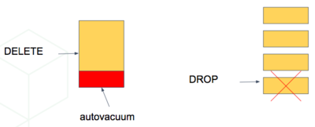
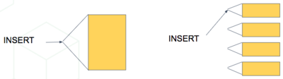

.. _timeseries:

Timeseries Data
===============

In a time-series workload, applications (such as some :ref:`distributing_by_entity_id`) query recent information, while archiving old information.

To deal with this workload, a single-node PostgreSQL database would typically use `table partitioning <https://www.postgresql.org/docs/current/static/ddl-partitioning.html>`_ to break a big table of time-ordered data into multiple inherited tables with each containing different time ranges.

Storing data in multiple physical tables speeds up data expiration. In a single big table, deleting rows incurs the cost of scanning to find which to delete, and then `vacuuming <https://www.postgresql.org/docs/current/static/routine-vacuuming.html>`_ the emptied space. On the other hand, dropping a partition is a fast operation independent of data size. It's the equivalent of simply removing files on disk that contain the data.

Partitioning a table also makes indices smaller and faster within each date range. Queries operating on recent data are likely to operate on "hot" indices that fit in memory. This speeds up reads.

.. image:: ../images/timeseries-multiple-indices-select.png
    :alt: select from a big table vs select from a smaller partition

Also inserts have smaller indices to update, so they go faster too.

Time-based partitioning makes most sense when:

1. Most queries access a very small subset of the most recent data
2. Older data is periodically expired (deleted/dropped)

Keep in mind that, in the wrong situation, reading all these partitions can hurt overhead more than it helps. However, in the right situations it is quite helpful. For example, when keeping a year of time series data and regularly querying only the most recent week.

Scaling Timeseries Data on Citus
--------------------------------

We can mix the single-node table partitioning techniques with Citus' distributed sharding to make a scalable time-series database. It's the best of both worlds. It's especially elegant atop Postgres's declarative table partitioning.

.. image:: ../images/timeseries-sharding-and-partitioning.png
    :alt: shards of partitions

For example, let's distribute *and* partition a table holding historical `GitHub events data <https://examples.citusdata.com/events.csv>`__.

Each record in this GitHub data set represents an event created in GitHub, along with key information regarding the event such as event type, creation date, and the user who created the event.

The first step is to create and partition the table by time as we would in a single-node PostgreSQL database:

.. code-block:: postgresql

  -- the separate schema will be useful later
  CREATE SCHEMA github;

  -- declaratively partitioned table
  CREATE TABLE github.events (
    event_id bigint,
    event_type text,
    event_public boolean,
    repo_id bigint,
    payload jsonb,
    repo jsonb,
    actor jsonb,
    org jsonb,
    created_at timestamp
  ) PARTITION BY RANGE (created_at);

Notice the ``PARTITION BY RANGE (created_at)``. This tells Postgres that the table will be partitioned by the ``created_at`` column in ordered ranges. We have not yet created any partitions for specific ranges, though.

Before creating specific partitions, let's distribute the table in Citus. We'll shard by ``repo_id``, meaning the events will be clustered into shards per repository.

.. code-block:: postgresql

  SELECT create_distributed_table('github.events', 'repo_id');

At this point Citus has created shards for this table across worker nodes. Internally each shard is a table with the name ``github.events_N`` for each shard identifier N. Also, Citus propagated the partitioning information, and each of these shards has ``Partition key: RANGE (created_at)`` declared.

A partitioned table cannot directly contain data, it is more like a view across its partitions. Thus the shards are not yet ready to hold data. We need to manually create partitions and specify their time ranges, after which we can insert data that match the ranges.

.. code-block:: postgresql

  -- manually make a partition for 2016 events
  CREATE TABLE github.events_2016 PARTITION OF github.events
  FOR VALUES FROM ('2016-01-01') TO ('2016-12-31');

The coordinator node now has the tables ``github.events`` and ``github.events_2016``. Citus will propagate partition creation to all the shards, creating a partition for each shard.

Automating Partition Creation
-----------------------------

In the previous section we manually created a partition of the ``github.events`` table. It's tedious to keep doing this, especially when using narrower partitions holding less than a year's range of data. It's more pleasant to let the `pg_partman extension <https://github.com/keithf4/pg_partman>`_ automatically create partitions on demand. The core functionality of pg_partman works out of the box with Citus when using it with native partitioning.

First clone, build, and install the pg_partman extension. Then tell partman we want to make partitions that each hold one hour of data. This will create the initial empty hourly partitions:

.. code-block:: sql

  CREATE SCHEMA partman;
  CREATE EXTENSION pg_partman WITH SCHEMA partman;

  -- Partition the table into hourly ranges of "created_at"
  SELECT partman.create_parent('github.events', 'created_at', 'native', 'hourly');
  UPDATE partman.part_config SET infinite_time_partitions = true;

Running ``\d+ github.events`` will now show more partitions:

::

  \d+ github.events
                                                  Table "github.events"
      Column    |            Type             | Collation | Nullable | Default | Storage  | Stats target | Description
  --------------+-----------------------------+-----------+----------+---------+----------+--------------+-------------
   event_id     | bigint                      |           |          |         | plain    |              |
   event_type   | text                        |           |          |         | extended |              |
   event_public | boolean                     |           |          |         | plain    |              |
   repo_id      | bigint                      |           |          |         | plain    |              |
   payload      | jsonb                       |           |          |         | extended |              |
   repo         | jsonb                       |           |          |         | extended |              |
   actor        | jsonb                       |           |          |         | extended |              |
   org          | jsonb                       |           |          |         | extended |              |
   created_at   | timestamp without time zone |           |          |         | plain    |              |
  Partition key: RANGE (created_at)
  Partitions: github.events_p2018_01_15_0700 FOR VALUES FROM ('2018-01-15 07:00:00') TO ('2018-01-15 08:00:00'),
              github.events_p2018_01_15_0800 FOR VALUES FROM ('2018-01-15 08:00:00') TO ('2018-01-15 09:00:00'),
              github.events_p2018_01_15_0900 FOR VALUES FROM ('2018-01-15 09:00:00') TO ('2018-01-15 10:00:00'),
              github.events_p2018_01_15_1000 FOR VALUES FROM ('2018-01-15 10:00:00') TO ('2018-01-15 11:00:00'),
              github.events_p2018_01_15_1100 FOR VALUES FROM ('2018-01-15 11:00:00') TO ('2018-01-15 12:00:00'),
              github.events_p2018_01_15_1200 FOR VALUES FROM ('2018-01-15 12:00:00') TO ('2018-01-15 13:00:00'),
              github.events_p2018_01_15_1300 FOR VALUES FROM ('2018-01-15 13:00:00') TO ('2018-01-15 14:00:00'),
              github.events_p2018_01_15_1400 FOR VALUES FROM ('2018-01-15 14:00:00') TO ('2018-01-15 15:00:00'),
              github.events_p2018_01_15_1500 FOR VALUES FROM ('2018-01-15 15:00:00') TO ('2018-01-15 16:00:00')

By default ``create_parent`` creates four partitions in the past, four in the future, and one for the present, all based on system time. If you need to backfill older data, you can specify a ``p_start_partition`` parameter in the call to ``create_parent``, or ``p_premake`` to make partitions for the future. See the `pg_partman documentation <https://github.com/keithf4/pg_partman/blob/master/doc/pg_partman.md>`_ for details.

As time progresses, pg_partman will need to do some maintenance to create new partitions and drop old ones. Anytime you want to trigger maintenance, call:

.. code-block:: postgresql

  -- disabling analyze is recommended for native partitioning
  -- due to aggressive locks
  SELECT partman.run_maintenance(p_analyze := false);

It's best to set up a periodic job to run the maintenance function. Pg_partman can be built with support for a background worker process to do this. Or we can use another extension like `pg_cron <https://github.com/citusdata/pg_cron>`_:

.. code-block:: postgresql

  SELECT cron.schedule('@hourly', $$
    SELECT partman.run_maintenance(p_analyze := false);
  $$);

Once periodic maintenance is set up, you no longer have to think about the partitions, they just work.

Finally, to configure pg_partman to drop old partitions, you can update the ``partman.part_config`` table:

.. code-block:: postgresql

  UPDATE partman.part_config
     SET retention_keep_table = false,
         retention = '1 month'
   WHERE parent_table = 'github.events';

Now whenever maintenance runs, partitions older than a month are automatically dropped.

.. note::

  Be aware that native partitioning in Postgres is still quite new and has a few quirks. For example, you cannot directly create an index on a partitioned table. Instead, pg_partman lets you create a template table to define indexes for new partitions. Maintenance operations on partitioned tables will also acquire aggressive locks that can briefly stall queries. There is currently a lot of work going on within the postgres community to resolve these issues, so expect time partitioning in Postgres to only get better.

.. _columnar_example:

Archiving with Columnar Storage
-------------------------------

Some applications have data logically divided into a small updatable part and a
larger part that's "frozen." Examples include logs, clickstreams, or sales
records. In this case we can combine partitioning with :ref:`columnar table
storage <columnar>` (introduced in Citus 10) to compress historical partitions
on disk. Citus columnar tables are currently append-only, meaning they do not
support updates or deletes, but we can use them for the immutable historical
partitions.

A partitioned table may be made up of any combination of row and columnar
partitions. When using range partitioning on a timestamp key, we can make the
newest partition a row table, and periodically roll the newest partition into
another historical columnar partition.

Let's see an example, using GitHub events again. We'll create a new table
called ``github.columnar_events`` for disambiguation from the earlier example.
We'll manage its partitions manually. To focus entirely on the columnar storage
aspect, we won't distribute this table.

.. code-block:: postgresql

  CREATE TABLE github.columnar_events ( LIKE github.events )
  PARTITION BY RANGE (created_at);

  -- create partitions to hold two hours of data each

  -- columnar partitions for historical data
  CREATE TABLE ge0 PARTITION OF github.columnar_events
    FOR VALUES FROM ('2015-01-01 00:00:00') TO ('2015-01-01 02:00:00')
    USING columnar;
  CREATE TABLE ge1 PARTITION OF github.columnar_events
    FOR VALUES FROM ('2015-01-01 02:00:00') TO ('2015-01-01 04:00:00')
    USING columnar;
  CREATE TABLE ge2 PARTITION OF github.columnar_events
    FOR VALUES FROM ('2015-01-01 04:00:00') TO ('2015-01-01 06:00:00')
    USING columnar;

  -- row partition for latest data
  CREATE TABLE ge3 PARTITION OF github.columnar_events
    FOR VALUES FROM ('2015-01-01 06:00:00') TO ('2015-01-01 08:00:00');

Next, download sample data:

.. code-block:: bash

  wget http://examples.citusdata.com/github_archive/github_events-2015-01-01-{0..5}.csv.gz
  gzip -d github_events-2015-01-01-*.gz

And load it:

.. code-block:: psql

  \COPY github.columnar_events FROM 'github_events-2015-01-01-1.csv' WITH (format CSV)
  \COPY github.columnar_events FROM 'github_events-2015-01-01-2.csv' WITH (format CSV)
  \COPY github.columnar_events FROM 'github_events-2015-01-01-3.csv' WITH (format CSV)
  \COPY github.columnar_events FROM 'github_events-2015-01-01-4.csv' WITH (format CSV)
  \COPY github.columnar_events FROM 'github_events-2015-01-01-5.csv' WITH (format CSV)

To see the compression ratio for a columnar table, use ``VACUUM VERBOSE``. The
compression ratio for our three columnar partitions is pretty good:

.. code-block:: postgresql

  VACUUM VERBOSE github.columnar_events;

::

  INFO:  statistics for "ge0":
  storage id: 10000000004
  total file size: 2179072, total data size: 2149126
  compression rate: 8.50x
  total row count: 7427, stripe count: 1, average rows per stripe: 7427
  chunk count: 9, containing data for dropped columns: 0, zstd compressed: 9
  
  INFO:  statistics for "ge1":
  storage id: 10000000005
  total file size: 3579904, total data size: 3543869
  compression rate: 8.27x
  total row count: 12714, stripe count: 2, average rows per stripe: 6357
  chunk count: 18, containing data for dropped columns: 0, zstd compressed: 18
  
  INFO:  statistics for "ge2":
  storage id: 10000000006
  total file size: 2949120, total data size: 2910929
  compression rate: 8.53x
  total row count: 11756, stripe count: 2, average rows per stripe: 5878
  chunk count: 18, containing data for dropped columns: 0, zstd compressed: 18

One power of the partitioned table ``github.columnar_events`` is that it can be
queried in its entirety like a normal table.

.. code-block:: postgresql

  SELECT COUNT(DISTINCT repo_id)
    FROM github.columnar_events;

::

  .
   count
  -------
   16001

Entries can be updated or deleted, as long as there's a WHERE clause on the
partition key which filters entirely into row table partitions.

Archiving a Row Partition to Columnar Storage
~~~~~~~~~~~~~~~~~~~~~~~~~~~~~~~~~~~~~~~~~~~~~

When a row partition has filled its range, you can archive it to compressed
columnar storage. The process is:

1. Make a columnar copy of the row partition.
2. Detach the row partition.
3. Perform table renames.
4. Attach the columnar copy in the row partition's stead.

In code, here's how to turn ge3 columnar:

.. code-block:: postgresql

  BEGIN;
  
  -- uncomment the following statement to avoid deadlock risk
  -- at the cost of holding the lock during the data conversion:
  --   LOCK TABLE github.columnar_events IN ACCESS EXCLUSIVE MODE;
  
  LOCK TABLE ge3 IN EXCLUSIVE MODE;
  CREATE TABLE ge3_tmp_new(LIKE ge3) USING columnar;
  INSERT INTO ge3_tmp_new SELECT * FROM ge3;
  
  -- DETACH will take ACCESS EXCLUSIVE LOCK on the partitioned table
  ALTER TABLE github.columnar_events DETACH PARTITION ge3;
  ALTER TABLE ge3 RENAME TO ge3_tmp_old;
  ALTER TABLE ge3_tmp_new RENAME TO ge3;
  ALTER TABLE github.columnar_events ATTACH PARTITION ge3
    FOR VALUES FROM ('2015-01-01 06:00:00') TO ('2015-01-01 08:00:00');
  DROP TABLE ge3_tmp_old;

  COMMIT;

After doing that, we can create a row partition to accept the new mutable data.

.. code-block:: postgresql

  -- the new row partition
  CREATE TABLE ge4 PARTITION OF github.columnar_events
    FOR VALUES FROM ('2015-01-01 08:00:00') TO ('2015-01-01 10:00:00');

For more information, see :ref:`columnar`.
